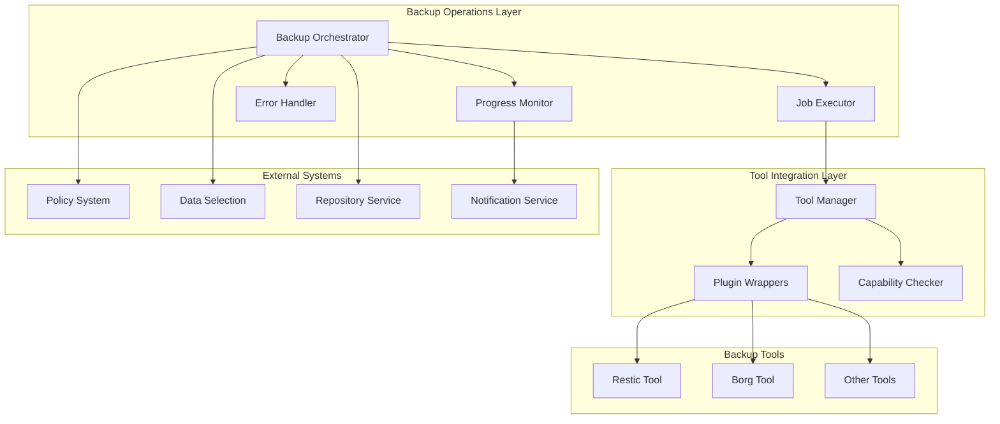
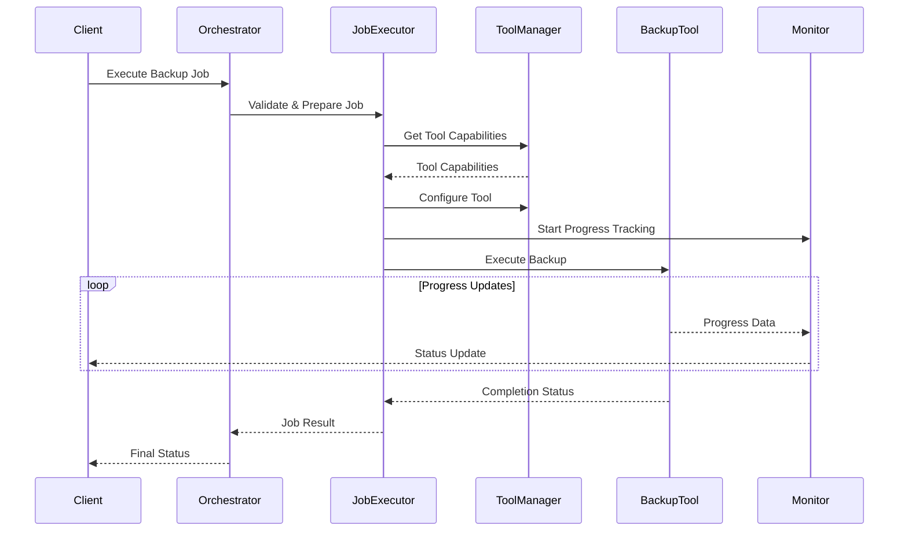
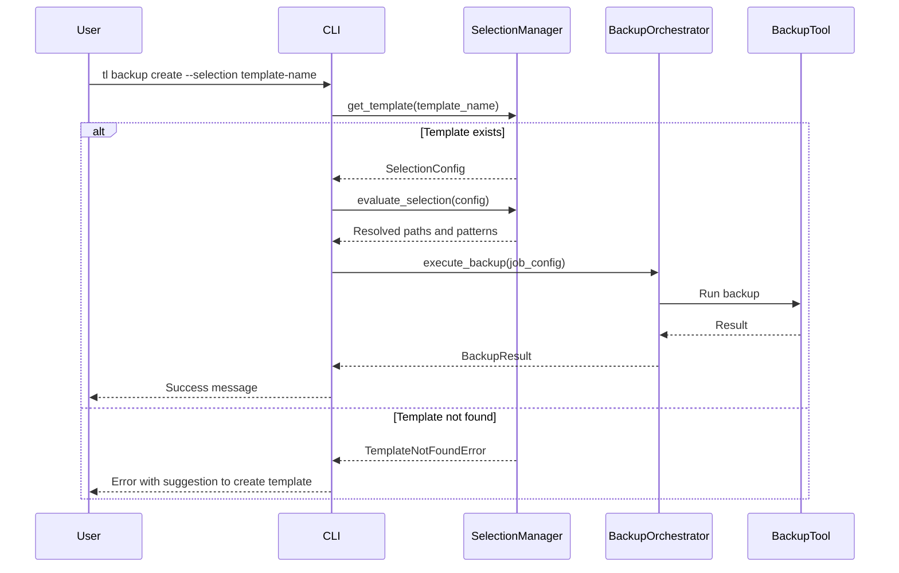

# Backup Operations Design Document

## Overview

The Backup Operations feature serves as the orchestration layer for executing backup jobs across different backup tools and storage backends. This system coordinates backup tool execution, monitors progress, handles errors, and ensures reliable data protection through integration with backup engines like Restic, Borg, and others.

The design focuses on providing a unified interface for backup execution while leveraging the native capabilities of underlying backup tools. Where tools lack certain features, plugin wrappers provide consistent functionality or clearly indicate limitations.

### Key Design Principles

- **Tool Agnostic**: Support multiple backup engines through a common interface
- **Capability Aware**: Leverage native tool features and supplement with plugins where needed
- **Resilient Execution**: Implement robust error handling and retry mechanisms
- **Performance Optimized**: Utilize parallel processing and tool-specific optimizations
- **Integration Focused**: Seamlessly integrate with Policy Management and Data Selection systems

## Architecture

### High-Level Architecture



### Component Interaction Flow



## Components and Interfaces

### Backup Orchestrator

The central component that coordinates backup job execution and integrates with external systems.

```python
class BackupOrchestrator:
    """
    Orchestrates backup job execution across different backup tools.
    
    Responsibilities:
    - Job validation and preparation
    - Integration with Policy Management and Data Selection
    - Error handling and retry coordination
    - Progress monitoring coordination
    """
    
    def execute_backup_job(self, job_config: BackupJobConfig) -> BackupResult:
        """Execute a backup job with full orchestration."""
        
    def validate_job_configuration(self, job_config: BackupJobConfig) -> ValidationResult:
        """Validate job configuration against tool capabilities."""
        
    def get_execution_status(self, job_id: str) -> ExecutionStatus:
        """Get current status of running backup job."""
```

### Job Executor

Handles the actual execution of backup operations with retry logic and error handling.

```python
class JobExecutor:
    """
    Executes backup jobs with retry logic and error handling.
    
    Responsibilities:
    - Direct backup tool execution
    - Retry logic implementation
    - Error classification and handling
    - Resource management
    """
    
    def execute_with_retry(self, job: BackupJob, max_retries: int = 3) -> ExecutionResult:
        """Execute backup job with configurable retry logic."""
        
    def handle_execution_error(self, error: BackupError, attempt: int) -> RetryDecision:
        """Determine retry strategy based on error type and attempt count."""
```

### Tool Manager

Manages backup tool integration and capability detection.

```python
class ToolManager:
    """
    Manages backup tool integration and capabilities.
    
    Responsibilities:
    - Tool capability detection and reporting
    - Tool configuration and optimization
    - Plugin wrapper coordination
    - Performance optimization
    """
    
    def get_tool_capabilities(self, tool_type: str) -> ToolCapabilities:
        """Get comprehensive capability information for a backup tool."""
        
    def configure_tool_for_job(self, tool: BackupTool, job: BackupJob) -> ToolConfiguration:
        """Configure backup tool for optimal job execution."""
        
    def get_supported_tools(self) -> List[ToolInfo]:
        """Get list of all supported backup tools with capability summaries."""
```

### Plugin Wrapper System

Provides consistent interfaces and fills capability gaps for different backup tools.

```python
class PluginWrapper:
    """
    Base class for backup tool plugin wrappers.
    
    Responsibilities:
    - Standardize tool interfaces
    - Provide missing capabilities where possible
    - Translate between TimeLocker and tool-specific formats
    """
    
    def execute_backup(self, config: BackupConfig) -> BackupResult:
        """Execute backup using wrapped tool with standardized interface."""
        
    def get_native_capabilities(self) -> Set[Capability]:
        """Get capabilities natively supported by the tool."""
        
    def get_wrapper_capabilities(self) -> Set[Capability]:
        """Get capabilities provided by the wrapper."""
```

### Progress Monitor

Tracks and reports backup execution progress in real-time.

```python
class ProgressMonitor:
    """
    Monitors and reports backup execution progress.
    
    Responsibilities:
    - Real-time progress tracking
    - Performance metrics collection
    - Status reporting and notifications
    - Progress estimation
    """
    
    def start_monitoring(self, job_id: str, estimated_size: int) -> None:
        """Start monitoring progress for a backup job."""
        
    def update_progress(self, job_id: str, progress_data: ProgressData) -> None:
        """Update progress information for active job."""
        
    def get_progress_report(self, job_id: str) -> ProgressReport:
        """Get comprehensive progress report for job."""
```

### Backup CLI Handler

Provides CLI-specific integration with data selection and backup orchestration.

```python
class BackupCLIHandler:
    """
    Handles CLI commands for backup operations with data selection integration.
    
    Responsibilities:
    - Selection template resolution and validation
    - CLI parameter translation to backup job configuration
    - User-friendly error handling and messaging
    - Help text generation and consistency
    """
    
    def __init__(
        self, 
        selection_manager: SelectionManager,
        backup_orchestrator: BackupOrchestrator
    ):
        """Initialize CLI handler with required services."""
        
    def execute_backup_with_selection(
        self,
        selection_name: str,
        repository: str,
        **cli_options
    ) -> BackupResult:
        """Execute backup using a named data selection template."""
        
    def validate_selection_exists(self, selection_name: str) -> bool:
        """Check if a selection template exists."""
        
    def get_selection_summary(self, selection_name: str) -> str:
        """Get human-readable summary of selection template."""
```

## Data Models

### Core Data Structures

```python
@dataclass
class BackupJobConfig:
    """Configuration for a backup job execution."""
    job_id: str
    policy_id: str
    repository_id: str
    data_selection_id: str
    tool_type: str
    execution_mode: ExecutionMode
    retry_config: RetryConfig
    notification_config: NotificationConfig

@dataclass
class BackupJob:
    """Runtime representation of a backup job."""
    config: BackupJobConfig
    source_paths: List[Path]
    exclude_patterns: List[str]
    tool_configuration: ToolConfiguration
    execution_context: ExecutionContext

@dataclass
class BackupResult:
    """Result of backup job execution."""
    job_id: str
    status: BackupStatus
    snapshot_id: Optional[str]
    files_processed: int
    bytes_transferred: int
    duration: timedelta
    errors: List[BackupError]
    warnings: List[BackupWarning]

@dataclass
class ToolCapabilities:
    """Comprehensive capability information for a backup tool."""
    tool_name: str
    version: str
    native_features: Set[Feature]
    wrapper_features: Set[Feature]
    limitations: List[Limitation]
    performance_characteristics: PerformanceProfile
```

### Execution States

```python
class BackupStatus(Enum):
    """Backup job execution status."""
    PENDING = "pending"
    VALIDATING = "validating"
    PREPARING = "preparing"
    RUNNING = "running"
    RETRYING = "retrying"
    COMPLETED = "completed"
    FAILED = "failed"
    CANCELLED = "cancelled"

class ExecutionMode(Enum):
    """Backup execution mode."""
    ON_DEMAND = "on_demand"
    SCHEDULED = "scheduled"
    MANUAL_RETRY = "manual_retry"
```

## Error Handling

### Error Classification and Recovery

The system implements a comprehensive error handling strategy with automatic recovery mechanisms:

#### Error Categories

1. **Transient Errors**: Network timeouts, temporary file locks, resource unavailability
   - **Strategy**: Automatic retry with exponential backoff
   - **Max Retries**: 3 attempts with 2^n second delays

2. **Configuration Errors**: Invalid paths, missing credentials, tool misconfiguration
   - **Strategy**: Immediate failure with detailed diagnostics
   - **Recovery**: Manual intervention required

3. **Tool-Specific Errors**: Backup tool crashes, corrupted repositories, version incompatibilities
   - **Strategy**: Tool-specific recovery procedures
   - **Fallback**: Alternative tool recommendation if available

4. **Resource Errors**: Insufficient disk space, memory limitations, permission issues
   - **Strategy**: Resource optimization and graceful degradation
   - **Monitoring**: Proactive resource usage tracking

#### Retry Logic Implementation

```python
class RetryHandler:
    """Handles retry logic for backup operations."""
    
    def should_retry(self, error: BackupError, attempt: int) -> bool:
        """Determine if operation should be retried based on error type and attempt count."""
        
    def calculate_delay(self, attempt: int, base_delay: int = 2) -> int:
        """Calculate exponential backoff delay for retry attempts."""
        
    def handle_final_failure(self, job: BackupJob, errors: List[BackupError]) -> FailureReport:
        """Handle final failure after all retry attempts exhausted."""
```

### Error Recovery Strategies

- **Partial Backup Recovery**: Continue with accessible files when some files are inaccessible
- **Network Resilience**: Resume interrupted transfers where backup tools support it
- **Repository Validation**: Verify repository integrity before and after operations
- **Graceful Degradation**: Reduce parallelism or feature usage when encountering resource constraints

## Testing Strategy

### Unit Testing Approach

1. **Component Isolation**: Test each component independently with mocked dependencies
2. **Error Simulation**: Comprehensive testing of error conditions and recovery paths
3. **Capability Testing**: Verify tool capability detection and wrapper functionality
4. **Performance Testing**: Validate optimization algorithms and resource usage

### Integration Testing Strategy

1. **Tool Integration**: Test with actual backup tools in controlled environments
2. **End-to-End Workflows**: Complete backup job execution from start to finish
3. **Cross-System Integration**: Verify integration with Policy Management and Data Selection
4. **Failure Scenarios**: Test complex failure and recovery scenarios

### Test Environment Requirements

- **Multiple Backup Tools**: Restic, Borg, and mock tools for testing
- **Various Storage Backends**: Local, S3-compatible, and network storage
- **Controlled Failure Injection**: Network interruptions, disk space limitations, permission issues
- **Performance Monitoring**: Resource usage and timing measurements

## Performance Considerations

### Optimization Strategies

#### Parallel Processing Optimization

The system leverages backup tool capabilities for parallel processing:

```python
class ParallelizationOptimizer:
    """Optimizes parallel processing based on tool capabilities and system resources."""
    
    def calculate_optimal_parallelism(self, tool: BackupTool, system_resources: SystemResources) -> int:
        """Calculate optimal number of parallel operations."""
        
    def monitor_performance_impact(self, job_id: str) -> PerformanceMetrics:
        """Monitor performance impact of parallelization settings."""
```

#### Resource Management

- **Memory Usage**: Monitor and limit memory consumption during large backup operations
- **CPU Utilization**: Balance backup tool CPU usage with system responsiveness
- **I/O Optimization**: Optimize disk and network I/O patterns for backup tools
- **Bandwidth Management**: Respect network bandwidth limits and QoS requirements

### Performance Monitoring

The system provides comprehensive performance monitoring:

- **Throughput Metrics**: Files per second, bytes per second transfer rates
- **Resource Utilization**: CPU, memory, disk, and network usage tracking
- **Tool Comparison**: Performance comparison between different backup tools
- **Bottleneck Identification**: Automatic identification of performance bottlenecks

## Security Considerations

### Credential Management

- **Secure Storage**: Integration with credential management system for repository access
- **Credential Rotation**: Support for credential updates without service interruption
- **Access Control**: Role-based access control for backup job execution
- **Audit Logging**: Comprehensive logging of all backup operations and access attempts

### Data Protection

- **In-Transit Encryption**: Ensure all data transfers use appropriate encryption
- **Integrity Verification**: Leverage backup tool integrity checking capabilities
- **Secure Temporary Storage**: Protect temporary files during backup operations
- **Log Sanitization**: Prevent sensitive information leakage in logs and error messages

## Integration Points

### Policy Management Integration

The Backup Operations system integrates with Policy Management to:

- **Retrieve Policies**: Get backup policies and their configurations
- **Validate Compatibility**: Ensure policies are compatible with selected backup tools
- **Apply Retention**: Coordinate with retention policy enforcement
- **Report Compliance**: Provide execution data for policy compliance reporting

### Data Selection Integration

Integration with Data Selection system provides:

- **Selection Rules**: Retrieve and apply file selection configurations
- **Rule Translation**: Convert selection rules to tool-specific include/exclude patterns
- **Validation**: Verify selection rules are compatible with backup tool capabilities
- **Dynamic Updates**: Handle changes to selection rules during backup execution

### Repository Service Integration

Coordination with Repository Service includes:

- **Repository Validation**: Verify repository accessibility and configuration
- **Capacity Management**: Check available storage capacity before backup execution
- **Connection Management**: Manage repository connections and authentication
- **Health Monitoring**: Monitor repository health and performance

### CLI Integration with Data Selection

The backup CLI commands integrate with the Data Selection system to provide a seamless user experience:

#### Selection Template Resolution

```python
class BackupCLIHandler:
    """
    Handles CLI-specific backup operations with data selection integration.
    
    Responsibilities:
    - Resolve selection template names to configurations
    - Translate selection rules to backup parameters
    - Provide user-friendly error messages
    - Deprecate backup target references
    """
    
    def resolve_selection_template(self, template_name: str) -> SelectionConfig:
        """Resolve a selection template name to its configuration."""
        
    def create_backup_from_selection(
        self, 
        template_name: str, 
        repository: str,
        **options
    ) -> BackupResult:
        """Execute backup using a data selection template."""
```

#### Command Flow



#### Help System Integration

The CLI help system provides accurate, up-to-date information:

- **Dynamic Help Generation**: Help text is generated from actual command definitions
- **Example Integration**: Help includes working examples using data selection templates
- **Deprecation Warnings**: Old features show deprecation notices with migration guidance
- **Consistent Terminology**: All help text uses "data selection templates" not "backup targets"

## Future Enhancements

### Planned Improvements

1. **Advanced Scheduling**: Integration with more sophisticated scheduling systems
2. **Machine Learning Optimization**: AI-driven performance optimization and failure prediction
3. **Cloud-Native Features**: Enhanced support for cloud-native backup tools and services
4. **Real-Time Analytics**: Advanced analytics and reporting capabilities
5. **Multi-Site Coordination**: Support for coordinated backups across multiple sites

### Extensibility Design

The architecture supports future enhancements through:

- **Plugin Architecture**: Easy addition of new backup tool support
- **Event-Driven Design**: Extensible event system for monitoring and integration
- **Configuration Framework**: Flexible configuration system for new features
- **API Versioning**: Backward-compatible API evolution strategy