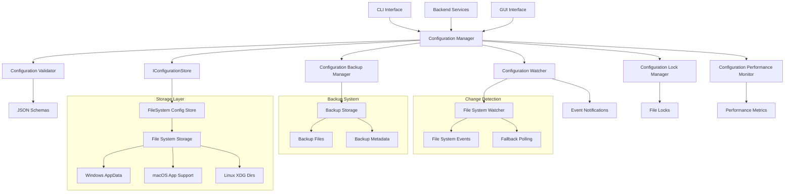
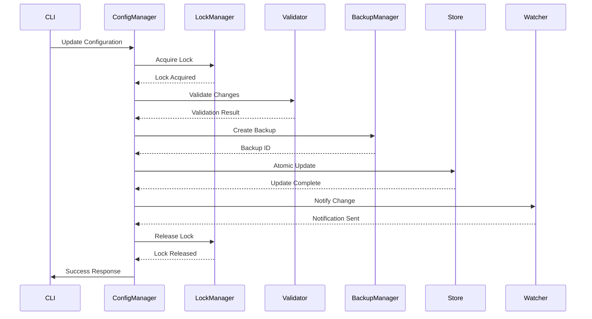

# Design Document

## Overview

The Configuration Management system provides centralized, schema-based configuration handling for all TimeLocker components. The design emphasizes simplicity, reliability, and cross-platform compatibility while providing atomic updates, validation, and migration capabilities. The system serves as the foundation for consistent configuration across CLI, services, and future GUI components.

## Architecture

### High-Level Architecture



### Component Interaction



## Components and Interfaces

### Configuration Manager

**Purpose**: Central coordinator for all configuration operations with atomic updates, validation, and transaction support.

**Interface**:
```python
class ConfigurationManager:
    # Core configuration operations
    def get_config(self, section: str, key: Optional[str] = None) -> Any
    def set_config(self, section: str, key: str, value: Any) -> bool
    def validate_config(self, config: Dict[str, Any]) -> ValidationResult
    
    # Atomic operations and transactions
    def atomic_update(self, updates: Dict[str, Any]) -> bool
    def begin_transaction(self) -> str
    def commit_transaction(self, transaction_id: str) -> bool
    def rollback_transaction(self, transaction_id: str) -> bool
    
    # Enhanced backup operations
    def create_backup(self, reason: str = "manual") -> str
    def list_backups(self) -> List[Dict[str, Any]]
    def restore_backup(self, backup_id: str) -> bool
    def compare_with_backup(self, backup_id: str) -> Dict[str, Any]
    
    # Configuration locking
    def acquire_lock(self, timeout: int = 30) -> bool
    def release_lock(self) -> None
    def is_locked(self) -> bool
    
    # Change notifications
    def watch_config(self, section: str, callback: Callable) -> str
    def unwatch_config(self, watch_id: str) -> None
```

### Configuration Store Interface

**Purpose**: Abstraction for configuration storage backends with atomic operations and locking.

**Interface**:
```python
class IConfigurationStore:
    def read_section(self, section: str) -> Dict[str, Any]
    def write_section(self, section: str, data: Dict[str, Any]) -> bool
    def atomic_update(self, updates: Dict[str, Dict[str, Any]]) -> bool
    def list_sections(self) -> List[str]
    def create_backup(self) -> str
    def restore_backup(self, backup_id: str) -> bool
    def acquire_lock(self, timeout: int = 30) -> bool
    def release_lock(self) -> None
```

### File System Configuration Store

**Purpose**: File-based implementation of configuration storage with JSON format.

**Interface**:
```python
class FileSystemConfigurationStore(IConfigurationStore):
    def __init__(self, config_path: Path, backup_dir: Path)
    def read_section(self, section: str) -> Dict[str, Any]
    def write_section(self, section: str, data: Dict[str, Any]) -> bool
    def atomic_update(self, updates: Dict[str, Dict[str, Any]]) -> bool
    def list_sections(self) -> List[str]
    def create_backup(self) -> str
    def restore_backup(self, backup_id: str) -> bool
    def acquire_lock(self, timeout: int = 30) -> bool
    def release_lock(self) -> None
```

### Configuration Watcher

**Purpose**: Monitors configuration changes and provides event notifications to subscribers.

**Interface**:
```python
class ConfigurationWatcher:
    def watch_section(self, section: str, callback: Callable) -> str
    def watch_key(self, key: str, callback: Callable) -> str
    def unwatch(self, watch_id: str) -> None
    def start_watching(self) -> None
    def stop_watching(self) -> None
    def get_change_history(self, limit: int = 100) -> List[Dict[str, Any]]
```

### Configuration Lock Manager

**Purpose**: Provides cross-platform file locking for configuration operations.

**Interface**:
```python
class ConfigurationLockManager:
    def acquire_lock(self, lock_path: Path, timeout: int = 30) -> bool
    def release_lock(self, lock_path: Path) -> None
    def is_locked(self, lock_path: Path) -> bool
    def cleanup_stale_locks(self, max_age: int = 300) -> int
```

### Configuration Backup Manager

**Purpose**: Enhanced backup management with metadata, comparison, and selective restoration.

**Interface**:
```python
class ConfigurationBackupManager:
    def create_backup(self, config: Dict[str, Any], reason: str) -> str
    def list_backups(self) -> List[Dict[str, Any]]
    def restore_backup(self, backup_id: str) -> Dict[str, Any]
    def compare_backups(self, backup_id1: str, backup_id2: str) -> Dict[str, Any]
    def restore_section(self, backup_id: str, section: str) -> Dict[str, Any]
    def cleanup_old_backups(self, keep_count: int = 5) -> int
    def validate_backup(self, backup_id: str) -> ValidationResult
```

### Configuration Performance Monitor

**Purpose**: Monitors configuration system performance and provides optimization recommendations.

**Interface**:
```python
class ConfigurationPerformanceMonitor:
    def track_operation(self, operation: str, duration: float) -> None
    def get_performance_metrics(self) -> Dict[str, Any]
    def optimize_cache(self) -> None
    def get_cache_statistics(self) -> Dict[str, Any]
    def get_recommendations(self) -> List[str]
```

## Data Models

### Configuration Schema

```python
@dataclass
class ConfigurationSchema:
    section: str
    version: str
    properties: Dict[str, PropertySchema]
    required: List[str]
    dependencies: Dict[str, List[str]]
    migration_rules: Optional[Dict[str, Any]] = None
```

### Configuration Entry

```python
@dataclass
class ConfigurationEntry:
    section: str
    key: str
    value: Any
    schema_version: str
    created_at: datetime
    modified_at: datetime
    source: str = "user"  # user, system, migration, default
    locked: bool = False
```

### Configuration Backup Metadata

```python
@dataclass
class ConfigurationBackup:
    backup_id: str
    created_at: datetime
    reason: str
    size_bytes: int
    sections: List[str]
    validation_status: str
    checksum: str
    retention_policy: str
```

### Configuration Change Event

```python
@dataclass
class ConfigurationChangeEvent:
    event_id: str
    timestamp: datetime
    section: str
    key: Optional[str]
    old_value: Any
    new_value: Any
    source: str
    user_context: Optional[str]
    transaction_id: Optional[str]
```

### Configuration Lock

```python
@dataclass
class ConfigurationLock:
    lock_id: str
    acquired_at: datetime
    expires_at: datetime
    process_id: int
    operation: str
    sections: List[str]
```

### Configuration Performance Metrics

```python
@dataclass
class ConfigurationMetrics:
    operation_counts: Dict[str, int]
    average_response_times: Dict[str, float]
    cache_hit_ratio: float
    error_counts: Dict[str, int]
    lock_contention_count: int
    backup_success_rate: float
```

## Error Handling and Recovery

### Error Categories

1. **Validation Errors**: Schema violations, constraint failures, dependency conflicts
2. **Storage Errors**: File system issues, permission problems, disk space limitations
3. **Locking Errors**: Lock acquisition failures, timeout conditions, stale lock detection
4. **Backup Errors**: Backup creation failures, restoration issues, corruption detection
5. **Migration Errors**: Legacy format issues, version compatibility problems

### Recovery Strategies

```python
class ConfigurationErrorHandler:
    def handle_validation_error(self, error: ValidationError) -> RecoveryAction
    def handle_storage_error(self, error: StorageError) -> RecoveryAction
    def handle_lock_error(self, error: LockError) -> RecoveryAction
    def handle_backup_error(self, error: BackupError) -> RecoveryAction
    def handle_migration_error(self, error: MigrationError) -> RecoveryAction
```

### Rollback Mechanisms

- **Transaction Rollback**: Automatic rollback of failed atomic operations
- **Backup Restoration**: Quick recovery from known good states
- **Partial Recovery**: Section-level restoration for targeted fixes
- **Lock Recovery**: Automatic cleanup of stale locks with process validation

## Performance Considerations

### Caching Strategy

- **Memory Cache**: Frequently accessed configuration sections
- **Cache Invalidation**: Event-driven cache updates on configuration changes
- **Lazy Loading**: On-demand loading of large configuration sections
- **Cache Warming**: Preloading critical configuration on startup

### Optimization Techniques

- **Incremental Validation**: Validate only changed sections
- **Batch Operations**: Group multiple configuration changes
- **Compression**: Compress large configuration files and backups
- **Index Files**: Fast lookup for large configuration structures

## Security Architecture

### Access Control

- **File Permissions**: Platform-appropriate file system permissions
- **Process Isolation**: Separate configuration access by process context
- **Audit Logging**: Comprehensive logging of all configuration access and modifications

### Data Protection

- **Encryption at Rest**: Sensitive configuration values encrypted using Security Services
- **Integrity Verification**: Configuration signing and checksum validation
- **Secure Transmission**: Encrypted communication for remote configuration access

## Testing Strategy

### Unit Testing

- **Component Isolation**: Test each component independently with mocks
- **Error Simulation**: Test error conditions and recovery mechanisms
- **Performance Testing**: Validate performance requirements under load
- **Cross-Platform Testing**: Ensure consistent behavior across operating systems

### Integration Testing

- **End-to-End Workflows**: Test complete configuration management scenarios
- **Concurrency Testing**: Validate locking and atomic operations under concurrent access
- **Migration Testing**: Test legacy configuration migration scenarios
- **Backup/Restore Testing**: Validate backup creation and restoration processes

### Test Organization

Following the project's testing conventions:

- Unit tests: `tests/TimeLocker/config/test_*.py`
- Integration tests: `tests/TimeLocker/integration/test_configuration_*.py`
- Performance tests: `tests/TimeLocker/performance/test_config_performance.py`
- Cross-platform tests: `tests/TimeLocker/platform/test_config_platform.py`