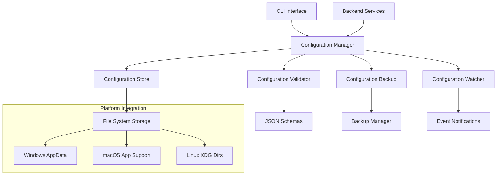
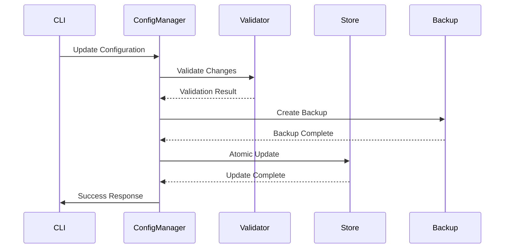

# Design Document

## Overview

The Configuration Management system provides centralized, schema-based configuration handling for all TimeLocker components. The design emphasizes simplicity, reliability, and cross-platform compatibility while providing atomic updates, validation, and migration capabilities. The system serves as the foundation for consistent configuration across CLI, services, and future GUI components.

## Architecture

### High-Level Architecture



### Component Interaction



## Components and Interfaces

### Configuration Manager

**Purpose**: Central coordinator for all configuration operations with atomic updates and validation.

**Interface**:
```python
class ConfigurationManager:
    def get_config(self, section: str, key: Optional[str] = None) -> Any
    def set_config(self, section: str, key: str, value: Any) -> bool
    def validate_config(self, config: Dict[str, Any]) -> ValidationResult
    def backup_config(self) -> str
    def restore_config(self, backup_id: str) -> bool
    def watch_config(self, section: str, callback: Callable) -> str
    def unwatch_config(self, watch_id: str) -> None
```

### Configuration Store

**Purpose**: Platform-appropriate persistent storage with atomic operations.

**Interface**:
```python
class ConfigurationStore:
    def read_section(self, section: str) -> Dict[str, Any]
    def write_section(self, section: str, data: Dict[str, Any]) -> bool
    def atomic_update(self, updates: Dict[str, Dict[str, Any]]) -> bool
    def list_sections(self) -> List[str]
    def backup_store(self) -> str
    def restore_store(self, backup_path: str) -> bool
```

## Data Models

### Configuration Schema

```python
@dataclass
class ConfigurationSchema:
    section: str
    version: str
    properties: Dict[str, PropertySchema]
    required: List[str]
    dependencies: Dict[str, List[str]]
```

### Configuration Entry

```python
@dataclass
class ConfigurationEntry:
    section: str
    key: str
    value: Any
    schema_version: str
    created_at: datetime
    modified_at: datetime
```

## Error Handling

The system implements comprehensive error handling with rollback capabilities and detailed error reporting for configuration operations.

## Testing Strategy

Focus on atomic operations, cross-platform compatibility, and schema validation with comprehensive unit and integration tests.