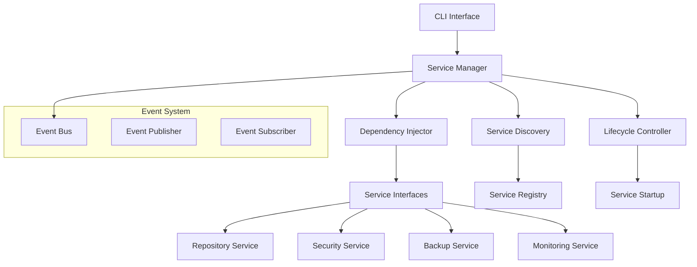
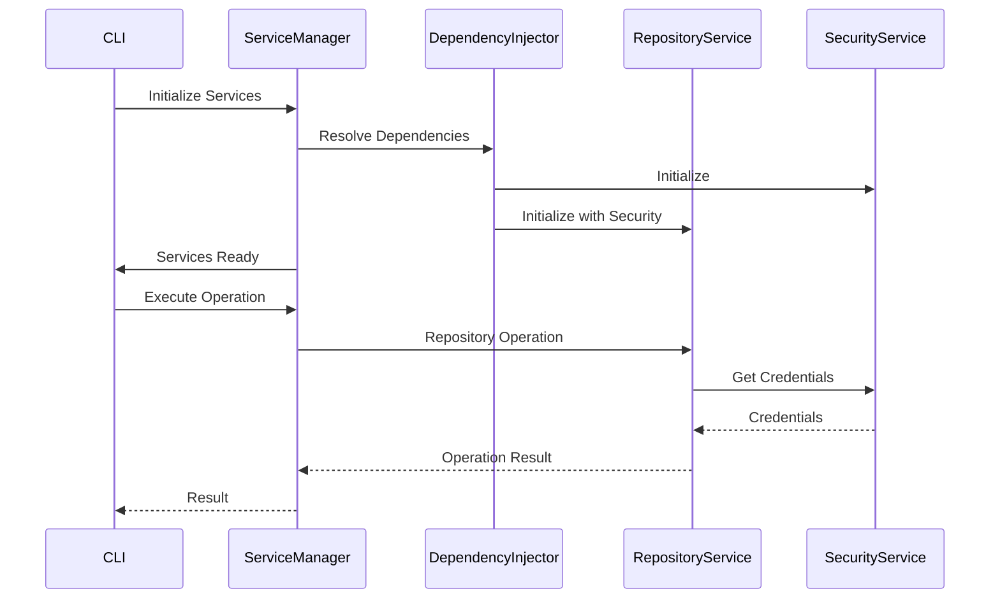

# Design Document

## Overview

The Integration Architecture provides the service communication foundation for TimeLocker, enabling CLI orchestration of backend services through well-defined interfaces, dependency injection, and event-driven communication. The design emphasizes simplicity, reliability, and maintainability suitable for desktop applications while providing the flexibility needed for future enhancements.

## Architecture

### High-Level Architecture



### Service Communication Flow



## Components and Interfaces

### Service Manager

**Purpose**: Central orchestrator for service lifecycle and communication.

**Interface**:
```python
class ServiceManager:
    def initialize_services(self) -> bool
    def get_service(self, service_type: Type[T]) -> T
    def shutdown_services(self) -> None
    def health_check(self) -> Dict[str, bool]
    def publish_event(self, event: Event) -> None
    def subscribe_event(self, event_type: str, handler: Callable) -> str
```

### Service Interface Base

**Purpose**: Standard interface contract for all services.

**Interface**:
```python
class ServiceInterface:
    def initialize(self, context: ServiceContext) -> bool
    def shutdown(self) -> None
    def health_check(self) -> bool
    def get_capabilities(self) -> List[str]
```

### Dependency Injector

**Purpose**: Manages service dependencies and initialization order.

**Interface**:
```python
class DependencyInjector:
    def register_service(self, service_type: Type, implementation: Type) -> None
    def resolve_dependencies(self) -> Dict[Type, Any]
    def get_dependency_order(self) -> List[Type]
```

## Data Models

### Service Context

```python
@dataclass
class ServiceContext:
    config_manager: ConfigurationManager
    event_bus: EventBus
    service_registry: ServiceRegistry
    user_context: Optional[UserContext]
```

### Event

```python
@dataclass
class Event:
    event_type: str
    source: str
    timestamp: datetime
    data: Dict[str, Any]
    correlation_id: Optional[str]
```

## Error Handling

Implements structured error propagation with context preservation and recovery mechanisms for service communication failures.

## Testing Strategy

Focus on service integration, dependency resolution, and error propagation with comprehensive mocking and integration test capabilities.