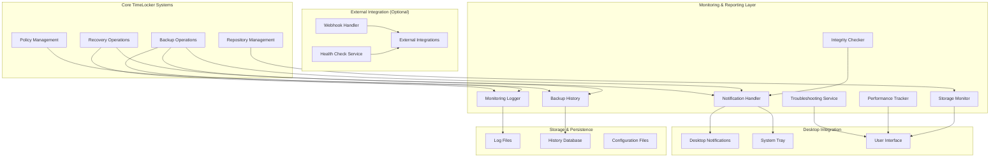
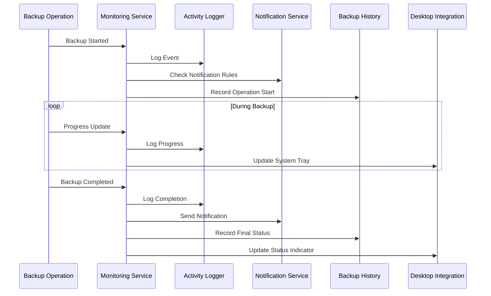

# Monitoring & Reporting Design Document

## Overview

The Monitoring & Reporting feature provides essential operational visibility for the TimeLocker desktop backup application. This system delivers user-friendly monitoring capabilities including activity logging, desktop notifications, backup history tracking, storage monitoring, and basic troubleshooting support.

The design focuses on simplicity and usability appropriate for desktop users while providing optional integration capabilities for power users who want to connect to external monitoring services.

### Key Design Principles

- **User-Centric**: Prioritize user-friendly interfaces and clear, actionable information
- **Desktop Integration**: Seamless integration with desktop notification systems and system tray
- **Performance Aware**: Lightweight monitoring that doesn't impact backup performance
- **Extensible**: Support optional integrations while maintaining core simplicity
- **Reliable**: Monitoring system failures should not affect backup operations

## Architecture

### High-Level Architecture



### Component Interaction Flow



## Components and Interfaces

### Monitoring Service (Core Orchestrator)

The central component that coordinates all monitoring activities and integrates with TimeLocker systems.

```python
class MonitoringService:
    """
    Central monitoring service that coordinates all monitoring activities.
    
    Responsibilities:
    - Event collection and distribution
    - Integration with core TimeLocker systems
    - Coordination of monitoring components
    - Health status management
    """
    
    def __init__(self, config_dir: Path):
        self.logger = ActivityLogger(config_dir)
        self.notifier = NotificationService(config_dir)
        self.history = BackupHistory(config_dir)
        self.storage_monitor = StorageMonitor()
        self.integrity_checker = IntegrityChecker()
        self.performance_tracker = PerformanceTracker()
        self.troubleshooter = TroubleshootingService()
    
    def handle_backup_event(self, event: BackupEvent) -> None:
        """Handle backup-related events from backup operations."""
        
    def handle_recovery_event(self, event: RecoveryEvent) -> None:
        """Handle recovery-related events from recovery operations."""
        
    def get_system_health(self) -> HealthStatus:
        """Get overall system health status."""
        
    def get_monitoring_summary(self) -> MonitoringSummary:
        """Get comprehensive monitoring summary for UI display."""
```

### Activity Logger

Handles all logging activities with user-friendly formatting and automatic log management.

```python
class ActivityLogger:
    """
    Manages activity logging with user-friendly formatting.
    
    Responsibilities:
    - Structured logging with readable format
    - Automatic log rotation and cleanup
    - Configurable log levels
    - Error context and troubleshooting information
    """
    
    def __init__(self, config_dir: Path):
        self.log_dir = config_dir / "logs"
        self.current_log = self.log_dir / "timelocker.log"
        self.max_log_size = 10 * 1024 * 1024  # 10MB
        self.max_log_files = 5
        
    def log_backup_event(self, event: BackupEvent) -> None:
        """Log backup-related events with appropriate detail level."""
        
    def log_error(self, error: Exception, context: Dict[str, Any]) -> None:
        """Log errors with context and troubleshooting suggestions."""
        
    def set_log_level(self, level: LogLevel) -> None:
        """Set logging level (info, warning, error)."""
        
    def get_recent_logs(self, hours: int = 24) -> List[LogEntry]:
        """Get recent log entries for troubleshooting."""
```

### Notification Service (Enhanced)

Extended notification service with desktop integration and user preferences.

```python
class NotificationService:
    """
    Enhanced notification service with desktop integration.
    
    Responsibilities:
    - Desktop notifications with system integration
    - System tray status indicators
    - Optional email notifications
    - User preference management
    - Notification history tracking
    """
    
    def __init__(self, config_dir: Path):
        self.config_dir = config_dir
        self.config = self._load_notification_config()
        self.system_tray = SystemTrayIntegration()
        
    def notify_backup_result(self, result: BackupResult) -> None:
        """Send notification for backup completion."""
        
    def update_system_tray_status(self, status: SystemStatus) -> None:
        """Update system tray icon and tooltip."""
        
    def send_desktop_notification(self, title: str, message: str, level: NotificationLevel) -> None:
        """Send desktop notification with appropriate urgency."""
        
    def configure_notifications(self, preferences: NotificationPreferences) -> None:
        """Update notification preferences."""
```

### Backup History

Maintains a searchable history of backup operations with performance metrics.

```python
class BackupHistory:
    """
    Maintains searchable backup operation history.
    
    Responsibilities:
    - Operation history storage and retrieval
    - Performance metrics tracking
    - History search and filtering
    - Export capabilities for user records
    """
    
    def __init__(self, config_dir: Path):
        self.history_db = config_dir / "history.db"
        self.retention_days = 90
        
    def record_backup_operation(self, operation: BackupOperation) -> None:
        """Record completed backup operation in history."""
        
    def get_backup_history(self, filters: HistoryFilters) -> List[BackupRecord]:
        """Get filtered backup history."""
        
    def export_history(self, format: ExportFormat, date_range: DateRange) -> Path:
        """Export backup history to CSV or other formats."""
        
    def get_performance_trends(self, days: int = 30) -> PerformanceTrends:
        """Get performance trends over specified period."""
```

### Storage Monitor

Tracks storage usage across repositories with capacity planning support.

```python
class StorageMonitor:
    """
    Monitors storage usage across all repositories.
    
    Responsibilities:
    - Repository storage usage tracking
    - Capacity warnings and recommendations
    - Growth trend analysis
    - Deduplication and compression reporting
    """
    
    def __init__(self):
        self.usage_cache = {}
        self.cache_ttl = 300  # 5 minutes
        
    def get_repository_usage(self, repository_id: str) -> StorageUsage:
        """Get current storage usage for repository."""
        
    def check_capacity_warnings(self) -> List[CapacityWarning]:
        """Check for repositories approaching capacity limits."""
        
    def get_storage_trends(self, repository_id: str, days: int = 30) -> StorageTrends:
        """Get storage growth trends for repository."""
        
    def get_optimization_recommendations(self, repository_id: str) -> List[OptimizationRecommendation]:
        """Get storage optimization recommendations."""
```

### Integrity Checker

Manages backup integrity verification with user-friendly reporting.

```python
class IntegrityChecker:
    """
    Manages backup integrity verification.
    
    Responsibilities:
    - Periodic integrity checks using backup tool capabilities
    - Integrity status tracking and reporting
    - User-initiated verification support
    - Clear guidance for integrity issues
    """
    
    def __init__(self):
        self.check_history = {}
        self.default_interval = timedelta(days=1)
        
    def schedule_integrity_check(self, repository_id: str, interval: timedelta) -> None:
        """Schedule periodic integrity checks for repository."""
        
    def run_integrity_check(self, repository_id: str) -> IntegrityResult:
        """Run integrity check for specific repository."""
        
    def get_integrity_status(self, repository_id: str) -> IntegrityStatus:
        """Get current integrity status for repository."""
        
    def get_remediation_guidance(self, issues: List[IntegrityIssue]) -> RemediationGuide:
        """Get user-friendly guidance for integrity issues."""
```

### Performance Tracker

Tracks backup performance with simple metrics and recommendations.

```python
class PerformanceTracker:
    """
    Tracks backup performance with user-friendly metrics.
    
    Responsibilities:
    - Basic performance metrics collection
    - Performance trend analysis
    - Simple optimization recommendations
    - Performance comparison across operations
    """
    
    def __init__(self):
        self.metrics_history = {}
        
    def record_performance_metrics(self, operation_id: str, metrics: PerformanceMetrics) -> None:
        """Record performance metrics for backup operation."""
        
    def get_performance_summary(self, repository_id: str) -> PerformanceSummary:
        """Get performance summary for repository."""
        
    def get_optimization_suggestions(self, recent_performance: List[PerformanceMetrics]) -> List[OptimizationSuggestion]:
        """Get simple optimization suggestions based on recent performance."""
        
    def compare_performance(self, operation1_id: str, operation2_id: str) -> PerformanceComparison:
        """Compare performance between two operations."""
```

### Troubleshooting Service

Provides event correlation and troubleshooting guidance for users.

```python
class TroubleshootingService:
    """
    Provides event correlation and troubleshooting support.
    
    Responsibilities:
    - Event correlation and pattern analysis
    - Root cause analysis for common issues
    - User-friendly troubleshooting guidance
    - Proactive issue detection and recommendations
    """
    
    def __init__(self):
        self.event_correlator = EventCorrelator()
        self.issue_detector = IssueDetector()
        
    def analyze_backup_failure(self, failure: BackupFailure) -> TroubleshootingReport:
        """Analyze backup failure and provide troubleshooting guidance."""
        
    def correlate_events(self, events: List[SystemEvent]) -> List[EventCorrelation]:
        """Correlate related events to identify patterns."""
        
    def detect_proactive_issues(self) -> List[ProactiveRecommendation]:
        """Detect potential issues before they cause failures."""
        
    def get_troubleshooting_guide(self, issue_type: IssueType) -> TroubleshootingGuide:
        """Get step-by-step troubleshooting guide for issue type."""
```

## Data Models

### Core Data Structures

```python
@dataclass
class BackupEvent:
    """Represents a backup-related event."""
    event_id: str
    event_type: BackupEventType
    timestamp: datetime
    repository_id: str
    operation_id: str
    message: str
    details: Dict[str, Any]
    severity: EventSeverity

@dataclass
class BackupRecord:
    """Historical record of a backup operation."""
    operation_id: str
    repository_id: str
    start_time: datetime
    end_time: datetime
    status: BackupStatus
    files_processed: int
    bytes_transferred: int
    duration: timedelta
    performance_metrics: PerformanceMetrics
    issues: List[BackupIssue]

@dataclass
class StorageUsage:
    """Storage usage information for a repository."""
    repository_id: str
    used_bytes: int
    available_bytes: int
    total_bytes: int
    usage_percentage: float
    deduplication_ratio: Optional[float]
    compression_ratio: Optional[float]
    last_updated: datetime

@dataclass
class IntegrityStatus:
    """Integrity status for a repository."""
    repository_id: str
    last_check: datetime
    status: IntegrityLevel
    issues_found: int
    check_duration: timedelta
    next_scheduled_check: datetime
    
@dataclass
class PerformanceMetrics:
    """Performance metrics for backup operations."""
    throughput_mbps: float
    files_per_second: float
    cpu_usage_percent: float
    memory_usage_mb: float
    network_usage_mbps: Optional[float]
    disk_io_mbps: float
```

### Status and Configuration Enums

```python
class BackupEventType(Enum):
    """Types of backup events."""
    BACKUP_STARTED = "backup_started"
    BACKUP_PROGRESS = "backup_progress"
    BACKUP_COMPLETED = "backup_completed"
    BACKUP_FAILED = "backup_failed"
    INTEGRITY_CHECK = "integrity_check"
    STORAGE_WARNING = "storage_warning"

class EventSeverity(Enum):
    """Event severity levels."""
    INFO = "info"
    WARNING = "warning"
    ERROR = "error"
    CRITICAL = "critical"

class NotificationLevel(Enum):
    """Notification urgency levels."""
    LOW = "low"
    NORMAL = "normal"
    HIGH = "high"
    CRITICAL = "critical"

class IntegrityLevel(Enum):
    """Integrity check result levels."""
    HEALTHY = "healthy"
    WARNING = "warning"
    ERROR = "error"
    UNKNOWN = "unknown"
```

## Desktop Integration

### System Tray Integration

The system tray integration provides always-visible status information:

```python
class SystemTrayIntegration:
    """
    Manages system tray icon and interactions.
    
    Features:
    - Status indicator icons (idle, running, success, error)
    - Tooltip with last backup status
    - Context menu with quick actions
    - Click-to-open main interface
    """
    
    def __init__(self):
        self.tray_icon = self._create_tray_icon()
        self.status_icons = self._load_status_icons()
        
    def update_status(self, status: SystemStatus) -> None:
        """Update tray icon and tooltip based on system status."""
        
    def show_context_menu(self) -> None:
        """Show context menu with quick actions."""
        
    def handle_tray_click(self, click_type: ClickType) -> None:
        """Handle tray icon clicks (single, double, right-click)."""
```

### Desktop Notification Integration

Platform-specific desktop notification integration:

```python
class DesktopNotificationManager:
    """
    Manages platform-specific desktop notifications.
    
    Supports:
    - Linux: notify-send with urgency levels
    - macOS: osascript with sound and persistence
    - Windows: PowerShell with balloon tips
    """
    
    def send_notification(self, notification: DesktopNotification) -> bool:
        """Send platform-appropriate desktop notification."""
        
    def test_notification_system(self) -> NotificationTestResult:
        """Test desktop notification system availability."""
```

## External Integration (Optional)

### Webhook Integration

Simple webhook support for power users:

```python
class WebhookHandler:
    """
    Handles optional webhook notifications.
    
    Features:
    - Configurable webhook URLs
    - Customizable payload formats
    - Basic retry logic with exponential backoff
    - SSL certificate validation options
    """
    
    def __init__(self, config: WebhookConfig):
        self.config = config
        self.retry_handler = RetryHandler()
        
    def send_webhook(self, event: BackupEvent) -> WebhookResult:
        """Send webhook notification for backup event."""
        
    def validate_webhook_config(self, config: WebhookConfig) -> ValidationResult:
        """Validate webhook configuration."""
```

### Health Check Service Integration

Integration with external health monitoring services:

```python
class HealthCheckIntegration:
    """
    Integration with external health check services.
    
    Supports:
    - healthchecks.io ping endpoints
    - Custom HTTP health check endpoints
    - Configurable ping intervals and timeouts
    """
    
    def __init__(self, config: HealthCheckConfig):
        self.config = config
        
    def ping_health_check(self, status: HealthStatus) -> None:
        """Send health check ping with current status."""
        
    def configure_health_check(self, service_config: HealthCheckServiceConfig) -> None:
        """Configure health check service integration."""
```

## User Interface Integration

### Monitoring Dashboard

Simple, user-friendly monitoring dashboard integrated into the main UI:

```python
class MonitoringDashboard:
    """
    User interface for monitoring and reporting.
    
    Features:
    - System health overview
    - Recent backup history
    - Storage usage visualization
    - Performance trends
    - Troubleshooting guidance
    """
    
    def render_health_overview(self) -> HealthOverviewWidget:
        """Render system health overview widget."""
        
    def render_backup_history(self, filters: HistoryFilters) -> BackupHistoryWidget:
        """Render backup history with filtering options."""
        
    def render_storage_usage(self) -> StorageUsageWidget:
        """Render storage usage across all repositories."""
        
    def render_troubleshooting_panel(self, issues: List[DetectedIssue]) -> TroubleshootingWidget:
        """Render troubleshooting guidance panel."""
```

## Error Handling

### Monitoring System Resilience

The monitoring system is designed to be resilient and never interfere with backup operations:

#### Failure Isolation

```python
class MonitoringErrorHandler:
    """
    Handles monitoring system errors without affecting backup operations.
    
    Principles:
    - Monitoring failures never block backup operations
    - Graceful degradation when monitoring components fail
    - Automatic recovery and retry mechanisms
    - Fallback to basic logging when advanced features fail
    """
    
    def handle_logging_failure(self, error: Exception) -> None:
        """Handle logging system failures with fallback mechanisms."""
        
    def handle_notification_failure(self, error: Exception) -> None:
        """Handle notification failures without blocking operations."""
        
    def handle_storage_monitoring_failure(self, error: Exception) -> None:
        """Handle storage monitoring failures with cached data fallback."""
```

#### Graceful Degradation

- **Logging Failures**: Fall back to basic console logging
- **Notification Failures**: Continue operations, log notification issues
- **Storage Monitoring Failures**: Use cached data, disable real-time updates
- **Desktop Integration Failures**: Fall back to in-application status display

## Testing Strategy

### Unit Testing

1. **Component Isolation**: Test each monitoring component independently
2. **Error Simulation**: Test failure scenarios and recovery mechanisms
3. **Desktop Integration**: Mock desktop notification systems for testing
4. **Performance Impact**: Verify monitoring overhead is minimal

### Integration Testing

1. **End-to-End Monitoring**: Test complete monitoring workflows
2. **Cross-Platform Testing**: Verify desktop integration on all supported platforms
3. **External Integration**: Test webhook and health check integrations
4. **Failure Recovery**: Test monitoring system recovery after failures

### User Experience Testing

1. **Notification Timing**: Verify appropriate notification timing and frequency
2. **Information Clarity**: Test that monitoring information is clear and actionable
3. **Performance Impact**: Ensure monitoring doesn't affect backup performance
4. **Accessibility**: Test with screen readers and accessibility tools

## Performance Considerations

### Monitoring Overhead

The monitoring system is designed to have minimal impact on backup performance:

#### Resource Usage Limits

- **CPU Usage**: < 2% during backup operations
- **Memory Usage**: < 50MB for monitoring components
- **Disk I/O**: Batched logging to minimize I/O impact
- **Network Usage**: Minimal for optional external integrations

#### Optimization Strategies

```python
class PerformanceOptimizer:
    """
    Optimizes monitoring system performance.
    
    Strategies:
    - Batched logging to reduce I/O overhead
    - Cached storage usage data with TTL
    - Asynchronous notification delivery
    - Configurable monitoring intervals
    """
    
    def optimize_logging_performance(self) -> None:
        """Optimize logging performance with batching and buffering."""
        
    def optimize_storage_monitoring(self) -> None:
        """Optimize storage monitoring with intelligent caching."""
        
    def optimize_notification_delivery(self) -> None:
        """Optimize notification delivery with async processing."""
```

## Security Considerations

### Data Privacy

- **Log Sanitization**: Ensure no sensitive information appears in logs
- **Notification Content**: Limit sensitive information in notifications
- **External Integration**: Secure webhook and health check communications
- **Local Storage**: Encrypt sensitive monitoring data at rest

### Access Control

- **Configuration Access**: Protect monitoring configuration from unauthorized changes
- **Log Access**: Appropriate file permissions for log files
- **External Integration**: Secure credential storage for external services
- **Audit Trail**: Log monitoring system configuration changes

## Future Enhancements

### Planned Improvements

1. **Advanced Analytics**: More sophisticated performance analysis and trending
2. **Machine Learning**: Predictive failure detection and optimization recommendations
3. **Mobile Integration**: Mobile app notifications and monitoring
4. **Cloud Integration**: Enhanced cloud service monitoring and reporting
5. **Collaborative Features**: Sharing monitoring data and configurations

### Extensibility Design

The architecture supports future enhancements through:

- **Plugin Architecture**: Easy addition of new monitoring capabilities
- **Event System**: Extensible event handling for new monitoring features
- **Configuration Framework**: Flexible configuration for new monitoring options
- **API Design**: RESTful APIs for external monitoring tool integration