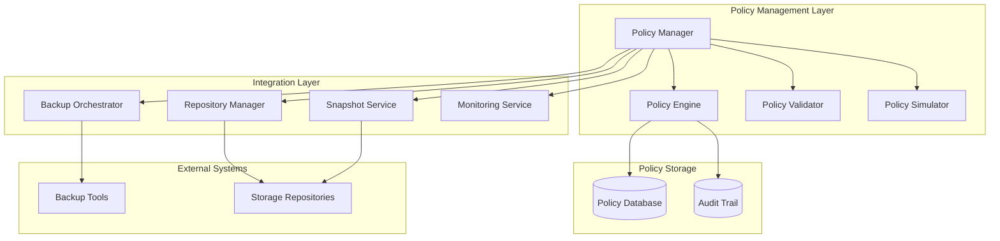

# Policy Management Design Document

## Overview

The Policy Management system provides centralized configuration and enforcement of backup and retention policies within the TimeLocker platform. This system enables administrators to define comprehensive backup operations, lifecycle management rules, and compliance requirements through a unified interface that coordinates with multiple backup tools and storage repositories.

The design follows a layered architecture with clear separation between policy definition, assignment, enforcement, and audit capabilities. The system integrates with existing TimeLocker components including backup orchestration, repository management, and monitoring services.

## Architecture

### High-Level Architecture



### Component Responsibilities

- **Policy Manager**: Central orchestrator for policy operations, API endpoint for policy CRUD operations
- **Policy Engine**: Executes policy enforcement, coordinates with backup tools for retention operations
- **Policy Validator**: Validates policy configurations, checks compatibility with repositories and backup tools
- **Policy Simulator**: Provides dry-run capabilities to preview policy effects before enforcement
- **Policy Database**: Persistent storage for policy definitions, assignments, and metadata
- **Audit Trail**: Comprehensive logging of all policy-related operations and enforcement actions

## Components and Interfaces

### Policy Manager

The Policy Manager serves as the primary interface for policy operations and coordinates all policy-related activities.

```python
class PolicyManager:
    """Central manager for policy operations and coordination."""
    
    def create_backup_policy(self, policy_config: BackupPolicyConfig) -> BackupPolicy:
        """Creates a new backup policy with validation."""
        
    def create_retention_policy(self, policy_config: RetentionPolicyConfig) -> RetentionPolicy:
        """Creates a new retention policy with validation."""
        
    def assign_policy(self, policy_id: str, target: PolicyTarget) -> PolicyAssignment:
        """Assigns a policy to repositories or backup operations."""
        
    def simulate_policy(self, policy_id: str, target: PolicyTarget) -> SimulationResult:
        """Simulates policy effects without enforcement."""
        
    def enforce_policies(self, enforcement_context: EnforcementContext) -> EnforcementResult:
        """Triggers policy enforcement across assigned targets."""
```

### Policy Engine

The Policy Engine handles the execution and enforcement of policies, coordinating with backup tools and repositories.

```python
class PolicyEngine:
    """Executes policy enforcement and coordinates with backup systems."""
    
    def evaluate_retention_rules(self, snapshots: List[Snapshot], policy: RetentionPolicy) -> RetentionDecision:
        """Evaluates which snapshots should be retained or pruned."""
        
    def execute_backup_policy(self, policy: BackupPolicy, target: BackupTarget) -> BackupResult:
        """Executes backup operations according to policy configuration."""
        
    def prune_snapshots(self, repository: Repository, retention_decisions: List[RetentionDecision]) -> PruneResult:
        """Safely removes snapshots according to retention policies."""
        
    def validate_compliance(self, policy: Policy, enforcement_history: List[EnforcementRecord]) -> ComplianceStatus:
        """Validates policy compliance and identifies violations."""
```

### Policy Validator

The Policy Validator ensures policy configurations are valid and compatible with target systems.

```python
class PolicyValidator:
    """Validates policy configurations and compatibility."""
    
    def validate_backup_policy(self, policy: BackupPolicyConfig) -> ValidationResult:
        """Validates backup policy configuration and dependencies."""
        
    def validate_retention_policy(self, policy: RetentionPolicyConfig) -> ValidationResult:
        """Validates retention policy rules and constraints."""
        
    def check_repository_compatibility(self, policy: Policy, repository: Repository) -> CompatibilityResult:
        """Checks if policy is compatible with target repository."""
        
    def validate_policy_assignment(self, policy: Policy, target: PolicyTarget) -> ValidationResult:
        """Validates policy assignment to specific targets."""
```

## Data Models

### Core Policy Models

```python
@dataclass
class BackupPolicy:
    """Defines comprehensive backup operation configuration."""
    id: str
    name: str
    description: str
    data_selection_refs: List[str]  # References to data selection configurations
    target_repositories: List[str]  # Repository identifiers
    backup_tool: str  # Tool identifier (restic, borg, etc.)
    schedule: ScheduleConfig
    execution_params: Dict[str, Any]
    retention_policy_id: Optional[str]
    tags: Dict[str, str]
    compliance_requirements: List[ComplianceRule]
    created_at: datetime
    updated_at: datetime
    created_by: str

@dataclass
class RetentionPolicy:
    """Defines snapshot lifecycle and retention rules."""
    id: str
    name: str
    description: str
    rules: List[RetentionRule]
    compliance_period: Optional[timedelta]
    tag_based_rules: List[TagBasedRule]
    priority: int
    created_at: datetime
    updated_at: datetime
    created_by: str

@dataclass
class RetentionRule:
    """Individual retention rule specification."""
    type: RetentionType  # HOURLY, DAILY, WEEKLY, MONTHLY, YEARLY
    count: int  # Number to retain
    minimum_age: Optional[timedelta]  # Minimum age before eligible for pruning
    tag_filters: Optional[Dict[str, str]]  # Apply rule only to matching tags

@dataclass
class PolicyAssignment:
    """Associates policies with specific targets."""
    id: str
    policy_id: str
    policy_type: PolicyType
    target_type: TargetType  # REPOSITORY, BACKUP_JOB, SYSTEM
    target_id: str
    priority: int
    active: bool
    assigned_at: datetime
    assigned_by: str
```

### Enforcement and Audit Models

```python
@dataclass
class EnforcementRecord:
    """Records policy enforcement execution."""
    id: str
    policy_id: str
    target_id: str
    enforcement_type: EnforcementType
    execution_time: datetime
    result: EnforcementResult
    snapshots_affected: List[str]
    errors: List[str]
    metadata: Dict[str, Any]

@dataclass
class SimulationResult:
    """Results from policy simulation."""
    policy_id: str
    target_id: str
    simulation_time: datetime
    snapshots_to_prune: List[SnapshotInfo]
    snapshots_to_retain: List[SnapshotInfo]
    storage_impact: StorageImpact
    compliance_warnings: List[str]
    conflicts: List[PolicyConflict]

@dataclass
class ComplianceStatus:
    """Policy compliance assessment."""
    policy_id: str
    target_id: str
    compliant: bool
    violations: List[ComplianceViolation]
    next_required_action: Optional[RequiredAction]
    assessment_time: datetime
```

## Error Handling

### Policy Validation Errors

The system implements comprehensive error handling for policy validation and enforcement:

```python
class PolicyValidationError(Exception):
    """Raised when policy configuration is invalid."""
    
class PolicyCompatibilityError(Exception):
    """Raised when policy is incompatible with target system."""
    
class PolicyEnforcementError(Exception):
    """Raised when policy enforcement fails."""
    
class ComplianceViolationError(Exception):
    """Raised when operation would violate compliance requirements."""
```

### Error Recovery Strategies

- **Validation Failures**: Provide detailed error messages with specific configuration issues and suggested fixes
- **Enforcement Failures**: Implement retry mechanisms with exponential backoff for transient failures
- **Repository Access Issues**: Queue enforcement operations for retry when repositories become available
- **Compliance Violations**: Block operations that would violate compliance and alert administrators
- **Partial Enforcement**: Track partial enforcement states and provide recovery mechanisms

## Testing Strategy

### Unit Testing

- **Policy Validation**: Test all validation rules with valid and invalid configurations
- **Retention Logic**: Verify retention rule evaluation with various snapshot scenarios
- **Compatibility Checking**: Test compatibility validation across different backup tools and repositories
- **Simulation Accuracy**: Ensure simulation results match actual enforcement outcomes

### Integration Testing

- **End-to-End Policy Lifecycle**: Test complete policy creation, assignment, and enforcement workflows
- **Multi-Tool Coordination**: Verify policy enforcement across different backup tools (restic, borg, etc.)
- **Repository Integration**: Test policy enforcement with various repository types (local, S3, B2)
- **Compliance Scenarios**: Test compliance rule enforcement and violation detection

### Performance Testing

- **Large-Scale Enforcement**: Test policy enforcement with repositories containing thousands of snapshots
- **Concurrent Operations**: Verify system behavior under concurrent policy enforcement operations
- **Simulation Performance**: Ensure policy simulation completes within acceptable time limits
- **Database Performance**: Test policy storage and retrieval performance under load

## Design Decisions and Rationales

### 1. Separation of Backup and Retention Policies

**Decision**: Implement backup policies and retention policies as separate but linkable entities.

**Rationale**: This separation allows for:
- Flexible policy reuse (multiple backup policies can share retention policies)
- Independent lifecycle management of backup operations and retention rules
- Simplified policy templates and inheritance
- Clear separation of concerns between backup execution and lifecycle management

### 2. Policy Simulation Before Enforcement

**Decision**: Mandatory simulation capability for all policy enforcement operations.

**Rationale**: 
- Prevents accidental data loss from misconfigured retention policies
- Allows administrators to preview storage impact before enforcement
- Enables testing of policy changes in production environments
- Provides confidence in policy configuration accuracy

### 3. Priority-Based Policy Resolution

**Decision**: Implement priority-based resolution when multiple policies could apply to the same target.

**Rationale**:
- Provides deterministic behavior in complex policy scenarios
- Allows for policy inheritance and override patterns
- Enables gradual policy rollout and testing
- Supports organizational hierarchy in policy management

### 4. Comprehensive Audit Trail

**Decision**: Log all policy operations with detailed context and metadata.

**Rationale**:
- Meets compliance and regulatory requirements for audit trails
- Enables troubleshooting of policy enforcement issues
- Provides accountability for policy changes and enforcement actions
- Supports forensic analysis of backup and retention operations

### 5. Integration with Existing TimeLocker Architecture

**Decision**: Build policy management as a coordinating layer above existing services rather than replacing them.

**Rationale**:
- Leverages existing backup orchestration and repository management capabilities
- Minimizes disruption to current system architecture
- Allows gradual adoption of policy management features
- Maintains compatibility with existing backup workflows and tools