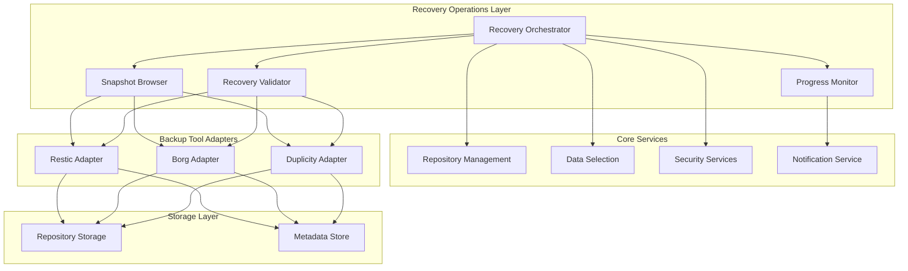

# Recovery Operations Design Document

## Overview

The Recovery Operations feature provides comprehensive data restoration capabilities within the TimeLocker backup system. This feature enables users to browse snapshot contents, perform full or selective file restoration, verify data integrity, and monitor recovery progress. The design integrates with existing TimeLocker components including Repository Management, Data Selection, and Security Services to provide a unified recovery experience across different backup tools.

The system is designed to handle recovery operations for snapshots created by various backup engines (Restic, Borg, Duplicity) while maintaining tool-specific compatibility and providing consistent user interfaces. Recovery operations support both interactive browsing and automated restoration workflows with comprehensive error handling and progress monitoring.

## Architecture

### High-Level Architecture



### Component Interaction Flow

The Recovery Operations system follows a layered architecture where the Recovery Orchestrator coordinates between high-level recovery operations and tool-specific adapters. The Snapshot Browser provides exploration capabilities, while the Recovery Validator ensures data integrity throughout the restoration process.

**Design Rationale**: This architecture separates concerns between recovery orchestration, tool-specific operations, and validation. This allows for consistent recovery interfaces while leveraging the unique capabilities of different backup tools.

## Components and Interfaces

### Recovery Orchestrator

The Recovery Orchestrator serves as the central coordination component for all recovery operations.

```python
class RecoveryOrchestrator:
    """
    Coordinates recovery operations across different backup tools and manages
    the overall recovery workflow including validation and progress monitoring.
    """
    
    def initiate_full_recovery(
        self, 
        snapshot_id: str, 
        target_path: str, 
        options: RecoveryOptions
    ) -> RecoveryOperation:
        """Initiates full snapshot restoration."""
        
    def initiate_selective_recovery(
        self, 
        snapshot_id: str, 
        selection_criteria: SelectionCriteria, 
        target_path: str,
        options: RecoveryOptions
    ) -> RecoveryOperation:
        """Initiates selective file restoration."""
        
    def get_recovery_status(self, operation_id: str) -> RecoveryStatus:
        """Retrieves current status of a recovery operation."""
        
    def cancel_recovery(self, operation_id: str) -> bool:
        """Cancels an ongoing recovery operation."""
```

**Design Rationale**: The orchestrator pattern centralizes recovery logic while delegating tool-specific operations to adapters. This ensures consistent behavior across different backup tools and simplifies error handling and progress monitoring.

### Snapshot Browser

The Snapshot Browser provides exploration and navigation capabilities for snapshot contents.

```python
class SnapshotBrowser:
    """
    Provides browsing and exploration capabilities for snapshot contents
    with support for different backup tool formats.
    """
    
    def list_snapshot_contents(
        self, 
        snapshot_id: str, 
        path: str = "/",
        pagination: PaginationOptions = None
    ) -> SnapshotListing:
        """Lists files and directories in a snapshot path."""
        
    def search_snapshot_files(
        self, 
        snapshot_id: str, 
        search_criteria: SearchCriteria
    ) -> List[FileEntry]:
        """Searches for files within a snapshot using patterns and filters."""
        
    def compare_snapshots(
        self, 
        snapshot_ids: List[str], 
        path: str = "/"
    ) -> SnapshotComparison:
        """Compares file versions across multiple snapshots."""
        
    def get_file_metadata(
        self, 
        snapshot_id: str, 
        file_path: str
    ) -> FileMetadata:
        """Retrieves detailed metadata for a specific file."""
```

### Recovery Validator

The Recovery Validator ensures data integrity throughout the recovery process.

```python
class RecoveryValidator:
    """
    Validates recovery operations and ensures data integrity
    through checksum verification and completeness checks.
    """
    
    def validate_pre_recovery(
        self, 
        snapshot_id: str, 
        target_path: str,
        selection_criteria: SelectionCriteria = None
    ) -> ValidationResult:
        """Validates conditions before starting recovery."""
        
    def validate_during_recovery(
        self, 
        operation_id: str
    ) -> ValidationResult:
        """Performs real-time validation during recovery."""
        
    def validate_post_recovery(
        self, 
        operation_id: str
    ) -> ValidationReport:
        """Comprehensive validation after recovery completion."""
        
    def verify_file_integrity(
        self, 
        restored_file_path: str, 
        expected_checksum: str
    ) -> bool:
        """Verifies individual file integrity using checksums."""
```

### Progress Monitor

The Progress Monitor tracks and reports recovery operation progress.

```python
class ProgressMonitor:
    """
    Monitors and reports progress for recovery operations
    with real-time updates and completion estimates.
    """
    
    def start_monitoring(self, operation_id: str) -> None:
        """Begins monitoring a recovery operation."""
        
    def get_progress_status(self, operation_id: str) -> ProgressStatus:
        """Retrieves current progress information."""
        
    def estimate_completion_time(self, operation_id: str) -> datetime:
        """Estimates recovery completion time based on current progress."""
        
    def register_progress_callback(
        self, 
        operation_id: str, 
        callback: Callable[[ProgressStatus], None]
    ) -> None:
        """Registers callback for progress updates."""
```

**Design Rationale**: Separating progress monitoring into its own component allows for flexible notification strategies and enables different user interfaces to consume progress information independently.

### Backup Tool Adapters

Tool-specific adapters handle the unique requirements and capabilities of different backup engines.

```python
class BackupToolAdapter(ABC):
    """
    Abstract base class for backup tool-specific recovery operations.
    Each supported backup tool implements this interface.
    """
    
    @abstractmethod
    def browse_snapshot(
        self, 
        repository_path: str, 
        snapshot_id: str, 
        path: str
    ) -> SnapshotListing:
        """Tool-specific snapshot browsing implementation."""
        
    @abstractmethod
    def restore_files(
        self, 
        repository_path: str, 
        snapshot_id: str, 
        selection: FileSelection, 
        target_path: str,
        options: RestoreOptions
    ) -> RestoreOperation:
        """Tool-specific file restoration implementation."""
        
    @abstractmethod
    def verify_restoration(
        self, 
        repository_path: str, 
        snapshot_id: str, 
        restored_files: List[str]
    ) -> VerificationResult:
        """Tool-specific restoration verification."""
```

## Data Models

### Core Recovery Models

```python
@dataclass
class RecoveryOperation:
    """Represents an active or completed recovery operation."""
    operation_id: str
    snapshot_id: str
    recovery_type: RecoveryType  # FULL, SELECTIVE
    target_path: str
    status: OperationStatus
    start_time: datetime
    completion_time: Optional[datetime]
    progress: ProgressStatus
    validation_result: Optional[ValidationResult]
    error_details: Optional[ErrorDetails]

@dataclass
class SnapshotListing:
    """Represents the contents of a snapshot directory."""
    path: str
    entries: List[FileEntry]
    total_entries: int
    pagination_info: Optional[PaginationInfo]

@dataclass
class FileEntry:
    """Represents a file or directory within a snapshot."""
    path: str
    name: str
    type: FileType  # FILE, DIRECTORY, SYMLINK
    size: int
    modification_time: datetime
    permissions: str
    checksum: Optional[str]

@dataclass
class SelectionCriteria:
    """Defines criteria for selective recovery operations."""
    include_patterns: List[str]
    exclude_patterns: List[str]
    file_types: List[FileType]
    size_range: Optional[SizeRange]
    date_range: Optional[DateRange]
    selection_template_id: Optional[str]

@dataclass
class RecoveryOptions:
    """Configuration options for recovery operations."""
    overwrite_existing: bool
    preserve_permissions: bool
    preserve_timestamps: bool
    verify_integrity: bool
    continue_on_error: bool
    max_retries: int
    notification_preferences: NotificationPreferences
```

### Progress and Status Models

```python
@dataclass
class ProgressStatus:
    """Tracks progress of recovery operations."""
    files_processed: int
    total_files: int
    bytes_transferred: int
    total_bytes: int
    current_file: Optional[str]
    estimated_completion: Optional[datetime]
    transfer_rate: float  # bytes per second

@dataclass
class ValidationResult:
    """Results of recovery validation operations."""
    is_valid: bool
    validated_files: int
    failed_validations: List[ValidationFailure]
    warnings: List[ValidationWarning]
    validation_time: datetime

@dataclass
class ValidationFailure:
    """Details of a validation failure."""
    file_path: str
    expected_checksum: str
    actual_checksum: str
    failure_type: FailureType
    error_message: str
```

**Design Rationale**: The data models are designed to be tool-agnostic while providing sufficient detail for comprehensive recovery operations. The separation between operation metadata and progress tracking allows for efficient status updates without modifying core operation data.

## Error Handling

### Error Classification and Recovery Strategies

The Recovery Operations system implements a multi-layered error handling approach:

#### Transient Errors
- **Network interruptions**: Automatic retry with exponential backoff
- **Temporary file system issues**: Retry with alternative paths when possible
- **Resource contention**: Queue operations and retry when resources become available

#### Permanent Errors
- **Corrupted snapshot data**: Report corruption and continue with recoverable files
- **Insufficient permissions**: Escalate to user with specific permission requirements
- **Missing backup tool**: Prevent operation and provide clear installation guidance

#### Configuration Errors
- **Invalid target paths**: Validate before operation start
- **Incompatible selection criteria**: Provide suggestions for valid alternatives
- **Repository access issues**: Integrate with Security Services for credential resolution

```python
class RecoveryErrorHandler:
    """
    Centralized error handling for recovery operations with
    configurable retry policies and error escalation.
    """
    
    def handle_recovery_error(
        self, 
        error: RecoveryError, 
        context: RecoveryContext
    ) -> ErrorHandlingResult:
        """Determines appropriate error handling strategy."""
        
    def should_retry(
        self, 
        error: RecoveryError, 
        attempt_count: int
    ) -> bool:
        """Determines if an operation should be retried."""
        
    def escalate_error(
        self, 
        error: RecoveryError, 
        context: RecoveryContext
    ) -> None:
        """Escalates errors that cannot be automatically resolved."""
```

**Design Rationale**: Centralized error handling ensures consistent behavior across different recovery scenarios while allowing for operation-specific error policies. The classification system enables appropriate automated responses while escalating complex issues to users.

## Integration Points

### Repository Management Integration

Recovery Operations integrates with Repository Management to:
- Validate repository accessibility and permissions
- Coordinate with ongoing backup operations to prevent conflicts
- Ensure proper authentication and authorization for repository access
- Respect repository-specific configuration and constraints

### Data Selection Integration

Integration with the Data Selection system provides:
- Reuse of existing selection templates for consistent recovery criteria
- Dynamic modification of selection templates for recovery-specific needs
- Validation of selection patterns against snapshot contents
- Support for complex selection logic including dependencies and relationships

### Security Services Integration

Security integration ensures:
- Proper authentication for repository access during recovery
- Encryption key management for encrypted snapshots
- Audit logging of recovery operations for compliance
- Access control validation for recovery target locations

### Notification Service Integration

Recovery operations integrate with notifications to:
- Send real-time progress updates to configured channels
- Alert on recovery completion, failure, or warning conditions
- Provide detailed recovery reports for audit and monitoring purposes
- Support different notification preferences for different recovery types

**Design Rationale**: Deep integration with existing TimeLocker services ensures that recovery operations respect system-wide policies and configurations while leveraging established security and monitoring capabilities.

## Testing Strategy

### Unit Testing Approach

- **Component Isolation**: Test each recovery component independently using mocks for external dependencies
- **Error Scenario Coverage**: Comprehensive testing of error handling paths and recovery strategies
- **Tool Adapter Testing**: Separate test suites for each backup tool adapter with tool-specific test data
- **Data Model Validation**: Ensure data models correctly represent recovery states and transitions

### Integration Testing Strategy

- **End-to-End Recovery Workflows**: Test complete recovery operations from snapshot browsing to validation
- **Cross-Tool Compatibility**: Verify recovery operations work correctly across different backup tools
- **Repository Integration**: Test recovery operations with various repository configurations and access patterns
- **Performance Testing**: Validate recovery performance with large snapshots and selective operations

### Test Data Management

- **Synthetic Snapshots**: Create controlled test snapshots with known content and checksums
- **Error Injection**: Systematic injection of various error conditions to test error handling
- **Performance Benchmarks**: Establish baseline performance metrics for different recovery scenarios
- **Compatibility Matrix**: Test combinations of backup tools, repository types, and recovery options

**Design Rationale**: The testing strategy emphasizes both component-level reliability and system-level integration to ensure recovery operations work correctly in real-world scenarios while maintaining performance and reliability standards.

## Performance Considerations

### Optimization Strategies

#### Lazy Loading and Pagination
- Implement lazy loading for large snapshot directory listings
- Use pagination to manage memory usage when browsing extensive snapshots
- Cache frequently accessed snapshot metadata to reduce repeated queries

#### Parallel Processing
- Support parallel file restoration for improved throughput
- Implement concurrent validation for multiple files during recovery
- Use asynchronous operations for progress monitoring and notifications

#### Resource Management
- Monitor and limit memory usage during large recovery operations
- Implement disk space validation before starting recovery operations
- Provide configurable resource limits for different recovery scenarios

#### Caching Strategy
- Cache snapshot metadata and directory structures for faster browsing
- Implement intelligent prefetching for commonly accessed snapshot areas
- Use tool-specific caching mechanisms where available

**Design Rationale**: Performance optimizations focus on scalability and resource efficiency while maintaining data integrity and user experience. The caching and parallel processing strategies are designed to work within the constraints of different backup tools and storage systems.

## Security Considerations

### Access Control and Authentication

- **Repository Access**: Leverage Security Services for repository authentication and authorization
- **Target Path Validation**: Ensure recovery target paths are within authorized locations
- **Credential Management**: Secure handling of repository credentials during recovery operations
- **Audit Logging**: Comprehensive logging of recovery operations for security monitoring

### Data Protection

- **Encryption Support**: Handle encrypted snapshots using appropriate decryption keys
- **Secure Temporary Storage**: Protect temporary files during recovery operations
- **Data Sanitization**: Secure cleanup of temporary data after recovery completion
- **Network Security**: Secure communication with remote repositories during recovery

### Compliance and Governance

- **Retention Policy Compliance**: Respect retention policies when accessing snapshots for recovery
- **Data Classification**: Handle sensitive data according to classification requirements
- **Recovery Auditing**: Maintain detailed audit trails for compliance reporting
- **Access Logging**: Log all snapshot access and recovery operations for security analysis

**Design Rationale**: Security considerations are integrated throughout the recovery process rather than being an afterthought. The design leverages existing Security Services while adding recovery-specific protections for data in transit and at rest during recovery operations.