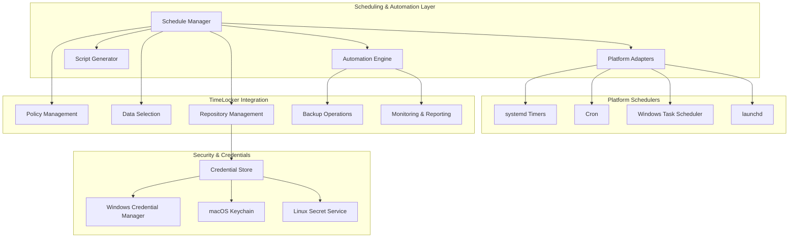
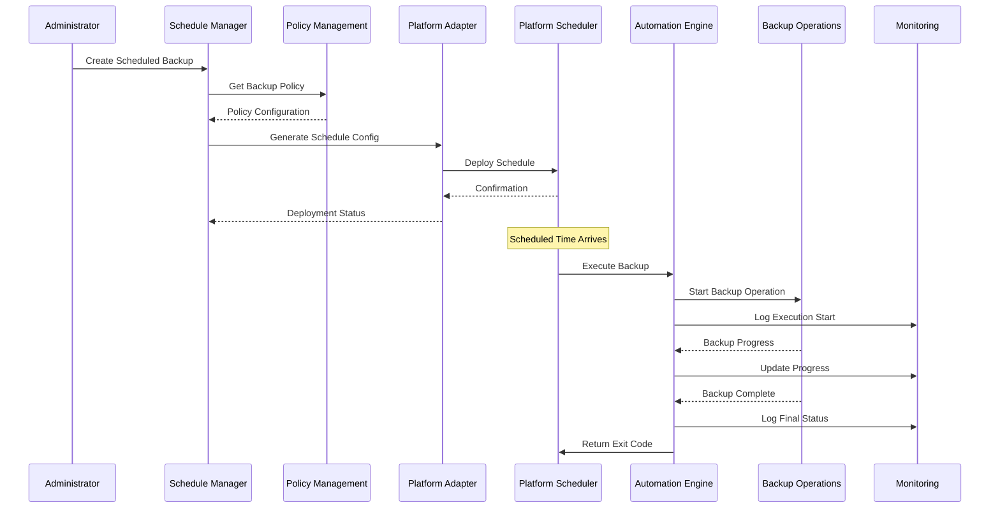

# Scheduling & Automation Design Document

## Overview

The Scheduling & Automation feature provides comprehensive automated backup scheduling capabilities for TimeLocker through platform-appropriate system schedulers. This system enables unattended backup operations by integrating with native OS scheduling systems (systemd timers, cron, Windows Task Scheduler, launchd) while coordinating with Policy Management, Data Selection, Repository Management, and Monitoring & Reporting systems.

The design emphasizes cross-platform compatibility, secure credential management, and seamless integration with existing TimeLocker architecture. The system automatically detects the appropriate platform scheduler and generates native configurations while maintaining consistent behavior across all supported platforms.

### Key Design Principles

- **Platform Native**: Leverage native OS scheduling capabilities for reliability and integration
- **Security First**: Secure credential management through platform credential stores
- **Integration Focused**: Deep integration with existing TimeLocker systems
- **Audit Compliant**: Comprehensive audit trails for compliance requirements
- **Failure Resilient**: Robust error handling and recovery mechanisms
- **Performance Aware**: Minimal overhead and efficient resource utilization

## Architecture

### High-Level Architecture



### Component Interaction Flow



## Components and Interfaces

### Schedule Manager

The central orchestrator for all scheduling operations and integration coordination.

```python
class ScheduleManager:
    """
    Central manager for backup scheduling operations.
    
    Responsibilities:
    - Schedule creation and management
    - Platform adapter coordination
    - Integration with TimeLocker systems
    - Audit trail maintenance
    """
    
    def __init__(self, config_dir: Path):
        self.config_dir = config_dir
        self.platform_adapter = self._detect_platform_adapter()
        self.policy_client = PolicyManagementClient()
        self.data_selection_client = DataSelectionClient()
        self.repository_client = RepositoryManagementClient()
        self.monitoring_client = MonitoringClient()
        self.audit_logger = SchedulingAuditLogger(config_dir)
    
    async def create_scheduled_backup(self, request: ScheduleRequest) -> ScheduleResult:
        """Create a new scheduled backup from a backup policy."""
        
    async def update_scheduled_backup(self, schedule_id: str, updates: ScheduleUpdates) -> ScheduleResult:
        """Update an existing scheduled backup configuration."""
        
    async def delete_scheduled_backup(self, schedule_id: str) -> bool:
        """Remove a scheduled backup and clean up platform scheduler."""
        
    async def list_scheduled_backups(self, filters: Optional[ScheduleFilters] = None) -> List[ScheduleInfo]:
        """List all scheduled backups with optional filtering."""
        
    async def get_schedule_status(self, schedule_id: str) -> ScheduleStatus:
        """Get current status and next run time for a scheduled backup."""
        
    async def validate_schedule_configuration(self, config: ScheduleConfig) -> ValidationResult:
        """Validate schedule configuration against all integration points."""
        
    async def test_schedule_execution(self, schedule_id: str, dry_run: bool = True) -> TestResult:
        """Test schedule execution with optional dry-run mode."""
```

### Platform Adapter System

Provides platform-specific scheduling implementations with a unified interface.

```python
class PlatformAdapter(ABC):
    """Abstract base class for platform-specific scheduling adapters."""
    
    @abstractmethod
    async def create_schedule(self, config: ScheduleConfig) -> PlatformScheduleResult:
        """Create a platform-specific scheduled task."""
        
    @abstractmethod
    async def update_schedule(self, schedule_id: str, config: ScheduleConfig) -> PlatformScheduleResult:
        """Update an existing platform-specific scheduled task."""
        
    @abstractmethod
    async def delete_schedule(self, schedule_id: str) -> bool:
        """Remove a platform-specific scheduled task."""
        
    @abstractmethod
    async def get_schedule_status(self, schedule_id: str) -> PlatformScheduleStatus:
        """Get platform-specific schedule status."""
        
    @abstractmethod
    async def list_schedules(self) -> List[PlatformScheduleInfo]:
        """List all platform-specific scheduled tasks."""
        
    @abstractmethod
    def validate_schedule_config(self, config: ScheduleConfig) -> ValidationResult:
        """Validate schedule configuration for platform compatibility."""

class SystemdAdapter(PlatformAdapter):
    """systemd timer adapter for Linux systems."""
    
    def __init__(self):
        self.systemd_user_dir = Path.home() / ".config" / "systemd" / "user"
        self.service_template = self._load_service_template()
        self.timer_template = self._load_timer_template()
    
    async def create_schedule(self, config: ScheduleConfig) -> PlatformScheduleResult:
        """Create systemd service and timer units."""
        
        service_content = self._generate_service_unit(config)
        timer_content = self._generate_timer_unit(config)
        
        service_file = self.systemd_user_dir / f"timelocker-{config.schedule_id}.service"
        timer_file = self.systemd_user_dir / f"timelocker-{config.schedule_id}.timer"
        
        # Write unit files
        await self._write_unit_file(service_file, service_content)
        await self._write_unit_file(timer_file, timer_content)
        
        # Enable and start timer
        await self._systemctl_command(["--user", "daemon-reload"])
        await self._systemctl_command(["--user", "enable", timer_file.name])
        await self._systemctl_command(["--user", "start", timer_file.name])
        
        return PlatformScheduleResult(
            success=True,
            platform_id=f"timelocker-{config.schedule_id}.timer",
            next_run=await self._get_next_run_time(config.schedule_id)
        )

class CronAdapter(PlatformAdapter):
    """Cron adapter for Unix-like systems."""
    
    def __init__(self):
        self.cron_comment_prefix = "# TimeLocker Scheduled Backup"
        self.wrapper_script_dir = Path.home() / ".local" / "bin"
    
    async def create_schedule(self, config: ScheduleConfig) -> PlatformScheduleResult:
        """Create cron job and wrapper script."""
        
        # Generate wrapper script
        script_path = await self._generate_wrapper_script(config)
        
        # Add cron entry
        cron_line = self._generate_cron_line(config, script_path)
        await self._add_cron_entry(config.schedule_id, cron_line)
        
        return PlatformScheduleResult(
            success=True,
            platform_id=f"cron-{config.schedule_id}",
            next_run=self._calculate_next_cron_run(config.schedule_pattern)
        )

class WindowsTaskSchedulerAdapter(PlatformAdapter):
    """Windows Task Scheduler adapter."""
    
    def __init__(self):
        self.task_folder = "\\TimeLocker"
        self.powershell_wrapper_dir = Path.home() / "AppData" / "Local" / "TimeLocker" / "Scripts"
    
    async def create_schedule(self, config: ScheduleConfig) -> PlatformScheduleResult:
        """Create Windows scheduled task."""
        
        # Generate PowerShell wrapper script
        script_path = await self._generate_powershell_script(config)
        
        # Create scheduled task using schtasks
        task_xml = self._generate_task_xml(config, script_path)
        task_name = f"TimeLocker-{config.schedule_id}"
        
        await self._create_scheduled_task(task_name, task_xml)
        
        return PlatformScheduleResult(
            success=True,
            platform_id=task_name,
            next_run=await self._get_task_next_run(task_name)
        )

class LaunchdAdapter(PlatformAdapter):
    """launchd adapter for macOS."""
    
    def __init__(self):
        self.launchd_dir = Path.home() / "Library" / "LaunchAgents"
        self.script_dir = Path.home() / "Library" / "Application Support" / "TimeLocker" / "Scripts"
    
    async def create_schedule(self, config: ScheduleConfig) -> PlatformScheduleResult:
        """Create launchd plist and wrapper script."""
        
        # Generate wrapper script
        script_path = await self._generate_wrapper_script(config)
        
        # Create plist file
        plist_content = self._generate_plist(config, script_path)
        plist_file = self.launchd_dir / f"com.timelocker.backup.{config.schedule_id}.plist"
        
        await self._write_plist_file(plist_file, plist_content)
        await self._load_launchd_job(plist_file)
        
        return PlatformScheduleResult(
            success=True,
            platform_id=plist_file.stem,
            next_run=self._calculate_next_launchd_run(config.schedule_pattern)
        )
```

### Script Generator

Generates platform-specific wrapper scripts with comprehensive error handling and integration.

```python
class ScriptGenerator:
    """
    Generates platform-specific wrapper scripts for scheduled backups.
    
    Responsibilities:
    - Platform-appropriate script generation
    - Environment setup and credential loading
    - Error handling and logging integration
    - Monitoring integration
    """
    
    def __init__(self, platform: str):
        self.platform = platform
        self.template_loader = ScriptTemplateLoader()
        self.credential_manager = CredentialManager()
    
    async def generate_wrapper_script(self, config: ScheduleConfig) -> Path:
        """Generate platform-specific wrapper script."""
        
        if self.platform == "linux":
            return await self._generate_bash_script(config)
        elif self.platform == "windows":
            return await self._generate_powershell_script(config)
        elif self.platform == "darwin":
            return await self._generate_bash_script(config)
        else:
            raise UnsupportedPlatformError(f"Platform {self.platform} not supported")
    
    async def _generate_bash_script(self, config: ScheduleConfig) -> Path:
        """Generate bash wrapper script for Unix-like systems."""
        
        template = self.template_loader.get_template("bash_wrapper.sh")
        
        script_content = template.render(
            schedule_id=config.schedule_id,
            policy_id=config.policy_id,
            timelocker_executable=self._get_timelocker_executable(),
            log_file=self._get_log_file_path(config.schedule_id),
            credential_env_file=await self._prepare_credential_env_file(config),
            monitoring_webhook=config.monitoring_config.webhook_url if config.monitoring_config else None,
            timeout_seconds=config.execution_timeout or 3600,
            max_retries=config.retry_config.max_attempts if config.retry_config else 3
        )
        
        script_path = self._get_script_path(config.schedule_id, "sh")
        await self._write_script_file(script_path, script_content, executable=True)
        
        return script_path
    
    async def _generate_powershell_script(self, config: ScheduleConfig) -> Path:
        """Generate PowerShell wrapper script for Windows."""
        
        template = self.template_loader.get_template("powershell_wrapper.ps1")
        
        script_content = template.render(
            schedule_id=config.schedule_id,
            policy_id=config.policy_id,
            timelocker_executable=self._get_timelocker_executable(),
            log_file=self._get_log_file_path(config.schedule_id),
            credential_store_key=await self._prepare_credential_store_key(config),
            monitoring_webhook=config.monitoring_config.webhook_url if config.monitoring_config else None,
            timeout_seconds=config.execution_timeout or 3600,
            max_retries=config.retry_config.max_attempts if config.retry_config else 3
        )
        
        script_path = self._get_script_path(config.schedule_id, "ps1")
        await self._write_script_file(script_path, script_content)
        
        return script_path
```

### Automation Engine

Handles the actual execution of scheduled backups with comprehensive integration.

```python
class AutomationEngine:
    """
    Handles execution of scheduled backup operations.
    
    Responsibilities:
    - Backup execution coordination
    - Integration with all TimeLocker systems
    - Error handling and retry logic
    - Monitoring and audit logging
    """
    
    def __init__(self):
        self.policy_client = PolicyManagementClient()
        self.data_selection_client = DataSelectionClient()
        self.repository_client = RepositoryManagementClient()
        self.backup_orchestrator = BackupOrchestrator()
        self.monitoring_client = MonitoringClient()
        self.audit_logger = SchedulingAuditLogger()
    
    async def execute_scheduled_backup(self, schedule_id: str, execution_context: ExecutionContext) -> ExecutionResult:
        """Execute a scheduled backup with full integration."""
        
        execution_id = self._generate_execution_id()
        
        try:
            # Log execution start
            await self.audit_logger.log_execution_start(schedule_id, execution_id, execution_context)
            await self.monitoring_client.report_backup_start(schedule_id, execution_id)
            
            # Get schedule configuration
            schedule_config = await self._get_schedule_config(schedule_id)
            
            # Retrieve and validate policy
            policy = await self.policy_client.get_backup_policy(schedule_config.policy_id)
            await self._validate_policy_for_execution(policy)
            
            # Retrieve and validate data selection
            data_selection = await self.data_selection_client.get_selection_template(policy.data_selection_id)
            await self._validate_data_selection_for_execution(data_selection)
            
            # Retrieve and validate repository credentials
            repository_config = await self.repository_client.get_repository_config(policy.repository_id)
            credentials = await self.repository_client.get_repository_credentials(policy.repository_id)
            await self._validate_repository_access(repository_config, credentials)
            
            # Execute backup operation
            backup_job_config = self._create_backup_job_config(
                policy, data_selection, repository_config, credentials, execution_context
            )
            
            backup_result = await self.backup_orchestrator.execute_backup_job(backup_job_config)
            
            # Process backup result
            execution_result = ExecutionResult(
                execution_id=execution_id,
                schedule_id=schedule_id,
                status=ExecutionStatus.SUCCESS if backup_result.success else ExecutionStatus.FAILED,
                backup_result=backup_result,
                execution_time=datetime.utcnow() - execution_context.start_time,
                error_details=backup_result.errors if not backup_result.success else None
            )
            
            # Log and report completion
            await self.audit_logger.log_execution_complete(execution_result)
            await self.monitoring_client.report_backup_complete(execution_result)
            
            return execution_result
            
        except Exception as e:
            # Handle execution failure
            execution_result = ExecutionResult(
                execution_id=execution_id,
                schedule_id=schedule_id,
                status=ExecutionStatus.FAILED,
                execution_time=datetime.utcnow() - execution_context.start_time,
                error_details=[str(e)]
            )
            
            await self.audit_logger.log_execution_error(execution_result, e)
            await self.monitoring_client.report_backup_error(execution_result, e)
            
            return execution_result
    
    async def _validate_policy_for_execution(self, policy: BackupPolicy) -> None:
        """Validate that backup policy is suitable for automated execution."""
        
        if not policy.enabled:
            raise PolicyValidationError(f"Policy {policy.id} is disabled")
        
        if policy.requires_user_interaction:
            raise PolicyValidationError(f"Policy {policy.id} requires user interaction")
        
        # Additional validation logic...
    
    async def _validate_data_selection_for_execution(self, data_selection: DataSelection) -> None:
        """Validate that data selection is accessible for automated execution."""
        
        # Check that all include paths are accessible
        for path in data_selection.include_paths:
            if not path.exists():
                raise DataSelectionValidationError(f"Include path {path} does not exist")
            if not os.access(path, os.R_OK):
                raise DataSelectionValidationError(f"Include path {path} is not readable")
        
        # Additional validation logic...
    
    async def _validate_repository_access(self, repository_config: RepositoryConfig, 
                                        credentials: RepositoryCredentials) -> None:
        """Validate repository accessibility with provided credentials."""
        
        try:
            # Test repository connection
            await self.repository_client.test_repository_connection(repository_config, credentials)
        except Exception as e:
            raise RepositoryValidationError(f"Repository access validation failed: {e}")
```

## Data Models

### Core Scheduling Models

```python
@dataclass
class ScheduleConfig:
    """Configuration for a scheduled backup."""
    schedule_id: str
    name: str
    description: Optional[str]
    policy_id: str
    schedule_pattern: SchedulePattern
    enabled: bool
    execution_timeout: Optional[int]  # seconds
    retry_config: Optional[RetryConfig]
    monitoring_config: Optional[MonitoringConfig]
    platform_specific_config: Dict[str, Any]
    created_at: datetime
    updated_at: datetime
    created_by: str

@dataclass
class SchedulePattern:
    """Defines when a backup should be executed."""
    pattern_type: SchedulePatternType
    cron_expression: Optional[str]  # For cron-style scheduling
    interval_minutes: Optional[int]  # For interval-based scheduling
    calendar_config: Optional[CalendarConfig]  # For calendar-based scheduling
    randomize_delay_minutes: int = 0  # Random delay to distribute load
    backup_window: Optional[BackupWindow] = None

class SchedulePatternType(Enum):
    CRON = "cron"
    INTERVAL = "interval"
    CALENDAR = "calendar"

@dataclass
class CalendarConfig:
    """Calendar-based scheduling configuration."""
    days_of_week: List[int]  # 0=Monday, 6=Sunday
    time_of_day: time
    weeks_of_month: Optional[List[int]] = None  # 1-4, None=all weeks
    months_of_year: Optional[List[int]] = None  # 1-12, None=all months

@dataclass
class BackupWindow:
    """Defines allowed backup execution time windows."""
    start_time: time
    end_time: time
    excluded_dates: List[date] = field(default_factory=list)
    timezone: str = "UTC"

@dataclass
class RetryConfig:
    """Retry configuration for failed backup executions."""
    max_attempts: int = 3
    initial_delay_minutes: int = 5
    backoff_multiplier: float = 2.0
    max_delay_minutes: int = 60

@dataclass
class MonitoringConfig:
    """Monitoring integration configuration."""
    webhook_url: Optional[str] = None
    health_check_url: Optional[str] = None
    notification_on_success: bool = True
    notification_on_failure: bool = True
    notification_on_retry: bool = False
```

### Execution and Status Models

```python
@dataclass
class ExecutionContext:
    """Context information for backup execution."""
    execution_id: str
    schedule_id: str
    triggered_by: ExecutionTrigger
    start_time: datetime
    platform: str
    user_context: str
    environment_variables: Dict[str, str]

class ExecutionTrigger(Enum):
    SCHEDULED = "scheduled"
    MANUAL = "manual"
    RETRY = "retry"
    TEST = "test"

@dataclass
class ExecutionResult:
    """Result of a scheduled backup execution."""
    execution_id: str
    schedule_id: str
    status: ExecutionStatus
    backup_result: Optional[BackupResult] = None
    execution_time: timedelta = timedelta()
    error_details: Optional[List[str]] = None
    retry_count: int = 0
    next_retry_time: Optional[datetime] = None

class ExecutionStatus(Enum):
    SUCCESS = "success"
    FAILED = "failed"
    RETRYING = "retrying"
    CANCELLED = "cancelled"
    TIMEOUT = "timeout"

@dataclass
class ScheduleStatus:
    """Current status of a scheduled backup."""
    schedule_id: str
    enabled: bool
    last_execution: Optional[ExecutionResult]
    next_execution_time: Optional[datetime]
    platform_status: PlatformScheduleStatus
    health_status: ScheduleHealthStatus
    execution_history: List[ExecutionResult]

class ScheduleHealthStatus(Enum):
    HEALTHY = "healthy"
    WARNING = "warning"
    ERROR = "error"
    UNKNOWN = "unknown"
```

## Error Handling

### Error Classification and Recovery

```python
class SchedulingError(Exception):
    """Base exception for scheduling operations."""
    pass

class PlatformSchedulerError(SchedulingError):
    """Platform scheduler operation failed."""
    pass

class PolicyValidationError(SchedulingError):
    """Backup policy validation failed."""
    pass

class DataSelectionValidationError(SchedulingError):
    """Data selection validation failed."""
    pass

class RepositoryValidationError(SchedulingError):
    """Repository access validation failed."""
    pass

class CredentialAccessError(SchedulingError):
    """Credential access failed."""
    pass

class ExecutionTimeoutError(SchedulingError):
    """Backup execution timed out."""
    pass

class ScheduleConflictError(SchedulingError):
    """Schedule conflict detected."""
    pass
```

### Recovery Strategies

1. **Platform Scheduler Failures**: Retry with exponential backoff, fallback to alternative scheduling methods
2. **Credential Access Failures**: Secure retry with user notification, credential refresh mechanisms
3. **Policy/Selection Validation Failures**: Skip execution with detailed logging, administrator notification
4. **Repository Access Failures**: Retry with backoff, repository health check integration
5. **Execution Timeouts**: Graceful termination, cleanup procedures, retry scheduling
6. **Schedule Conflicts**: Automatic rescheduling with conflict resolution algorithms

## Security Considerations

### Credential Management

The system integrates with platform-specific credential stores for secure credential management:

```python
class PlatformCredentialManager:
    """Platform-specific credential management."""
    
    def __init__(self):
        self.platform = platform.system().lower()
        self.credential_store = self._initialize_credential_store()
    
    def _initialize_credential_store(self) -> CredentialStore:
        """Initialize platform-appropriate credential store."""
        
        if self.platform == "windows":
            return WindowsCredentialStore()
        elif self.platform == "darwin":
            return MacOSKeychainStore()
        elif self.platform == "linux":
            return LinuxSecretServiceStore()
        else:
            return FileBasedCredentialStore()  # Fallback with encryption
    
    async def store_repository_credentials(self, repository_id: str, 
                                         credentials: RepositoryCredentials) -> bool:
        """Store repository credentials securely."""
        
        credential_key = f"timelocker.repository.{repository_id}"
        encrypted_credentials = await self._encrypt_credentials(credentials)
        
        return await self.credential_store.store_credential(credential_key, encrypted_credentials)
    
    async def retrieve_repository_credentials(self, repository_id: str) -> RepositoryCredentials:
        """Retrieve repository credentials securely."""
        
        credential_key = f"timelocker.repository.{repository_id}"
        encrypted_credentials = await self.credential_store.retrieve_credential(credential_key)
        
        if not encrypted_credentials:
            raise CredentialNotFoundError(f"Credentials for repository {repository_id} not found")
        
        return await self._decrypt_credentials(encrypted_credentials)
```

### Audit and Compliance

```python
class SchedulingAuditLogger:
    """Comprehensive audit logging for scheduling operations."""
    
    def __init__(self, config_dir: Path):
        self.audit_log_path = config_dir / "audit" / "scheduling.log"
        self.audit_log_path.parent.mkdir(parents=True, exist_ok=True)
        self.logger = self._setup_audit_logger()
    
    async def log_schedule_creation(self, schedule_config: ScheduleConfig, 
                                  created_by: str) -> None:
        """Log schedule creation with full context."""
        
        audit_entry = AuditEntry(
            timestamp=datetime.utcnow(),
            event_type=AuditEventType.SCHEDULE_CREATED,
            schedule_id=schedule_config.schedule_id,
            user=created_by,
            details={
                "policy_id": schedule_config.policy_id,
                "schedule_pattern": schedule_config.schedule_pattern.dict(),
                "platform": platform.system()
            }
        )
        
        await self._write_audit_entry(audit_entry)
    
    async def log_execution_start(self, schedule_id: str, execution_id: str, 
                                context: ExecutionContext) -> None:
        """Log backup execution start."""
        
        audit_entry = AuditEntry(
            timestamp=datetime.utcnow(),
            event_type=AuditEventType.EXECUTION_STARTED,
            schedule_id=schedule_id,
            execution_id=execution_id,
            details={
                "triggered_by": context.triggered_by.value,
                "platform": context.platform,
                "user_context": context.user_context
            }
        )
        
        await self._write_audit_entry(audit_entry)
    
    async def log_execution_complete(self, result: ExecutionResult) -> None:
        """Log backup execution completion."""
        
        audit_entry = AuditEntry(
            timestamp=datetime.utcnow(),
            event_type=AuditEventType.EXECUTION_COMPLETED,
            schedule_id=result.schedule_id,
            execution_id=result.execution_id,
            details={
                "status": result.status.value,
                "execution_time_seconds": result.execution_time.total_seconds(),
                "backup_success": result.backup_result.success if result.backup_result else False,
                "files_processed": result.backup_result.files_processed if result.backup_result else 0,
                "bytes_transferred": result.backup_result.bytes_transferred if result.backup_result else 0
            }
        )
        
        await self._write_audit_entry(audit_entry)
```

## Testing Strategy

### Unit Testing

1. **Schedule Manager**: Test schedule CRUD operations, validation, and integration coordination
2. **Platform Adapters**: Test each platform adapter with mock schedulers and configuration generation
3. **Script Generator**: Test script generation for all platforms with various configurations
4. **Automation Engine**: Test execution logic, error handling, and integration with mocked services
5. **Credential Management**: Test secure credential storage and retrieval across platforms

### Integration Testing

1. **End-to-End Scheduling**: Test complete scheduling workflow from creation to execution
2. **Cross-Platform Compatibility**: Test on Linux, Windows, and macOS with native schedulers
3. **TimeLocker Integration**: Test integration with Policy Management, Data Selection, Repository Management, and Monitoring
4. **Failure Scenarios**: Test various failure conditions and recovery mechanisms
5. **Security Testing**: Test credential security and audit trail integrity

### Performance Testing

1. **Schedule Management**: Test performance with large numbers of scheduled backups
2. **Execution Overhead**: Measure scheduling system overhead on backup performance
3. **Platform Scheduler Load**: Test impact on system schedulers with multiple TimeLocker schedules
4. **Concurrent Execution**: Test handling of concurrent backup executions

## Implementation Considerations

### Platform Detection and Adaptation

```python
class PlatformDetector:
    """Detects platform capabilities and selects appropriate adapter."""
    
    @staticmethod
    def detect_best_scheduler() -> Type[PlatformAdapter]:
        """Detect the best available scheduler for the current platform."""
        
        system = platform.system().lower()
        
        if system == "linux":
            if PlatformDetector._has_systemd():
                return SystemdAdapter
            elif PlatformDetector._has_cron():
                return CronAdapter
            else:
                raise UnsupportedPlatformError("No supported scheduler found on Linux")
        
        elif system == "darwin":
            if PlatformDetector._has_launchd():
                return LaunchdAdapter
            elif PlatformDetector._has_cron():
                return CronAdapter
            else:
                raise UnsupportedPlatformError("No supported scheduler found on macOS")
        
        elif system == "windows":
            if PlatformDetector._has_task_scheduler():
                return WindowsTaskSchedulerAdapter
            else:
                raise UnsupportedPlatformError("Windows Task Scheduler not available")
        
        else:
            raise UnsupportedPlatformError(f"Platform {system} not supported")
    
    @staticmethod
    def _has_systemd() -> bool:
        """Check if systemd is available and user services are supported."""
        try:
            result = subprocess.run(["systemctl", "--user", "status"], 
                                  capture_output=True, timeout=5)
            return result.returncode == 0
        except (subprocess.TimeoutExpired, FileNotFoundError):
            return False
    
    @staticmethod
    def _has_cron() -> bool:
        """Check if cron is available."""
        try:
            result = subprocess.run(["crontab", "-l"], 
                                  capture_output=True, timeout=5)
            return result.returncode in [0, 1]  # 0=has entries, 1=no entries
        except (subprocess.TimeoutExpired, FileNotFoundError):
            return False
    
    @staticmethod
    def _has_launchd() -> bool:
        """Check if launchd is available."""
        return Path("/bin/launchctl").exists()
    
    @staticmethod
    def _has_task_scheduler() -> bool:
        """Check if Windows Task Scheduler is available."""
        try:
            result = subprocess.run(["schtasks", "/query"], 
                                  capture_output=True, timeout=5)
            return result.returncode == 0
        except (subprocess.TimeoutExpired, FileNotFoundError):
            return False
```

### Configuration Management

The system maintains scheduling configuration in a structured format that supports all platforms:

```python
@dataclass
class SchedulingConfiguration:
    """Master configuration for scheduling system."""
    
    platform_preferences: Dict[str, str]  # Platform -> Preferred scheduler
    default_retry_config: RetryConfig
    default_monitoring_config: MonitoringConfig
    audit_retention_days: int = 365
    max_concurrent_executions: int = 3
    execution_timeout_minutes: int = 60
    credential_store_config: Dict[str, Any]
    
    @classmethod
    def load_from_file(cls, config_path: Path) -> 'SchedulingConfiguration':
        """Load configuration from file with validation."""
        
    def save_to_file(self, config_path: Path) -> None:
        """Save configuration to file."""
        
    def validate(self) -> ValidationResult:
        """Validate configuration for current platform."""
```

This design provides a comprehensive, secure, and platform-native scheduling system that integrates seamlessly with the existing TimeLocker architecture while maintaining excellent usability and reliability across all supported platforms.