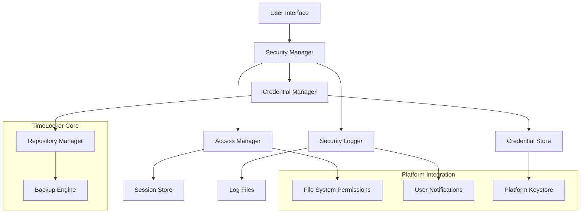
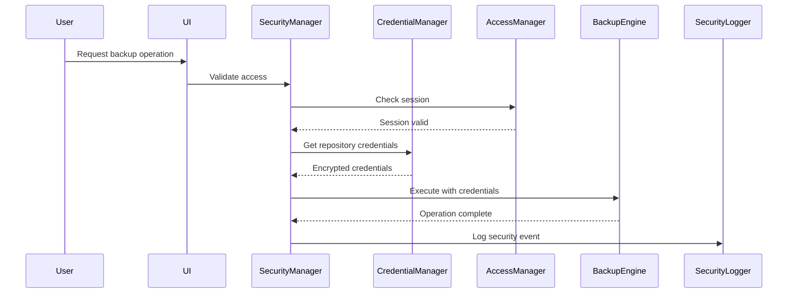

# Design Document

## Overview

The Security Services feature provides essential security controls for the TimeLocker desktop backup application, implementing data encryption, secure credential management, and basic access protection suitable for personal and small business environments. The design emphasizes simplicity, user-friendliness, and integration with existing desktop security mechanisms while maintaining strong security practices.

The system leverages platform-native security features (file system permissions, credential stores) and integrates seamlessly with the backup tool's encryption capabilities. The architecture prioritizes ease of use for desktop users while providing robust protection for backup data and credentials.

## Architecture

### High-Level Architecture



### Component Interaction Flow



## Components and Interfaces

### Security Manager

**Purpose**: Central coordinator for all security operations, providing a unified interface for security services.

**Key Responsibilities**:
- Coordinate authentication and authorization
- Manage security sessions
- Integrate with backup operations
- Handle security event logging

**Interface**:
```python
class SecurityManager:
    def authenticate_user(self, credentials: UserCredentials) -> AuthResult
    def validate_session(self, session_id: str) -> bool
    def get_repository_credentials(self, repo_id: str) -> EncryptedCredentials
    def authorize_operation(self, operation: Operation, context: SecurityContext) -> bool
    def log_security_event(self, event: SecurityEvent) -> None
```

### Credential Manager

**Purpose**: Secure storage, retrieval, and management of repository credentials with per-repository isolation.

**Key Responsibilities**:
- Encrypt and store repository credentials
- Implement credential resolution precedence
- Integrate with platform credential stores
- Provide credential lifecycle management

**Interface**:
```python
class CredentialManager:
    def store_credentials(self, repo_id: str, credentials: Credentials) -> bool
    def retrieve_credentials(self, repo_id: str) -> Optional[Credentials]
    def remove_credentials(self, repo_id: str) -> bool
    def list_stored_repositories(self) -> List[str]
    def validate_credentials(self, repo_id: str, credentials: Credentials) -> bool
```

**Storage Strategy**:
- Use Fernet (AES-128 + HMAC) for credential encryption
- Store encrypted credentials in user-specific configuration directory
- Generate unique encryption keys per repository using repository hash
- Integrate with platform keystores for master key storage

### Access Manager

**Purpose**: Handle user authentication, session management, and basic access control for desktop environments.

**Key Responsibilities**:
- Manage user sessions with timeout
- Enforce file system permissions
- Provide user account isolation
- Handle authentication state

**Interface**:
```python
class AccessManager:
    def create_session(self, user_id: str) -> Session
    def validate_session(self, session_id: str) -> bool
    def extend_session(self, session_id: str) -> bool
    def terminate_session(self, session_id: str) -> None
    def check_file_permissions(self, path: str, operation: str) -> bool
```

### Security Logger

**Purpose**: Record security events for troubleshooting and basic audit purposes with user-friendly presentation.

**Key Responsibilities**:
- Log authentication and access events
- Provide simple log viewing interface
- Maintain log retention and cleanup
- Generate user notifications for security issues

**Interface**:
```python
class SecurityLogger:
    def log_event(self, event: SecurityEvent) -> None
    def get_events(self, filter: EventFilter) -> List[SecurityEvent]
    def cleanup_old_logs(self) -> None
    def export_logs(self, format: str, date_range: DateRange) -> str
```

## Data Models

### Security Event

```python
@dataclass
class SecurityEvent:
    timestamp: datetime
    event_type: SecurityEventType
    user_id: str
    repository_id: Optional[str]
    operation: str
    result: EventResult
    details: Dict[str, Any]
    ip_address: Optional[str] = None
```

### User Session

```python
@dataclass
class Session:
    session_id: str
    user_id: str
    created_at: datetime
    last_accessed: datetime
    expires_at: datetime
    is_active: bool
```

### Encrypted Credentials

```python
@dataclass
class EncryptedCredentials:
    repository_id: str
    encrypted_data: bytes
    encryption_key_id: str
    created_at: datetime
    last_modified: datetime
```

### Security Configuration

```python
@dataclass
class SecurityConfig:
    session_timeout_minutes: int = 30
    log_retention_days: int = 30
    max_failed_attempts: int = 3
    lockout_duration_minutes: int = 15
    enable_notifications: bool = True
    credential_store_path: str = "~/.timelocker/credentials"
```

## Error Handling

### Error Categories

1. **Authentication Errors**
   - Invalid credentials
   - Session expired
   - Account locked

2. **Authorization Errors**
   - Insufficient permissions
   - Repository access denied
   - Operation not allowed

3. **Credential Errors**
   - Credential not found
   - Decryption failed
   - Credential store inaccessible

4. **System Errors**
   - File system permission denied
   - Platform keystore unavailable
   - Configuration corruption

### Error Handling Strategy

```python
class SecurityError(Exception):
    """Base class for security-related errors"""
    pass

class AuthenticationError(SecurityError):
    """Authentication failed"""
    pass

class AuthorizationError(SecurityError):
    """Operation not authorized"""
    pass

class CredentialError(SecurityError):
    """Credential management error"""
    pass
```

**Error Recovery**:
- Graceful degradation for non-critical operations
- Clear user messaging with suggested actions
- Automatic retry for transient errors
- Fallback to interactive prompts when credential store fails

## Testing Strategy

### Unit Testing

**Credential Manager Tests**:
- Encryption/decryption functionality
- Credential storage and retrieval
- Platform keystore integration
- Error handling for corrupted data

**Access Manager Tests**:
- Session creation and validation
- Timeout handling
- File permission checks
- User isolation

**Security Logger Tests**:
- Event logging and retrieval
- Log rotation and cleanup
- Export functionality
- Performance with large log volumes

### Integration Testing

**End-to-End Security Flow**:
- Complete authentication to backup operation
- Credential resolution across different sources
- Session management during long operations
- Error propagation and user notification

**Platform Integration Tests**:
- File system permission enforcement
- Platform keystore integration
- Desktop notification delivery
- Cross-platform compatibility

### Security Testing

**Credential Security**:
- Encryption strength validation
- Key derivation testing
- Secure deletion verification
- Memory protection during operations

**Access Control Testing**:
- Session hijacking prevention
- File system isolation
- Privilege escalation prevention
- Concurrent access handling

### Performance Testing

**Credential Operations**:
- Credential retrieval latency (< 100ms)
- Bulk credential operations
- Memory usage during encryption
- Startup time impact

**Logging Performance**:
- Log write performance
- Log query response time
- Storage space utilization
- Cleanup operation efficiency

## Security Considerations

### Threat Model

**Desktop Environment Threats**:
- Malicious software accessing credential files
- Physical access to unlocked computer
- User account compromise
- Accidental credential exposure

**Mitigation Strategies**:
- File system permissions for credential protection
- Session timeouts for unattended access
- Secure credential storage with encryption
- Clear separation of user data

### Encryption Implementation

**Credential Encryption**:
- Use Fernet (AES-128 in CBC mode + HMAC-SHA256)
- Generate unique keys per repository
- Store master keys in platform keystore when available
- Implement secure key derivation (PBKDF2)

**Key Management**:
- Automatic key rotation capability
- Secure key storage using platform features
- Key backup and recovery procedures
- Protection against key extraction

### Privacy Protection

**Data Minimization**:
- Log only essential security information
- Avoid storing sensitive file contents
- Implement secure deletion for temporary data
- Provide user control over data retention

**User Transparency**:
- Clear privacy information display
- User consent for data collection
- Easy access to security logs
- Simple privacy controls

## Platform Integration

### Windows Integration

**Credential Storage**:
- Windows Credential Manager for master keys
- DPAPI for additional encryption layer
- User profile isolation
- Windows Event Log integration

**File Permissions**:
- NTFS ACLs for credential files
- User-specific AppData directories
- Windows service integration for scheduled operations

### macOS Integration

**Credential Storage**:
- Keychain Services for master keys
- FileVault integration
- User-specific Library directories
- Console.app log integration

**File Permissions**:
- POSIX permissions with extended attributes
- Sandbox compliance for App Store distribution
- LaunchAgent integration for background operations

### Linux Integration

**Credential Storage**:
- Secret Service API (libsecret)
- GNOME Keyring or KDE Wallet integration
- User-specific XDG directories
- systemd journal integration

**File Permissions**:
- POSIX permissions with proper umask
- SELinux/AppArmor policy compliance
- systemd user service integration

## Performance Optimization

### Credential Caching

**Strategy**:
- In-memory credential cache with encryption
- Configurable cache timeout (default 5 minutes)
- Automatic cache invalidation on credential changes
- Memory protection for cached credentials

### Session Management

**Optimization**:
- Lightweight session tokens
- Efficient session validation
- Automatic cleanup of expired sessions
- Minimal storage overhead

### Logging Efficiency

**Performance Features**:
- Asynchronous log writing
- Batch log operations
- Efficient log rotation
- Indexed log queries for UI display

## Future Enhancements

### Advanced Features

**Multi-Factor Authentication**:
- TOTP support for enhanced security
- Hardware token integration
- Biometric authentication on supported platforms
- Smart card support for enterprise users

**Enhanced Monitoring**:
- Security dashboard with trends
- Anomaly detection for unusual access patterns
- Integration with system security tools
- Advanced threat detection

### Enterprise Features

**Centralized Management**:
- Policy-based security configuration
- Remote credential management
- Centralized audit logging
- Compliance reporting tools

**Advanced Access Control**:
- Role-based permissions
- Time-based access restrictions
- Location-based access control
- Integration with enterprise identity systems