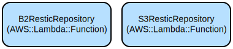

# Python Restic Backup Manager: A High-Level Interface for Restic Backup Operations

The Python Restic Backup Manager provides a robust, object-oriented interface for managing backups using the Restic backup tool. It simplifies backup operations by providing a high-level API that handles repository management, file selection patterns, and backup configurations across multiple storage backends including local, S3, and B2.

The library abstracts away the complexity of managing Restic commands and configurations while providing type-safe interfaces and comprehensive error handling. It supports multiple storage backends (Local, S3, Backblaze B2) with automatic credential management and validation.

Key features include:
- Unified interface for managing backup repositories across different storage backends
- Smart file selection system with pattern-based inclusion/exclusion
- Built-in support for common backup patterns and file groups
- Automatic credential management for cloud storage backends
- Comprehensive error handling and logging
- Type-safe interfaces with full typing support
- Extensible architecture for adding new repository types

## Repository Structure
```
.
├── src/                          # Main source code
│   └── TimeLocker/              # Core package
│       ├── backup_manager.py    # Central backup operation coordinator
│       ├── backup_repository.py # Abstract base class for repositories
│       ├── backup_snapshot.py   # Snapshot management functionality
│       ├── backup_target.py     # Backup target configuration
│       ├── file_selections.py   # File selection pattern management
│       ├── restic/             # Restic-specific implementations
│       │   ├── Repositories/   # Storage backend implementations
│       │   │   ├── b2.py      # Backblaze B2 repository implementation
│       │   │   ├── local.py   # Local filesystem repository
│       │   │   └── s3.py      # Amazon S3 repository
│       │   ├── errors.py      # Custom error definitions
│       │   └── logging.py     # Logging configuration
│       └── utils/             # Utility functions and helpers
├── tests/                      # Test suite
└── docs/                      # Documentation and diagrams
```

## Usage Instructions
### Prerequisites
- Python 3.12 or higher
- Restic backup tool installed and accessible in PATH
- For cloud storage:
  - S3: boto3 package (`pip install boto3`)
  - B2: b2sdk package (`pip install b2sdk`)

### Installation
```bash
# Clone the repository
git clone <repository-url>
cd restic-backup-manager

# Install dependencies
pip install -r requirements.txt
```

### Quick Start
```python
from TimeLocker.backup_manager import BackupManager
from TimeLocker.backup_target import BackupTarget
from TimeLocker.file_selections import FileSelection, SelectionType

# Initialize backup manager
manager = BackupManager()

# Create a backup target
selection = FileSelection()
selection.add_path("/path/to/backup")
selection.add_pattern("*.txt", SelectionType.INCLUDE)
selection.add_pattern("*.tmp", SelectionType.EXCLUDE)
target = BackupTarget(selection, tags=["documents"])

# Create and initialize repository
repo = manager.from_uri("s3:bucket-name/backup", password="your-password")

# Perform backup
repo.backup(target)
```

### More Detailed Examples
```python
# Using B2 backend
repo = manager.from_uri(
    "b2:bucket-name/backup?account_id=your-id&account_key=your-key",
    password="your-password"
)

# Adding pattern groups
selection = FileSelection()
selection.add_pattern_group("office_documents")
selection.add_pattern_group("source_code", SelectionType.EXCLUDE)

# Creating snapshot
snapshot = repo.create_snapshot(target)

# Restoring files
snapshot.restore("/path/to/restore")
```

### Troubleshooting
Common issues and solutions:

1. Repository Authentication Failures
```python
try:
    repo = manager.from_uri("s3:bucket/backup")
except RepositoryError as e:
    # Check environment variables
    print("AWS credentials not found:", e)
```

2. File Selection Validation
```python
try:
    selection = FileSelection()
    selection.validate()
except ValueError:
    print("At least one folder must be included in backup selection")
```

3. Debug Logging
```python
import logging
logging.getLogger('restic').setLevel(logging.DEBUG)
```

## Data Flow
The backup process follows this general flow:
1. Configuration of backup target and file selection patterns
2. Repository initialization and validation
3. Execution of backup operation with selected files
4. Snapshot creation and management

```ascii
[BackupManager] --> [BackupRepository]
       |                    |
       v                    v
[FileSelection] --> [BackupTarget] --> [Snapshot]
```

Key component interactions:
- BackupManager orchestrates repository creation and management
- BackupRepository handles storage backend operations
- FileSelection manages include/exclude patterns
- BackupTarget combines file selection with metadata
- Snapshot represents a point-in-time backup state
- Repository implementations handle backend-specific operations

## Infrastructure


### S3 Repository
- Type: `S3ResticRepository`
- Purpose: Manages backups in Amazon S3 buckets
- Environment: Requires AWS credentials (access key, secret key, region)

### B2 Repository
- Type: `B2ResticRepository`
- Purpose: Manages backups in Backblaze B2 storage
- Environment: Requires B2 credentials (account ID, application key)

### Local Repository
- Type: `LocalResticRepository`
- Purpose: Manages backups in local filesystem
- Environment: Requires write access to target directory

---

> Copyright © Bruce Cherrington
>
> This program is free software: you can redistribute it and/or modify
> it under the terms of the GNU General Public License as published by
the Free Software Foundation, either version 3 of the License, or
(at your option) any later version.
> 
> This program is distributed in the hope that it will be useful,
but WITHOUT ANY WARRANTY; without even the implied warranty of
MERCHANTABILITY or FITNESS FOR A PARTICULAR PURPOSE. See the
GNU General Public License for more details.
> 
> You should have received a copy of the GNU General Public License
along with this program. If not, see <https://www.gnu.org/licenses/>.