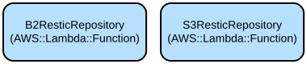

# TimeLocker: A High-Level Interface for Backup Operations

<!-- Project Info Badges -->
[](https://www.gnu.org/licenses/gpl-3.0)
[](https://www.python.org/downloads/)
[](https://github.com/Auriora/TimeLocker)
[](https://github.com/Auriora/TimeLocker/actions/workflows/test-suite.yml)
[](https://github.com/Auriora/TimeLocker/actions)
[](CONTRIBUTING.md)


TimeLocker provides a CLI-first interface for managing backups with Restic and related orchestration services. It covers repository management, file
selection, scheduling, monitoring, and recovery workflows across local, S3-compatible, and B2 backends.

This repository is feature-rich but still being consolidated. Treat this README
and [`docs/README.md`](docs/README.md) as the current orientation layer. Active
delivery work is indexed under [`docs/specs/`](docs/specs/README.md).

> **Note**: TimeLocker is a **CLI-based application**. There is currently no desktop GUI or REST API - these are design specifications for future consideration.
> The application includes optional system tray integration for desktop notifications.

## Table of Contents

- [Project description](#project-description)
- [Who this project is for](#who-this-project-is-for)
- [Features](#features)
- [Repository Structure](#repository-structure)
- [Instructions for using TimeLocker](#instructions-for-using-timelocker)
    - [Project dependencies](#project-dependencies)
    - [Installation](#installation)
    - [Quick Start](#quick-start)
- [More Detailed Examples](#more-detailed-examples)
- [Troubleshooting](#troubleshooting)
- [Data Flow](#data-flow)
- [Infrastructure](#infrastructure)
- [Documentation](#documentation)
- [Contributing](#contributing)
- [Support](#support)
- [Acknowledgements](#acknowledgements)
- [Terms of use](#terms-of-use)
- [Document Information](#document-information)

## Project description

The library abstracts away the complexity of managing Restic commands and configurations while providing type-safe interfaces and comprehensive error handling.
It supports multiple storage backends (Local, S3, Backblaze B2) with automatic credential management and validation.

## Who this project is for

This project is intended for:

- System administrators who need to set up backup solutions
- Developers who want to integrate backup functionality into their applications
- End users who want a more user-friendly interface for Restic backups

## Features

- Unified interface for managing backup repositories across different storage backends
- Smart file selection system with pattern-based inclusion/exclusion
- Built-in support for common backup patterns and file groups
- Automatic credential management for cloud storage backends
- Comprehensive error handling and logging
- Type-safe interfaces with full typing support
- Extensible architecture for adding new repository types

## Repository Structure

```text
.
├── src/TimeLocker/                   # Python package and Typer CLI
│   ├── cli.py                        # `timelocker` / `tl` entrypoint
│   ├── cli_modules/                  # Commands, helpers, and CLI services
│   ├── services/                     # Application orchestration
│   ├── config/                       # Filesystem-backed configuration
│   ├── monitoring/                   # Telemetry, progress, notifications
│   ├── scheduling/                   # Scheduling integrations
│   ├── security/                     # Credentials and privacy controls
│   ├── policy/                       # Policy models and persistence
│   └── restic/                       # Restic repositories and commands
├── tests/TimeLocker/                 # Pytest unit and integration suites
├── docs/
│   ├── 1-requirements/               # Durable product requirements
│   ├── 2-architecture/               # Current system architecture
│   ├── 3-implementation/             # Current implementation guidance
│   ├── 4-testing/                    # Test strategy and environments
│   ├── guides/                       # User, developer, and agent guidance
│   ├── reference/                    # Current command and API references
│   ├── resources/                    # Documentation images and source data
│   ├── specs/                        # Temporary active delivery packages
│   └── history/                      # Compact spec closure indexes
├── examples/                         # Integration examples
├── resources/                        # Product branding assets
├── scripts/                          # Repository maintenance utilities
└── pyproject.toml                    # Package, dependencies, pytest, coverage
```

## Instructions for using TimeLocker

### Project dependencies

- Python 3.12 or higher
- Restic backup tool installed and accessible in PATH
- For cloud storage:
    - S3: boto3 package (`pip install boto3`)
    - B2: b2sdk package (`pip install b2sdk`)

### Installation

#### From PyPI (Recommended)

```bash
# Basic installation
pip install timelocker

# With optional desktop integration
pip install timelocker[gui]

# Development and test tooling (from a source checkout)
pip install -e '.[dev]'
```

#### From Source

```bash
# Clone the repository
git clone https://github.com/Auriora/TimeLocker.git
cd TimeLocker

# Install in development mode with all dependencies
pip install -e .[dev]
```

For detailed installation instructions, including platform-specific guidance, configuration, and troubleshooting, please refer to
our [Installation Guide](docs/guides/user/installation.md).

### Quick Start

#### Command Line Interface

```bash
# Add and initialize a local repository (file:// is required for local paths)
tl repos add myrepo file:///path/to/repo --set-default
tl repos init myrepo

# Create a backup (sources can be specified directly or via a target)
tl backup create /home/user/documents --repository myrepo

# List snapshots (for a specific repo; omit --repository to use default behavior if applicable)
tl snapshots list --repository myrepo

# Restore from a snapshot
tl snapshots restore abc123 /restore/path --repository myrepo
```

Note: Credentials are resolved via the Credential Service (system keyring preferred), then the TIMELOCKER_PASSWORD environment variable (fallback), then
RESTIC_PASSWORD. The --password flag is available but discouraged; prefer secure storage via the Credential Service or environment variables.

#### Selection Templates & Service Manager

TimeLocker’s modern backup flow revolves around reusable selection templates. Define the template once and reuse it through the same service layer that powers the CLI.

This repository is feature-rich but still actively being consolidated. Prefer
current guidance under `docs/guides/` and `docs/reference/`, and consult the
[active-spec index](docs/specs/README.md) for approved work in progress.

```python
from pathlib import Path
from TimeLocker.selection_models import (
    SelectionTemplate,
    SelectionConfig,
    PatternRule,
    PatternSyntax,
    PathComponent,
)
from TimeLocker.selection_template_manager import SelectionTemplateManager

template_manager = SelectionTemplateManager()
template_manager.create_template(
    SelectionTemplate(
        id="home-documents",
        name="Home Documents",
        description="Sync ~/Documents and skip scratch files",
        selection_config=SelectionConfig(
            include_paths=[Path("/home/user/Documents")],
            exclude_patterns=[
                PatternRule(
                    pattern="*.tmp",
                    syntax=PatternSyntax.GLOB,
                    applies_to=PathComponent.FULL_PATH,
                )
            ],
        ),
    )
)
```

Run the template through the CLI service manager (the same path used by `tl backup create --selection …`):

```python
from TimeLocker.cli_services import CLIServiceManager

service_manager = CLIServiceManager()
result = service_manager.run_selection_backup(
    selection_name="Home Documents",
    repository="myrepo",
    tags=["documents", "desktop"],
    dry_run=True,
    cli_options={"tool_type": "restic"},
)

print(f"Backup status: {result.status.value}")
if result.warnings:
    print("Selection warnings:", result.warnings)
```

CLI equivalent for quick smoke tests:

```bash
tl selections create home-documents --include /home/user/Documents --exclude '*.tmp'
tl backup create --selection home-documents --repository myrepo --dry-run
```

### More Detailed Examples

```bash
# Configure a B2 repository and set it as default
tl repos add my-b2 --uri "b2:bucket-name/backup?account_id=abc&account_key=xyz"
tl repos set-default my-b2

# Create/preview a selection template with pattern groups
tl selections create work-docs --include /home/user/work --pattern-group office_documents
tl selections preview work-docs --limit 20

# Trigger a dry-run backup so you can review selection warnings
tl backup create --selection work-docs --dry-run --tags team=ops --verbose
```

### Troubleshooting

Common issues and solutions:

1. Repository Authentication Failures

```python
try:
    repo = manager.from_uri("s3:bucket/backup")
except RepositoryError as e:
    # Check environment variables
    print("AWS credentials not found:", e)
```

2. File Selection Validation

```python
try:
    selection = FileSelection()
    selection.validate()
except ValueError:
    print("At least one folder must be included in backup selection")
```

3. Debug Logging

```python
import logging

logging.getLogger('restic').setLevel(logging.DEBUG)
```

## Data Flow

The backup process follows this general flow:

1. Selection template definition and validation
2. Repository initialization and credential resolution
3. CLI/Service manager builds the job config and invokes the Backup Orchestrator
4. Snapshot creation and management with selection metadata

```ascii
[SelectionTemplateManager] --> [SelectionManager]
           |                           |
           v                           v
  Selection Templates         CLIServiceManager / BackupCLIHandler
                                       |
                                       v
                           [BackupOrchestrator] --> [Snapshot]
```

Key component interactions:

- SelectionTemplateManager & SelectionManager own selection definitions, previews, and validation
- CLIServiceManager/BackupCLIHandler resolve template IDs and create canonical backup job configs
- BackupRepository handles storage backend operations
- FileSelection + DataSelectionIntegration translate rules per tool
- Snapshot represents a point-in-time backup state
- Repository implementations handle backend-specific operations

## Infrastructure



### S3 Repository

- Type: `S3ResticRepository`
- Purpose: Manages backups in Amazon S3 buckets
- Environment: Requires AWS credentials (access key, secret key, region)

### B2 Repository

- Type: `B2ResticRepository`
- Purpose: Manages backups in Backblaze B2 storage
- Environment: Requires B2 credentials (account ID, application key)

### Local Repository

- Type: `LocalResticRepository`
- Purpose: Manages backups in local filesystem
- Environment: Requires write access to target directory

---

## Documentation

For detailed documentation, please refer to:

### Current Documentation (Verified Accurate)

- [**Architecture Documentation**](docs/2-architecture/README.design.md) - System architecture and design
- [**Implementation Guides**](docs/3-implementation/README.md) - Implementation details and patterns
- [**API References**](docs/reference/README.md) - API references for backup and recovery operations
- [**Testing Documentation**](docs/4-testing/README.md) - Testing guides and strategies
- [**System Tray Setup**](docs/SYSTEM-TRAY-SETUP.md) - Optional system tray integration
- [**User Guides**](docs/guides/user/README.md) - End-user documentation
- [**Developer Guides**](docs/guides/developer/README.md) - Developer documentation

### Key Architecture Documents

- [System Architecture](docs/2-architecture/system-architecture.md) - Overall system design
- [CLI Modules](docs/3-implementation/cli-modules.md) - CLI structure and commands
- [Scheduling System](docs/2-architecture/scheduling-system.md) - Automated backup scheduling
- [Security System](docs/2-architecture/security-system.md) - Security and credential management
- [Integration Layer](docs/2-architecture/integration-layer.md) - Service communication framework

### Project State and Change History

- [Documentation Status](docs/DOCUMENTATION-STATUS.md) - Current documentation health
- [Active Specifications](docs/specs/README.md) - Approved work in progress
- [Specification Closure Log](docs/history/spec-closure-log.md) - Compact lifecycle history
- [Changelog](CHANGELOG.md) - Release-facing notable changes

## Contributing

Contributions are welcome! Please read our [Contributing Guide](CONTRIBUTING.md) for details on our code of conduct and the process for submitting pull
requests.

By participating in this project, you agree to abide by the [Code of Conduct](CODE_OF_CONDUCT.md).

## Support

If you're experiencing issues with TimeLocker or have questions about its usage, please check our [Support Guide](SUPPORT.md) for information on how to get
help.

For security-related issues, please refer to our [Security Policy](SECURITY.md) and follow the instructions there instead of filing a public issue.

## Acknowledgements

- [Restic](https://restic.net/) - The underlying backup tool that TimeLocker builds upon
- All contributors who have helped shape TimeLocker

## Terms of use

This project is licensed under the [GNU General Public License v3.0 (GPL-3.0)](https://www.gnu.org/licenses/gpl-3.0.html). See the repository-root `LICENSE` file for
details.

The GPL-3.0 is a strong copyleft license that requires anyone who distributes your code or a derivative work to make the source available under the same terms.
This is particularly suitable for libraries and applications that you want to remain open source.

## Document Information

- Version: 0.9.0
- Last Updated: 2026-07-18
- Author: Bruce Cherrington
- Copyright © Bruce Cherrington
