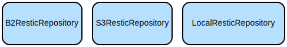

# TimeLocker: A High-Level Interface for Backup Operations

<!-- Project Info Badges -->
[](https://www.gnu.org/licenses/gpl-3.0)
[](https://www.python.org/downloads/)
[](https://github.com/Auriora/TimeLocker)
[](https://github.com/Auriora/TimeLocker/actions/workflows/test-suite.yml)
[](https://github.com/Auriora/TimeLocker/actions)
[](CONTRIBUTING.md)


TimeLocker provides a robust, object-oriented interface for managing backups using the Restic backup tool (in future other backup tools maybe supported). It
simplifies backup operations by providing a high-level GUI that handles repository management, file selection patterns, and backup configurations across
multiple storage backends including local, network, S3, and B2.

## Table of Contents

- [Project description](#project-description)
- [Who this project is for](#who-this-project-is-for)
- [Features](#features)
- [Repository Structure](#repository-structure)
- [Instructions for using TimeLocker](#instructions-for-using-timelocker)
    - [Project dependencies](#project-dependencies)
    - [Installation](#installation)
    - [Quick Start](#quick-start)
- [More Detailed Examples](#more-detailed-examples)
- [Troubleshooting](#troubleshooting)
- [Data Flow](#data-flow)
- [Infrastructure](#infrastructure)
- [Documentation](#documentation)
- [Contributing](#contributing)
- [Support](#support)
- [Acknowledgements](#acknowledgements)
- [Terms of use](#terms-of-use)
- [Document Information](#document-information)

## Project description

The library abstracts away the complexity of managing Restic commands and configurations while providing type-safe interfaces and comprehensive error handling.
It supports multiple storage backends (Local, S3, Backblaze B2) with automatic credential management and validation.

## Who this project is for

This project is intended for:

- System administrators who need to set up backup solutions
- Developers who want to integrate backup functionality into their applications
- End users who want a more user-friendly interface for Restic backups

## Features

- Unified interface for managing backup repositories across different storage backends
- Smart file selection system with pattern-based inclusion/exclusion
- Built-in support for common backup patterns and file groups
- Automatic credential management for cloud storage backends
- Comprehensive error handling and logging
- Type-safe interfaces with full typing support
- Extensible architecture for adding new repository types

## Repository Structure

```
.
├── src/                                # Main source code
│   ├── TimeLocker/                    # Core package
│   │   ├── backup_manager.py          # Central backup operation coordinator
│   │   ├── backup_repository.py       # Abstract base class for repositories
│   │   ├── backup_snapshot.py         # Snapshot management functionality
│   │   ├── backup_target.py           # Backup target configuration
│   │   ├── file_selections.py         # File selection pattern management
│   │   ├── command_builder/          # Command-line builder utilities
│   │   │   ├── core.py               # Core command builder implementation
│   │   │   └── __init__.py           # Package initialization
│   │   ├── restic/                   # Restic-specific implementations
│   │   │   ├── Repositories/         # Storage backend implementations
│   │   │   │   ├── b2.py             # Backblaze B2 repository implementation
│   │   │   │   ├── local.py          # Local filesystem repository
│   │   │   │   └── s3.py             # Amazon S3 repository
│   │   │   ├── errors.py             # Custom error definitions
│   │   │   ├── logging.py            # Logging configuration
│   │   │   ├── restic_command_definition.py # Restic command definitions
│   │   │   └── restic_repository.py  # Base Restic repository implementation
│   ├── json2command_definition/      # JSON to command definition converter
│   └── man2json/                     # Man page to JSON converter
├── tests/                            # Test suite
│   ├── TimeLocker/                   # Tests for core package
│   │   ├── backup/                   # Tests for backup functionality
│   │   ├── command_builder/          # Tests for command builder
│   │   └── restic/                   # Tests for Restic implementations
│   ├── json2command_definition/      # Tests for JSON converter
│   └── man2json/                     # Tests for man page converter
├── docs/                             # Documentation
│   ├── command_builder.md            # Command builder documentation
│   ├── compliance/                   # Compliance documentation
│   ├── resources/                    # Documentation resources
│   │   ├── diagrams/                 # UML and other diagrams
│   │   └── images/                   # Images used in documentation
│   ├── SDLC/                         # Software Development Lifecycle docs
│   │   ├── Process/                  # SDLC process documentation
│   │   ├── SRS/                      # Software Requirements Specification
│   │   ├── acceptance_tests/         # Acceptance test documentation
│   │   └── tests/                    # Test documentation
│   └── restic_commands.json          # JSON definition of Restic commands
├── temp/                             # Temporary files
├── test-results/                     # Test results output
├── CHANGELOG.md                      # Project changelog
├── CODE_OF_CONDUCT.md                # Code of conduct
├── CONTRIBUTING.md                   # Contributing guidelines
├── LICENSE                           # GNU GPL v3 license
├── README.md                         # This file
├── SECURITY.md                       # Security policy
├── SUPPORT.md                        # Support information
├── devfile.yaml                      # Development environment configuration
├── qodana.yaml                       # Code quality configuration
└── requirements.txt                  # Python dependencies
```

## Instructions for using TimeLocker

### Project dependencies

- Python 3.12 or higher
- Restic backup tool installed and accessible in PATH
- For cloud storage:
    - S3: boto3 package (`pip install boto3`)
    - B2: b2sdk package (`pip install b2sdk`)

### Installation

For basic installation:

```bash
# Clone the repository
git clone <repository-url>
cd timelocker

# Install dependencies
pip install -r requirements.txt
```

For detailed installation instructions, including platform-specific guidance, configuration, and troubleshooting, please refer to
our [Installation Guide](docs/INSTALLATION.md).

### Quick Start

```python
from TimeLocker.backup_manager import BackupManager
from TimeLocker.backup_target import BackupTarget
from TimeLocker.file_selections import FileSelection, SelectionType

# Initialize backup manager
manager = BackupManager()

# Create a backup target
selection = FileSelection()
selection.add_path("/path/to/backup")
selection.add_pattern("*.txt", SelectionType.INCLUDE)
selection.add_pattern("*.tmp", SelectionType.EXCLUDE)
target = BackupTarget(selection, tags=["documents"])

# Create and initialize repository
repo = manager.from_uri("s3:bucket-name/backup", password="your-password")

# Perform backup
repo.backup(target)
```

### More Detailed Examples

```python
# Using B2 backend
repo = manager.from_uri(
    "b2:bucket-name/backup?account_id=your-id&account_key=your-key",
    password="your-password"
)

# Adding pattern groups
selection = FileSelection()
selection.add_pattern_group("office_documents")
selection.add_pattern_group("source_code", SelectionType.EXCLUDE)

# Creating snapshot
snapshot = repo.create_snapshot(target)

# Restoring files
snapshot.restore("/path/to/restore")
```

### Troubleshooting

Common issues and solutions:

1. Repository Authentication Failures

```python
try:
    repo = manager.from_uri("s3:bucket/backup")
except RepositoryError as e:
    # Check environment variables
    print("AWS credentials not found:", e)
```

2. File Selection Validation

```python
try:
    selection = FileSelection()
    selection.validate()
except ValueError:
    print("At least one folder must be included in backup selection")
```

3. Debug Logging

```python
import logging
logging.getLogger('restic').setLevel(logging.DEBUG)
```

## Data Flow

The backup process follows this general flow:

1. Configuration of backup target and file selection patterns
2. Repository initialization and validation
3. Execution of backup operation with selected files
4. Snapshot creation and management

```ascii
[BackupManager] --> [BackupRepository]
       |                    |
       v                    v
[FileSelection] --> [BackupTarget] --> [Snapshot]
```

Key component interactions:

- BackupManager orchestrates repository creation and management
- BackupRepository handles storage backend operations
- FileSelection manages include/exclude patterns
- BackupTarget combines file selection with metadata
- Snapshot represents a point-in-time backup state
- Repository implementations handle backend-specific operations

## Infrastructure



### S3 Repository

- Type: `S3ResticRepository`
- Purpose: Manages backups in Amazon S3 buckets
- Environment: Requires AWS credentials (access key, secret key, region)

### B2 Repository

- Type: `B2ResticRepository`
- Purpose: Manages backups in Backblaze B2 storage
- Environment: Requires B2 credentials (account ID, application key)

### Local Repository

- Type: `LocalResticRepository`
- Purpose: Manages backups in local filesystem
- Environment: Requires write access to target directory

---

## Documentation

For more detailed documentation, please refer to:

- [**Installation Guide**](docs/INSTALLATION.md) Detailed instructions for installing TimeLocker
- [**Command Builder Documentation**](docs/command_builder.md) Details on using the command builder
- [**Documentation Organization**](docs/DOCUMENTATION_ORGANIZATION.md) Guidelines for organizing documentation
- [**SDLC Documentation**](docs/SDLC/) Software Development Lifecycle documentation
- [**Simplified SDLC for Solo Developers**](docs/SDLC/Simplified-SDLC-Index.md) Streamlined process for solo developers with AI assistance
- [**SRS Documentation**](docs/SDLC/SRS/) Software Requirements Specification

## Contributing

Contributions are welcome! Please read our [Contributing Guide](CONTRIBUTING.md) for details on our code of conduct and the process for submitting pull
requests.

By participating in this project, you agree to abide by the [Code of Conduct](CODE_OF_CONDUCT.md).

## Support

If you're experiencing issues with TimeLocker or have questions about its usage, please check our [Support Guide](SUPPORT.md) for information on how to get
help.

For security-related issues, please refer to our [Security Policy](SECURITY.md) and follow the instructions there instead of filing a public issue.

## Acknowledgements

- [Restic](https://restic.net/) - The underlying backup tool that TimeLocker builds upon
- All contributors who have helped shape TimeLocker

## Terms of use

This project is licensed under the [GNU General Public License v3.0 (GPL-3.0)](https://www.gnu.org/licenses/gpl-3.0.html). See the [LICENSE](LICENSE) file for
details.

The GPL-3.0 is a strong copyleft license that requires anyone who distributes your code or a derivative work to make the source available under the same terms.
This is particularly suitable for libraries and applications that you want to remain open source.

## Document Information

- Version: 1.0.0
- Last Updated: 2024-07-01
- Author: Bruce Cherrington
- Copyright © Bruce Cherrington
