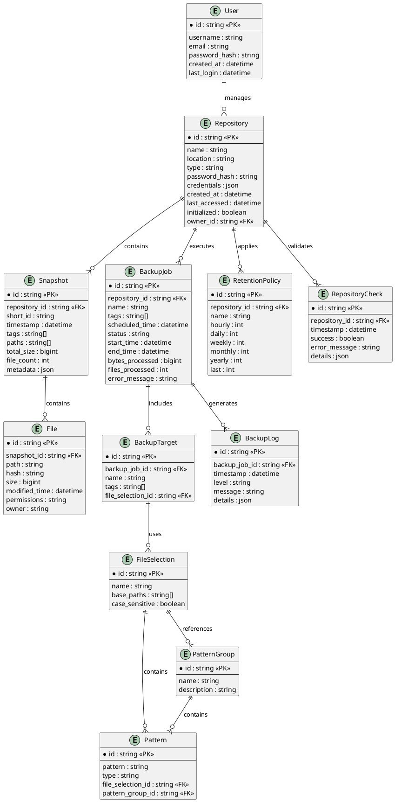

# Data Model

This document describes the data structures and relationships used in the TimeLocker application.

## Entity Relationship Diagram

The following diagram shows the relationships between the main entities in the TimeLocker application:

## Data Dictionary

### User

Represents a user of the TimeLocker application.

| Attribute     | Type     | Description                        |
|---------------|----------|------------------------------------|
| id            | string   | Unique identifier for the user     |
| username      | string   | User's login name                  |
| email         | string   | User's email address               |
| password_hash | string   | Hashed password for authentication |
| created_at    | datetime | When the user account was created  |
| last_login    | datetime | When the user last logged in       |

### Repository

Represents a backup repository managed by TimeLocker.

| Attribute     | Type     | Description                                          |
|---------------|----------|------------------------------------------------------|
| id            | string   | Unique identifier for the repository                 |
| name          | string   | User-friendly name for the repository                |
| location      | string   | URI location of the repository                       |
| type          | string   | Repository type (local, s3, b2, etc.)                |
| password_hash | string   | Hashed repository password                           |
| credentials   | json     | Credentials for accessing the repository (encrypted) |
| created_at    | datetime | When the repository was created                      |
| last_accessed | datetime | When the repository was last accessed                |
| initialized   | boolean  | Whether the repository has been initialized          |
| owner_id      | string   | Foreign key to the User who owns this repository     |

### Snapshot

Represents a point-in-time backup in a repository.

| Attribute     | Type     | Description                            |
|---------------|----------|----------------------------------------|
| id            | string   | Unique identifier for the snapshot     |
| repository_id | string   | Foreign key to the Repository          |
| short_id      | string   | Short identifier used by Restic        |
| timestamp     | datetime | When the snapshot was created          |
| tags          | string[] | Tags associated with the snapshot      |
| paths         | string[] | Paths included in the snapshot         |
| total_size    | bigint   | Total size of the snapshot in bytes    |
| file_count    | int      | Number of files in the snapshot        |
| metadata      | json     | Additional metadata about the snapshot |

### BackupJob

Represents a backup operation.

| Attribute       | Type     | Description                                          |
|-----------------|----------|------------------------------------------------------|
| id              | string   | Unique identifier for the backup job                 |
| repository_id   | string   | Foreign key to the Repository                        |
| name            | string   | User-friendly name for the job                       |
| tags            | string[] | Tags to apply to the resulting snapshot              |
| scheduled_time  | datetime | When the job is scheduled to run                     |
| status          | string   | Current status (pending, running, completed, failed) |
| start_time      | datetime | When the job started                                 |
| end_time        | datetime | When the job completed                               |
| bytes_processed | bigint   | Number of bytes processed                            |
| files_processed | int      | Number of files processed                            |
| error_message   | string   | Error message if the job failed                      |

### BackupTarget

Represents a target to be backed up.

| Attribute         | Type     | Description                             |
|-------------------|----------|-----------------------------------------|
| id                | string   | Unique identifier for the backup target |
| backup_job_id     | string   | Foreign key to the BackupJob            |
| name              | string   | User-friendly name for the target       |
| tags              | string[] | Tags associated with the target         |
| file_selection_id | string   | Foreign key to the FileSelection        |

### FileSelection

Represents a set of file selection criteria.

| Attribute      | Type     | Description                                |
|----------------|----------|--------------------------------------------|
| id             | string   | Unique identifier for the file selection   |
| name           | string   | User-friendly name for the selection       |
| base_paths     | string[] | Base paths to include in the selection     |
| case_sensitive | boolean  | Whether pattern matching is case-sensitive |

### Pattern

Represents an include or exclude pattern for file selection.

| Attribute         | Type   | Description                                |
|-------------------|--------|--------------------------------------------|
| id                | string | Unique identifier for the pattern          |
| pattern           | string | The pattern string                         |
| type              | string | Type of pattern (include, exclude)         |
| file_selection_id | string | Foreign key to the FileSelection           |
| pattern_group_id  | string | Foreign key to the PatternGroup (optional) |

### PatternGroup

Represents a reusable group of patterns.

| Attribute   | Type   | Description                             |
|-------------|--------|-----------------------------------------|
| id          | string | Unique identifier for the pattern group |
| name        | string | User-friendly name for the group        |
| description | string | Description of the pattern group        |

### File

Represents a file in a snapshot.

| Attribute     | Type     | Description                     |
|---------------|----------|---------------------------------|
| id            | string   | Unique identifier for the file  |
| snapshot_id   | string   | Foreign key to the Snapshot     |
| path          | string   | Path of the file                |
| hash          | string   | Hash of the file content        |
| size          | bigint   | Size of the file in bytes       |
| modified_time | datetime | When the file was last modified |
| permissions   | string   | File permissions                |
| owner         | string   | Owner of the file               |

### RetentionPolicy

Represents a policy for retaining snapshots.

| Attribute     | Type   | Description                                |
|---------------|--------|--------------------------------------------|
| id            | string | Unique identifier for the retention policy |
| repository_id | string | Foreign key to the Repository              |
| name          | string | User-friendly name for the policy          |
| hourly        | int    | Number of hourly snapshots to keep         |
| daily         | int    | Number of daily snapshots to keep          |
| weekly        | int    | Number of weekly snapshots to keep         |
| monthly       | int    | Number of monthly snapshots to keep        |
| yearly        | int    | Number of yearly snapshots to keep         |
| last          | int    | Number of most recent snapshots to keep    |

### BackupLog

Represents a log entry for a backup job.

| Attribute     | Type     | Description                            |
|---------------|----------|----------------------------------------|
| id            | string   | Unique identifier for the log entry    |
| backup_job_id | string   | Foreign key to the BackupJob           |
| timestamp     | datetime | When the log entry was created         |
| level         | string   | Log level (info, warning, error)       |
| message       | string   | Log message                            |
| details       | json     | Additional details about the log entry |

### RepositoryCheck

Represents a repository integrity check.

| Attribute     | Type     | Description                        |
|---------------|----------|------------------------------------|
| id            | string   | Unique identifier for the check    |
| repository_id | string   | Foreign key to the Repository      |
| timestamp     | datetime | When the check was performed       |
| success       | boolean  | Whether the check was successful   |
| error_message | string   | Error message if the check failed  |
| details       | json     | Additional details about the check |