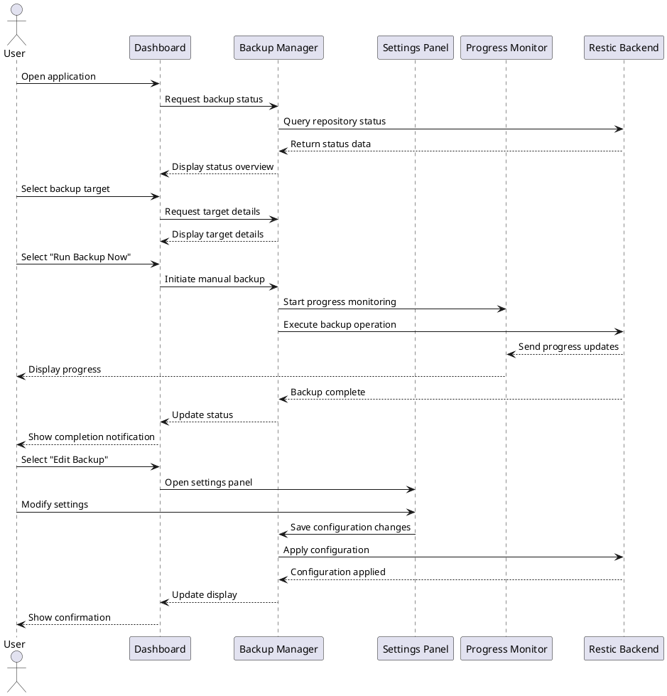

# UX Flow Diagram and Description: Backup Management Flow

## Flow Information

- **Flow ID**: UXF-002
- **Flow Name**: Backup Management Flow
- **Created By**: TimeLocker Team
- **Creation Date**: 2023-11-15
- **Last Updated**: 2023-11-16
- **Related Requirements**: Backup Operations, Status Monitoring, Configuration Management
- **Priority**: High

## Flow Objective

The Backup Management Flow aims to:

- Provide clear visibility into backup status and history
- Enable easy modification of backup configurations
- Allow users to initiate manual backups
- Present relevant metrics and statistics
- Alert users to potential issues or optimizations

## User Personas

This flow is designed for:

- **Everyday Users (Sarah)**: Users who need simple status monitoring and basic backup controls
- **Power Users (Michael)**: Technical users who want detailed metrics and advanced configuration options
- **Business Users (Elena)**: Users focused on business metrics, compliance, and team management

## Preconditions

- TimeLocker application is installed and configured
- At least one backup repository has been initialized
- User has completed the initial setup process
- User has appropriate permissions to access backup configurations

## Flow Diagram

## Entry Points

Users enter this flow when:

- Completing the initial setup process
- Opening the application after setup has been completed
- Navigating to the dashboard from other sections
- Clicking on backup status notifications

## Step-by-Step Flow

| Step # | Actor  | Action                   | System Response                                      | UI Elements                          | Notes                                                          |
|--------|--------|--------------------------|------------------------------------------------------|--------------------------------------|----------------------------------------------------------------|
| 1      | User   | Views dashboard          | System displays backup status overview               | Dashboard with status cards          | Visual indicators show backup health at a glance               |
| 2      | User   | Selects a backup target  | System displays detailed information for that target | Backup detail panel                  | Shows last backup time, next scheduled backup, and status      |
| 3      | User   | Selects "Run Backup Now" | System initiates manual backup                       | Progress indicator, status updates   | Shows real-time progress with option to minimize to background |
| 4      | System | Completes backup         | System updates status and notifies user              | Success notification, updated status | Notification can be clicked to view details                    |
| 5      | User   | Selects "Edit Backup"    | System displays editable backup settings             | Settings form with current values    | Grouped into basic and advanced sections                       |
| 6      | User   | Modifies settings        | System validates changes                             | Form validation feedback             | Prevents invalid configurations                                |
| 7      | User   | Saves changes            | System updates configuration                         | Confirmation message, updated status | Clearly indicates when changes will take effect                |

## Exit Points

Users exit this flow when:

- Navigating to another section of the application
- Initiating a restore operation
- Closing the application
- Completing a specific backup management task

## Error Scenarios

| Error Scenario         | Trigger                                           | System Response                                                   | User Recovery Action                                         |
|------------------------|---------------------------------------------------|-------------------------------------------------------------------|--------------------------------------------------------------|
| Backup Failure         | Network disconnection, permissions issue, etc.    | Clear error message with specific cause and troubleshooting steps | Follow guided steps to resolve connection/permission issues  |
| Configuration Error    | Invalid settings combination                      | Validation error with explanation                                 | Correct the invalid settings based on guidance               |
| Repository Unavailable | Repository offline or inaccessible                | Alert with repository status and reconnection options             | Check repository connection or select alternative repository |
| Insufficient Storage   | Not enough space for backup                       | Warning before backup starts with space requirements              | Free up space or change repository location                  |
| Backup Conflict        | Multiple backups attempting to run simultaneously | Notification with conflict resolution options                     | Choose which backup should proceed or reschedule             |

## UI Components

### Dashboard

- **Status Overview**: Visual summary of all backup targets with health indicators
- **Activity Timeline**: Recent and upcoming backup operations
- **Quick Action Buttons**: Run backup, restore files, add new backup
- **Storage Usage Meter**: Visual representation of repository space usage
- **Notification Center**: Recent alerts and system messages

### Backup Detail Panel

- **Status Summary**: Current backup status with color-coded indicators
- **Last Backup Information**: Time, size, and status of most recent backup
- **Next Backup Information**: Scheduled time for next automatic backup
- **Quick Actions**: Buttons for common operations (run now, edit, restore)
- **Performance Metrics**: Backup speed, compression ratio, etc.

### Backup Editor

- **Basic Settings Section**: Essential configuration options
- **Advanced Settings Toggle**: Expands to show advanced options
- **Schedule Editor**: Visual interface for setting backup frequency
- **File Selection Tool**: Interface for modifying included/excluded files
- **Validation Indicators**: Real-time feedback on setting validity

### Progress Indicator

- **Progress Bar**: Visual representation of backup progress
- **Status Messages**: Current operation and file being processed
- **Time Estimates**: Remaining time and completion percentage
- **Cancel Option**: Ability to safely cancel in-progress backup
- **Minimize Button**: Sends operation to background with status in system tray

## Design Considerations

### For Everyday Users (Sarah)

- Simplified dashboard with clear status indicators
- Plain-language status messages and instructions
- One-click access to common operations
- Guided troubleshooting for errors

### For Power Users (Michael)

- Detailed metrics and performance statistics
- Advanced configuration options readily available
- Command history and logs accessible
- Batch operations for managing multiple backups

### For Business Users (Elena)

- Business-relevant metrics (cost estimates, compliance status)
- Efficiency indicators and optimization suggestions
- Priority indicators for critical backups
- Delegation options for team management

## Accessibility Considerations

- Status indicators use both color and shape for differentiation
- All actions available via keyboard shortcuts
- Screen reader support for dynamic status updates
- Configurable refresh rates for status updates
- Scalable UI elements for different display sizes
- Progress indicators include both visual and text-based information

## Performance Expectations

- Dashboard should load within 3 seconds with complete status information
- Status updates should refresh at least every 30 seconds
- Manual backup operations should start within 2 seconds of user request
- Configuration changes should apply within 5 seconds
- Progress updates should occur at least once per second during active operations

## Related Flows

- [Initial Setup Flow](initial-setup-flow.md) - Precedes this flow for new users
- [Restore Operation Flow](restore-operation-flow.md) - For recovering files from backups
- [Repository Management Flow](repository-management-flow.md) - For managing backup destinations
- [Pattern Group Management Flow](pattern-group-management-flow.md) - For managing file selection patterns
- [Scheduled Task Management Flow](scheduled-task-management-flow.md) - For managing backup schedules

## Notes

- The dashboard is designed to provide at-a-glance status while allowing drill-down for details
- Background operations continue even when the UI is closed
- Configuration changes take effect immediately but scheduled operations follow their defined schedule
- Status indicators use a consistent color scheme across the application
- Critical alerts are displayed prominently and require acknowledgment

## Change Tracking

This section records the history of changes made to this document.

| Version | Date       | Author          | Description of Changes                   |
|---------|------------|-----------------|------------------------------------------|
| 1.0     | 2023-11-15 | TimeLocker Team | Initial version                          |
| 1.1     | 2023-11-16 | TimeLocker Team | Added detailed UI component descriptions |
| 1.2     | 2023-11-20 | TimeLocker Team | Updated to match UXFlow template format  |
