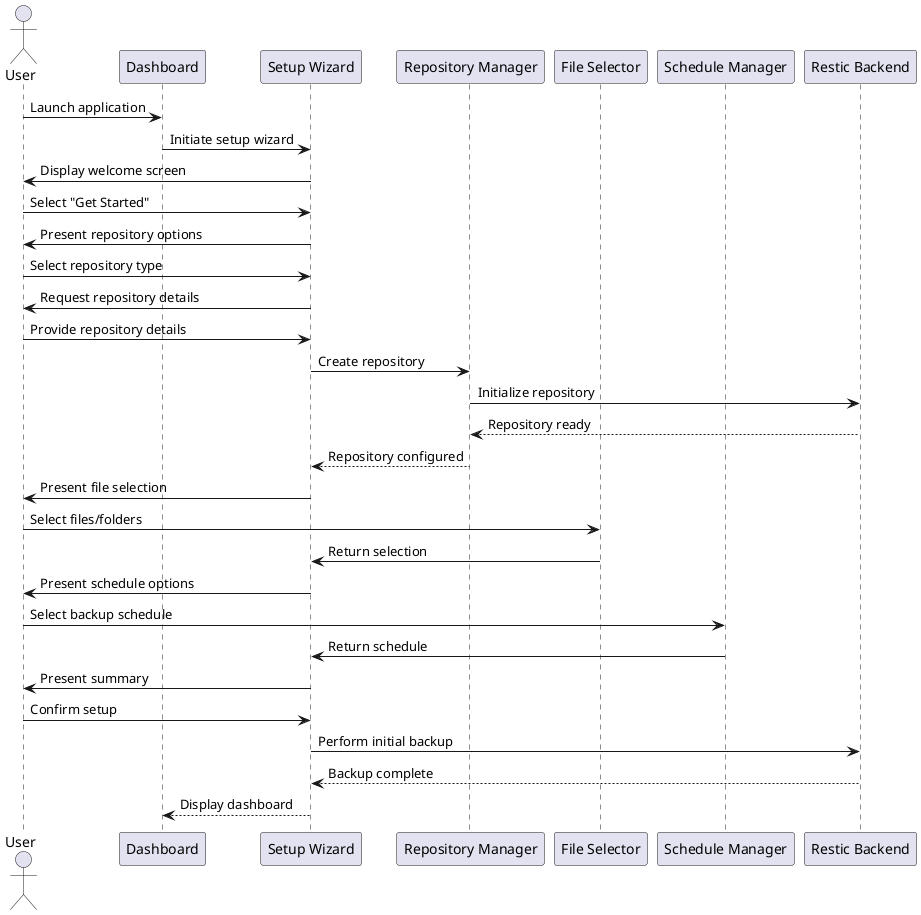

# UX Flow Diagram and Description: Initial Setup Flow

## Flow Information

- **Flow ID**: UXF-001
- **Flow Name**: Initial Setup Flow
- **Created By**: TimeLocker Team
- **Creation Date**: 2023-11-15
- **Last Updated**: 2023-11-16
- **Related Requirements**: Repository Management, Backup Configuration, User Onboarding
- **Priority**: High

## Flow Objective

The Initial Setup Flow aims to:

- Guide users through the essential configuration steps
- Simplify complex technical concepts
- Provide sensible defaults while allowing customization
- Ensure a successful first backup experience

## User Personas

This flow is designed for:

- **Everyday Users (Sarah)**: Users with limited technical knowledge who need guided setup
- **Power Users (Michael)**: Technical users who want access to advanced options
- **Business Users (Elena)**: Users focused on business requirements and compliance

## Preconditions

- TimeLocker application is installed on the user's system
- User has sufficient permissions to create and access backup repositories
- System meets minimum requirements for running the application

## Flow Diagram

## Entry Points

Users enter this flow when:

- Launching the application for the first time
- Manually initiating the setup wizard after installation
- Resetting the application to factory defaults

## Step-by-Step Flow

| Step # | Actor  | Action                                        | System Response                                                 | UI Elements                                                 | Notes                                                                                |
|--------|--------|-----------------------------------------------|-----------------------------------------------------------------|-------------------------------------------------------------|--------------------------------------------------------------------------------------|
| 1      | User   | Launches application for first time           | System detects no configuration and launches setup wizard       | Welcome screen with brief introduction                      | Simplified explanation of what backups are and why they're important                 |
| 2      | User   | Selects "Get Started"                         | System presents repository options with visual explanations     | Repository selection screen with visual icons for each type | Simplified to "Where do you want to store your backups?" with visual representations |
| 3      | User   | Selects repository type (e.g., "Local Drive") | System requests repository details with smart defaults          | Repository configuration form with pre-filled values        | For local repositories, automatically suggests appropriate locations                 |
| 4      | User   | Confirms or modifies repository location      | System validates location and creates repository                | Progress indicator, confirmation message                    | Handles permissions and space validation automatically                               |
| 5      | User   | Selects "What to Back Up"                     | System presents file/folder selection interface                 | File browser with common locations highlighted              | Suggests common user folders (Documents, Pictures, etc.)                             |
| 6      | User   | Selects files/folders to back up              | System calculates approximate size and displays summary         | Selection summary with size estimate                        | Warns if selection is unusually large                                                |
| 7      | User   | Selects "When to Back Up"                     | System presents simplified schedule options                     | Schedule selector with visual timeline                      | Offers presets like "Daily," "Weekly," etc. with visual calendar                     |
| 8      | User   | Selects schedule                              | System configures backup schedule                               | Schedule confirmation                                       | Shows next backup time in human-readable format                                      |
| 9      | User   | Reviews and confirms setup                    | System creates backup configuration and performs initial backup | Setup summary, progress indicator                           | Option to skip initial backup                                                        |
| 10     | System | Completes setup                               | System displays dashboard with backup status                    | Dashboard with status indicators                            | Provides clear "next steps" guidance                                                 |

## Exit Points

Users exit this flow when:

- Completing the setup process (success path)
- Canceling the setup process (will prompt on next launch)
- Encountering an unrecoverable error (with guidance on resolution)

## Error Scenarios

| Error Scenario                 | Trigger                                           | System Response                                      | User Recovery Action                                               |
|--------------------------------|---------------------------------------------------|------------------------------------------------------|--------------------------------------------------------------------|
| Invalid Repository Location    | User selects inaccessible or read-only location   | Clear error message with explanation and suggestions | Select different location with proper permissions                  |
| Insufficient Storage Space     | Selected location has inadequate free space       | Warning with space requirements and alternatives     | Free up space or choose different location                         |
| Network Repository Unreachable | Connection issues with remote repository          | Specific error with connection troubleshooting steps | Check network, credentials, or select local repository temporarily |
| Permission Denied              | User lacks necessary file system permissions      | Explanation of required permissions with guidance    | Adjust permissions or select different locations                   |
| Setup Interrupted              | Application crash or system shutdown during setup | Resume setup from last completed step                | Continue from where they left off                                  |

## UI Components

### Welcome Screen

- Friendly introduction with application overview
- Simple explanation of backup benefits
- Clear "Get Started" call-to-action
- Option to import existing configuration

### Repository Selection

- Visual cards for different repository types
- Brief explanation of each type's benefits and requirements
- Recommended option highlighted for new users

### File Selection Browser

- Hierarchical view of file system
- Quick selection buttons for common locations
- Size indicators for folders
- Search functionality for finding specific files/folders

### Schedule Configuration

- Visual calendar/timeline representation
- Preset options with plain-language descriptions
- Advanced toggle for custom scheduling

### Setup Summary

- Clear overview of selected options
- Estimated storage requirements
- Estimated time for initial backup
- Option to modify any section before proceeding

## Design Considerations

### For Everyday Users (Sarah)

- Simplified terminology throughout the wizard
- Visual representations of technical concepts
- Strong defaults requiring minimal decision-making
- Clear explanations at each step

### For Power Users (Michael)

- "Advanced options" toggles at each step
- Keyboard shortcuts for efficient navigation
- Detailed technical information available on demand
- Custom configuration options for all settings

### For Business Users (Elena)

- Business-focused presets for common scenarios
- Efficiency-oriented interface with time estimates
- Security and compliance information highlighted
- Cost estimation for cloud storage options

## Accessibility Considerations

- High contrast mode for all UI elements
- Keyboard navigation for all steps
- Screen reader compatibility with descriptive labels
- Resizable text and UI elements
- Sufficient color contrast for all status indicators
- Alternative text for all visual elements

## Performance Expectations

- Setup wizard should load within 2 seconds
- Repository initialization should complete within 30 seconds for local repositories
- File browser should respond to navigation within 500ms
- Initial backup progress should update at least once per second
- UI should remain responsive during background operations

## Related Flows

- [Backup Management Flow](backup-management-flow.md) - Next step after completing initial setup
- [Repository Management Flow](repository-management-flow.md) - For adding or modifying repositories
- [Settings Management Flow](settings-management-flow.md) - For adjusting application settings

## Notes

- The setup wizard is designed to be interruptible and resumable
- Default settings are optimized for security and performance
- Advanced options are hidden by default but accessible via toggle
- All settings can be modified later through the application settings

## Change Tracking

This section records the history of changes made to this document.

| Version | Date       | Author          | Description of Changes                   |
|---------|------------|-----------------|------------------------------------------|
| 1.0     | 2023-11-15 | TimeLocker Team | Initial version                          |
| 1.1     | 2023-11-16 | TimeLocker Team | Added detailed UI component descriptions |
| 1.2     | 2023-11-20 | TimeLocker Team | Updated to match UXFlow template format  |
