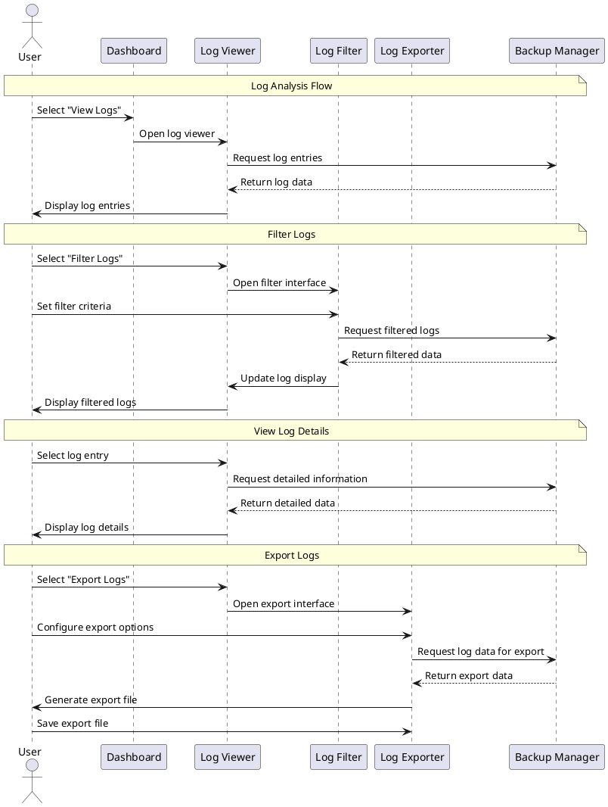

# UX Flow Diagram and Description: Log Analysis Flow

This document details the Log Analysis Flow for the TimeLocker application, which enables users to review, filter, search, and export operation logs.

## Flow Information

- **Flow ID**: UXF-007
- **Flow Name**: Log Analysis Flow
- **Created By**: TimeLocker Team
- **Creation Date**: 2023-11-15
- **Last Updated**: 2023-11-16
- **Related Requirements**: Log Management, Troubleshooting, Audit Trails, Compliance Reporting
- **Priority**: Medium

## Flow Objective

The Log Analysis Flow aims to:

- Provide comprehensive visibility into application operations
- Enable users to troubleshoot issues through detailed log analysis
- Support filtering and searching logs by various criteria
- Allow export of logs for external analysis or record-keeping
- Maintain audit trails for compliance and security purposes

## Entry Points

Users enter this flow when:

- Selecting "View Logs" from the dashboard
- Clicking on an error notification to view related logs
- Investigating issues during troubleshooting
- Performing routine audits of backup operations
- Generating reports for compliance purposes

## Flow Diagram

## Step-by-Step Flow: Viewing Logs

| Step # | Actor | Action                             | System Response                           | UI Elements                           | Notes                                         |
|--------|-------|------------------------------------|-------------------------------------------|---------------------------------------|-----------------------------------------------|
| 1      | User  | Selects "View Logs" from dashboard | System opens log viewer interface         | Log viewer with recent entries        | Shows most recent logs by default             |
| 2      | User  | Scrolls through log entries        | System loads additional entries as needed | Scrollable log list with lazy loading | Efficiently handles large log volumes         |
| 3      | User  | Selects log entry                  | System displays detailed information      | Log detail panel                      | Shows complete information for selected entry |
| 4      | User  | Navigates between related logs     | System highlights related entries         | Navigation links, highlighted entries | Helps track sequence of related events        |

## Step-by-Step Flow: Filtering Logs

| Step # | Actor | Action                         | System Response                      | UI Elements                             | Notes                                          |
|--------|-------|--------------------------------|--------------------------------------|-----------------------------------------|------------------------------------------------|
| 1      | User  | Selects "Filter" in log viewer | System displays filter options       | Filter panel with multiple criteria     | Includes date range, severity, component, etc. |
| 2      | User  | Sets filter criteria           | System applies filters in real-time  | Interactive filter controls             | Shows matching count as filters are adjusted   |
| 3      | User  | Applies filters                | System displays filtered log entries | Filtered log list with filter indicator | Clearly shows active filters                   |
| 4      | User  | Saves filter preset (optional) | System stores filter configuration   | Save filter button, preset name input   | Allows quick access to common filters          |

## Step-by-Step Flow: Exporting Logs

| Step # | Actor  | Action                            | System Response                         | UI Elements                      | Notes                                       |
|--------|--------|-----------------------------------|-----------------------------------------|----------------------------------|---------------------------------------------|
| 1      | User   | Selects "Export" in log viewer    | System displays export options          | Export panel with format options | Supports multiple export formats            |
| 2      | User   | Configures export (format, range) | System validates export settings        | Export configuration form        | Includes current filters in export          |
| 3      | User   | Initiates export                  | System generates export file            | Progress indicator               | Processes logs according to export settings |
| 4      | System | Completes export                  | System prompts for save location        | File save dialog                 | Default filename includes date range        |
| 5      | User   | Saves export file                 | System writes file to selected location | Save confirmation                | Option to open exported file                |

## Exit Points

Users exit this flow when:

- Navigating back to the dashboard
- Proceeding to related troubleshooting tools
- Completing a log export process
- Closing the log viewer

## Error Scenarios

| Error Scenario          | Trigger                                | System Response                    | User Recovery Action                          |
|-------------------------|----------------------------------------|------------------------------------|-----------------------------------------------|
| Log Access Failure      | Permission issue or corruption         | Error with specific cause          | Check permissions or repair log database      |
| No Matching Logs        | Filter criteria too restrictive        | Empty result with suggestion       | Broaden filter criteria                       |
| Export Failure          | Insufficient disk space or permissions | Error with specific cause          | Free disk space or change export location     |
| Log Database Corruption | Database file damage                   | Warning with repair option         | Initiate log database repair                  |
| Large Export Timeout    | Export size exceeds processing limit   | Warning with pagination suggestion | Export smaller chunks or use different format |

## UI Components

### Log Entry List

- **Entry Cards**: Visual representation of each log entry
- **Severity Indicators**: Color-coded icons for different log levels
- **Timestamp Display**: Clear date/time formatting with relative time
- **Category Labels**: Visual indicators of log categories
- **Quick Filters**: One-click filtering by common criteria

### Log Detail Panel

- **Complete Message**: Full log message with formatting
- **Metadata Section**: All associated log metadata
- **Stack Trace**: Expandable technical details for errors
- **Context Information**: Related system state at time of log
- **Related Logs**: Links to connected log entries

### Filter Panel

- **Date Range Selector**: Visual calendar for time filtering
- **Severity Filters**: Checkboxes for log levels
- **Component Filters**: Select specific application components
- **Text Search**: Full-text search across log content
- **Filter Presets**: Saved filter configurations

### Search Tool

- **Search Input**: Field for entering search terms
- **Advanced Syntax**: Support for complex search queries
- **Result Highlighting**: Visual highlighting of matches
- **Search History**: Recently used search terms
- **Suggestions**: Auto-complete for common search terms

### Export Configuration

- **Format Selector**: Choose between CSV, JSON, PDF, etc.
- **Range Selector**: Select which logs to include
- **Field Selector**: Choose which data fields to export
- **Anonymization Options**: Remove sensitive information
- **Compression Settings**: Options for large exports

### Timeline View

- **Visual Timeline**: Graphical representation of log events
- **Density Indicators**: Show periods of high activity
- **Event Markers**: Highlight significant events
- **Zoom Controls**: Adjust time scale of view
- **Selection Tool**: Select time ranges for detailed view

## Design Considerations

### For Everyday Users (Sarah)

- Simplified log view with plain-language descriptions
- Pre-configured filters for common troubleshooting scenarios
- Guided interpretation of error messages
- Simple export options with sensible defaults

### For Power Users (Michael)

- Advanced filtering and search capabilities
- Detailed technical information readily available
- Batch operations for log management
- Custom export configurations
- Command-line equivalent actions shown for learning

### For Business Users (Elena)

- Compliance-focused views and exports
- Summary reports of key metrics
- Audit trail capabilities
- Scheduled log exports for record-keeping
- Business impact indicators for issues

## Related Flows

- [Backup Management Flow](backup-management-flow.md) - Generates logs analyzed in this flow
- [Restore Operation Flow](restore-operation-flow.md) - Generates logs analyzed in this flow
- [Scheduled Task Management Flow](scheduled-task-management-flow.md) - For reviewing schedule execution logs
- [Settings Management Flow](settings-management-flow.md) - For configuring logging behavior
