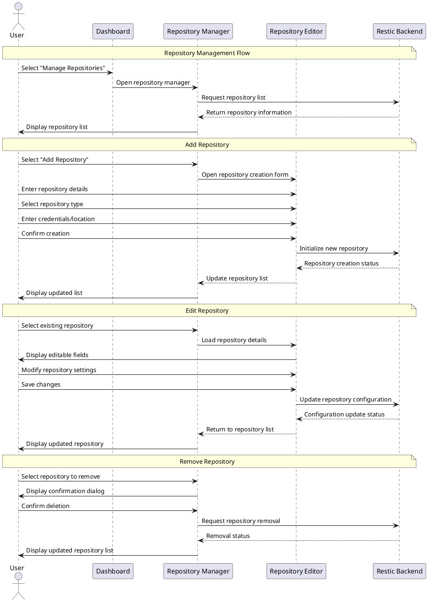

# UX Flow Diagram and Description: Repository Management Flow

This document details the Repository Management Flow for the TimeLocker application, which allows users to add, edit, and remove backup repositories.

## Flow Information

- **Flow ID**: UXF-003
- **Flow Name**: Repository Management Flow
- **Created By**: TimeLocker Team
- **Creation Date**: 2023-11-15
- **Last Updated**: 2023-11-16
- **Related Requirements**: Repository Management, Security, Storage Configuration
- **Priority**: High

## Flow Objective

The Repository Management Flow aims to:

- Enable users to create and configure repositories of different types
- Provide tools for testing and validating repository connections
- Allow modification of existing repository configurations
- Support secure credential management for repository access
- Facilitate removal of repositories when no longer needed

## Entry Points

Users enter this flow when:

- Selecting "Manage Repositories" from the main dashboard
- Completing initial setup and prompted to add additional repositories
- Encountering a repository access failure and directed to repository management
- Adding a new backup that requires a new repository

## Flow Diagram

## Step-by-Step Flow: Adding a Repository

| Step # | Actor  | Action                                            | System Response                                      | UI Elements                                    | Notes                                           |
|--------|--------|---------------------------------------------------|------------------------------------------------------|------------------------------------------------|-------------------------------------------------|
| 1      | User   | Selects "Manage Repositories" from dashboard      | System opens repository management interface         | Repository list with status indicators         | Shows all configured repositories               |
| 2      | User   | Selects "Add Repository"                          | System presents repository type selection            | Repository type cards with visual explanations | Includes local, SFTP, S3, B2, etc.              |
| 3      | User   | Selects repository type                           | System displays configuration form for selected type | Type-specific configuration form               | Fields vary based on repository type            |
| 4      | User   | Enters repository details (location, credentials) | System validates input in real-time                  | Validation indicators, suggestion tooltips     | Provides immediate feedback on input validity   |
| 5      | User   | Selects "Test Connection"                         | System attempts to connect to repository             | Progress indicator, connection status          | Verifies credentials and accessibility          |
| 6      | User   | Selects "Create Repository"                       | System initializes the repository                    | Progress indicator, creation status            | Creates necessary structures at target location |
| 7      | System | Completes repository creation                     | System adds repository to list                       | Updated repository list, success notification  | New repository is immediately available for use |

## Step-by-Step Flow: Editing a Repository

| Step # | Actor  | Action                                | System Response                            | UI Elements                                         | Notes                                               |
|--------|--------|---------------------------------------|--------------------------------------------|-----------------------------------------------------|-----------------------------------------------------|
| 1      | User   | Selects existing repository from list | System displays repository details         | Repository detail panel with edit button            | Shows current configuration                         |
| 2      | User   | Selects "Edit Repository"             | System presents editable repository form   | Form with current values pre-filled                 | Some fields may be read-only after creation         |
| 3      | User   | Modifies repository settings          | System validates changes in real-time      | Validation indicators, warning for critical changes | Warns about potential impact of changes             |
| 4      | User   | Selects "Test Connection"             | System verifies updated configuration      | Connection test results                             | Ensures repository remains accessible               |
| 5      | User   | Saves changes                         | System updates repository configuration    | Progress indicator, success notification            | Updates configuration without affecting stored data |
| 6      | System | Completes update                      | System displays updated repository details | Updated repository detail panel                     | Changes take effect immediately                     |

## Step-by-Step Flow: Removing a Repository

| Step # | Actor  | Action                       | System Response                              | UI Elements                                   | Notes                                           |
|--------|--------|------------------------------|----------------------------------------------|-----------------------------------------------|-------------------------------------------------|
| 1      | User   | Selects repository from list | System displays repository details           | Repository detail panel with remove button    | Shows current usage and status                  |
| 2      | User   | Selects "Remove Repository"  | System displays confirmation dialog          | Warning dialog with options                   | Explains consequences of removal                |
| 3      | User   | Confirms removal             | System removes repository from configuration | Progress indicator                            | Option to keep or delete actual repository data |
| 4      | System | Completes removal            | System updates repository list               | Updated repository list, confirmation message | Repository no longer appears in application     |

## Exit Points

Users exit this flow when:

- Returning to the repository list after completing operations
- Navigating back to the main dashboard
- Proceeding to the next step in setup wizard after adding a repository

## Error Scenarios

| Error Scenario        | Trigger                                         | System Response                                                  | User Recovery Action                           |
|-----------------------|-------------------------------------------------|------------------------------------------------------------------|------------------------------------------------|
| Connection Failure    | Network issue, invalid credentials              | Specific error with connection details and troubleshooting steps | Verify network connectivity, check credentials |
| Permission Denied     | Insufficient permissions at target location     | Error message with permission requirements                       | Adjust permissions or use different location   |
| Duplicate Repository  | Attempting to add already configured repository | Warning with option to update existing or create new             | Update existing or use different location      |
| Repository Corruption | Damaged repository structure detected           | Error with recovery options                                      | Repair repository or create new one            |
| Removal Failure       | Repository in use by active backup              | Warning with list of dependent backups                           | Disable dependent backups first                |

## UI Components

### Repository List

- **Repository Cards**: Visual representation of each repository with type icon
- **Status Indicators**: Color-coded status for each repository
- **Usage Statistics**: Storage usage and backup count for each repository
- **Action Buttons**: Quick access to common operations
- **Search/Filter**: Tools to find specific repositories in large lists

### Repository Type Selector

- **Type Cards**: Visual cards for different repository types
- **Type Descriptions**: Brief explanation of each type's benefits and limitations
- **Recommendation Badges**: Suggested options for different use cases
- **Requirements List**: Prerequisites for each repository type

### Repository Configuration Form

- **Type-Specific Fields**: Dynamic form based on selected repository type
- **Validation Indicators**: Real-time feedback on input validity
- **Credential Manager**: Secure interface for entering authentication details
- **Advanced Options**: Expandable section for power user settings
- **Help Tooltips**: Contextual guidance for each field

### Connection Tester

- **Test Button**: Prominent button to verify configuration
- **Progress Indicator**: Visual feedback during connection test
- **Result Display**: Clear success/failure indication with details
- **Troubleshooting Tips**: Suggestions for resolving connection issues

### Confirmation Dialogs

- **Warning Messages**: Clear explanation of potentially destructive actions
- **Option Selectors**: Choices for how to proceed with operations
- **Dependency Lists**: Information about affected backups or configurations
- **Confirmation Controls**: Require explicit confirmation for critical actions

## Design Considerations

### For Everyday Users (Sarah)

- Simplified repository types with clear explanations
- Guided setup with smart defaults
- Visual confirmation of successful operations
- Plain-language error messages with recovery steps

### For Power Users (Michael)

- Access to all repository configuration options
- Batch operations for managing multiple repositories
- Detailed connection and performance metrics
- Command-line equivalent actions shown for learning

### For Business Users (Elena)

- Business-focused repository recommendations
- Cost and compliance information for different repository types
- Delegation options for team-managed repositories
- Audit trail of repository management actions

## Related Flows

- [Initial Setup Flow](initial-setup-flow.md) - Includes repository setup as a key step
- [Backup Management Flow](backup-management-flow.md) - Uses repositories configured in this flow
- [Restore Operation Flow](restore-operation-flow.md) - Retrieves data from repositories
