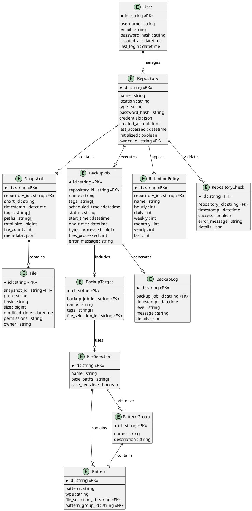

# Architecture Document: Data Model

- **Owner**: Architecture Team
- **Status**: Design Specification - Future Consideration
- **Created Date**: 19-12-2024
- **Last Updated**: 13-11-2025
- **Audience**: Backend Engineers, Database Administrators, QA

> **⚠️ IMPLEMENTATION STATUS**: This document describes a **conceptual data model for future database implementation**. The current TimeLocker implementation
> uses **filesystem-based JSON configuration** and does not implement a relational database schema. This design specification is retained for future
> consideration
> when migrating to a database-backed storage system.

## 1. Context

This document captures the canonical entity relationships and data dictionary that **could be used** if TimeLocker migrates from filesystem-based configuration
to a relational database system. It describes how repositories, snapshots, backup jobs, policies, and audit logs would be structured in a database.

### Current Implementation

The current implementation stores configuration data as:

- **JSON files** in `~/.config/timelocker/` (XDG-compliant)
- **Interface models** in `/src/TimeLocker/interfaces/` (data_models.py, recovery_models.py, repository_management_models.py)
- **Service-oriented architecture** without centralized database
- **Restic backend** for snapshot and backup data storage

## 2. Conceptual Data Model (Future Database Design)

This section describes a potential database schema for future implementation. **This is not currently implemented.**

### 2.1 How Current Implementation Works

TimeLocker currently stores data as follows:

**Configuration Storage**:

- **Location**: `~/.config/timelocker/` (XDG Base Directory Specification)
- **Format**: JSON files
- **Structure**:
    - `config.json` - Application configuration
    - `repositories.json` - Repository configurations
    - `policies/` - Policy definitions
    - `selections/` - Data selection templates
    - `schedules/` - Scheduled backup configurations

**Data Models**:

- **Repository Models**: `/src/TimeLocker/interfaces/repository_management_models.py`
- **Backup Models**: `/src/TimeLocker/interfaces/data_models.py`
- **Recovery Models**: `/src/TimeLocker/interfaces/recovery_models.py`

**Snapshot Storage**:

- Managed entirely by Restic backend
- Stored in repository (not in TimeLocker database)
- Accessed via Restic commands

**Example Current Structure**:

```
~/.config/timelocker/
├── config.json
├── repositories.json
├── credentials/          # Encrypted credentials (per-repository)
├── policies/
│   └── {policy-id}.json
├── selections/
│   └── {selection-id}.json
└── schedules/
    └── {schedule-id}.json
```

### 2.2 Future Database Entity Relationship Diagram

If TimeLocker migrates to a database system, the following entity relationships could be implemented.



### 2.3 Future Database Data Dictionary

The following data dictionary describes entities for a potential future database implementation.

#### User

Represents a user of the TimeLocker application.

| Attribute     | Type     | Description                        |
|---------------|----------|------------------------------------|
| id            | string   | Unique identifier for the user     |
| username      | string   | User's login name                  |
| email         | string   | User's email address               |
| password_hash | string   | Hashed password for authentication |
| created_at    | datetime | When the user account was created  |
| last_login    | datetime | When the user last logged in       |

#### Repository

Represents a backup repository managed by TimeLocker.

| Attribute     | Type     | Description                                          |
|---------------|----------|------------------------------------------------------|
| id            | string   | Unique identifier for the repository                 |
| name          | string   | User-friendly name for the repository                |
| location      | string   | URI location of the repository                       |
| type          | string   | Repository type (local, s3, b2, etc.)                |
| password_hash | string   | Hashed repository password                           |
| credentials   | json     | Credentials for accessing the repository (encrypted) |
| created_at    | datetime | When the repository was created                      |
| last_accessed | datetime | When the repository was last accessed                |
| initialized   | boolean  | Whether the repository has been initialized          |
| owner_id      | string   | Foreign key to the User who owns this repository     |

#### Snapshot

Represents a point-in-time backup in a repository.

| Attribute     | Type     | Description                            |
|---------------|----------|----------------------------------------|
| id            | string   | Unique identifier for the snapshot     |
| repository_id | string   | Foreign key to the Repository          |
| short_id      | string   | Short identifier used by Restic        |
| timestamp     | datetime | When the snapshot was created          |
| tags          | string[] | Tags associated with the snapshot      |
| paths         | string[] | Paths included in the snapshot         |
| total_size    | bigint   | Total size of the snapshot in bytes    |
| file_count    | int      | Number of files in the snapshot        |
| metadata      | json     | Additional metadata about the snapshot |

#### BackupJob

Represents a backup operation.

| Attribute       | Type     | Description                                          |
|-----------------|----------|------------------------------------------------------|
| id              | string   | Unique identifier for the backup job                 |
| repository_id   | string   | Foreign key to the Repository                        |
| name            | string   | User-friendly name for the job                       |
| tags            | string[] | Tags to apply to the resulting snapshot              |
| scheduled_time  | datetime | When the job is scheduled to run                     |
| status          | string   | Current status (pending, running, completed, failed) |
| start_time      | datetime | When the job started                                 |
| end_time        | datetime | When the job completed                               |
| bytes_processed | bigint   | Number of bytes processed                            |
| files_processed | int      | Number of files processed                            |
| error_message   | string   | Error message if the job failed                      |

#### BackupTarget

Represents a target to be backed up.

| Attribute         | Type     | Description                             |
|-------------------|----------|-----------------------------------------|
| id                | string   | Unique identifier for the backup target |
| backup_job_id     | string   | Foreign key to the BackupJob            |
| name              | string   | User-friendly name for the target       |
| tags              | string[] | Tags associated with the target         |
| file_selection_id | string   | Foreign key to the FileSelection        |

#### FileSelection

Represents a set of file selection criteria.

| Attribute      | Type     | Description                                |
|----------------|----------|--------------------------------------------|
| id             | string   | Unique identifier for the file selection   |
| name           | string   | User-friendly name for the selection       |
| base_paths     | string[] | Base paths to include in the selection     |
| case_sensitive | boolean  | Whether pattern matching is case-sensitive |

#### Pattern

Represents an include or exclude pattern for file selection.

| Attribute         | Type   | Description                                |
|-------------------|--------|--------------------------------------------|
| id                | string | Unique identifier for the pattern          |
| pattern           | string | The pattern string                         |
| type              | string | Type of pattern (include, exclude)         |
| file_selection_id | string | Foreign key to the FileSelection           |
| pattern_group_id  | string | Foreign key to the PatternGroup (optional) |

#### PatternGroup

Represents a reusable group of patterns.

| Attribute   | Type   | Description                             |
|-------------|--------|-----------------------------------------|
| id          | string | Unique identifier for the pattern group |
| name        | string | User-friendly name for the group        |
| description | string | Description of the pattern group        |

#### File

Represents a file in a snapshot.

| Attribute     | Type     | Description                     |
|---------------|----------|---------------------------------|
| id            | string   | Unique identifier for the file  |
| snapshot_id   | string   | Foreign key to the Snapshot     |
| path          | string   | Path of the file                |
| hash          | string   | Hash of the file content        |
| size          | bigint   | Size of the file in bytes       |
| modified_time | datetime | When the file was last modified |
| permissions   | string   | File permissions                |
| owner         | string   | Owner of the file               |

#### RetentionPolicy

Represents a policy for retaining snapshots.

| Attribute     | Type   | Description                                |
|---------------|--------|--------------------------------------------|
| id            | string | Unique identifier for the retention policy |
| repository_id | string | Foreign key to the Repository              |
| name          | string | User-friendly name for the policy          |
| hourly        | int    | Number of hourly snapshots to keep         |
| daily         | int    | Number of daily snapshots to keep          |
| weekly        | int    | Number of weekly snapshots to keep         |
| monthly       | int    | Number of monthly snapshots to keep        |
| yearly        | int    | Number of yearly snapshots to keep         |
| last          | int    | Number of most recent snapshots to keep    |

#### BackupLog

Represents a log entry for a backup job.

| Attribute     | Type     | Description                            |
|---------------|----------|----------------------------------------|
| id            | string   | Unique identifier for the log entry    |
| backup_job_id | string   | Foreign key to the BackupJob           |
| timestamp     | datetime | When the log entry was created         |
| level         | string   | Log level (info, warning, error)       |
| message       | string   | Log message                            |
| details       | json     | Additional details about the log entry |

#### RepositoryCheck

Represents a repository integrity check.

| Attribute     | Type     | Description                        |
|---------------|----------|------------------------------------|
| id            | string   | Unique identifier for the check    |
| repository_id | string   | Foreign key to the Repository      |
| timestamp     | datetime | When the check was performed       |
| success       | boolean  | Whether the check was successful   |
| error_message | string   | Error message if the check failed  |
| details       | json     | Additional details about the check |

## 3. Current Implementation Details

### 3.1 Interface Models

The actual data models currently in use are defined as Python dataclasses:

**Repository Management Models** (`/src/TimeLocker/interfaces/repository_management_models.py`):

- `RepositoryConfig` - Repository configuration and credentials
- `RepositoryMetadata` - Repository metadata and statistics
- `RepositoryValidationResult` - Validation results

**Backup Operations Models** (`/src/TimeLocker/interfaces/data_models.py`):

- `BackupJobConfig` - Backup job configuration
- `BackupResult` - Backup operation results
- `ExecutionMode` - Backup execution modes
- `DataSelectionConfig` - Data selection configuration

**Recovery Operations Models** (`/src/TimeLocker/interfaces/recovery_models.py`):

- `RecoveryOptions` - Recovery operation options
- `RecoveryResult` - Recovery operation results
- `RecoveryValidationResult` - Validation results

### 3.2 Data Persistence Strategy

**Current Approach**:

- **Configuration**: JSON files in XDG-compliant directories
- **Credentials**: Encrypted per-repository using platform keystores
- **Snapshots**: Managed by Restic, stored in repository
- **Logs**: File-based logging to `~/.cache/timelocker/logs/`

**Benefits**:

- Simple deployment (no database required)
- Easy backup of configuration (copy directory)
- Platform-independent
- No database maintenance overhead

**Limitations**:

- No transaction support
- Limited query capabilities
- No built-in concurrent access control
- Manual schema migration

### 3.3 When Database Migration Makes Sense

A database migration could be considered when:

- Multi-user scenarios requiring concurrent access
- Need for complex queries across entities
- Transaction requirements for data consistency
- Centralized management for enterprise deployments
- Advanced reporting and analytics needs

## 4. Migration Path (Future Consideration)

If migrating to a database system:

1. **Phase 1: Hybrid Approach**
    - Keep JSON for simple configuration
    - Add database for operational data (jobs, logs, history)
    - Gradual migration of entities

2. **Phase 2: Full Database**
    - Migrate all configuration to database
    - Implement schema migration tools
    - Provide export/import utilities

3. **Phase 3: Advanced Features**
    - Enable multi-user scenarios
    - Implement advanced querying
    - Add real-time synchronization

## 5. Consequences

**Current Filesystem Approach**:

- ✅ Simple deployment and maintenance
- ✅ Easy configuration backup and restore
- ✅ No database dependencies
- ✅ Platform-independent
- ⚠️ Limited query capabilities
- ⚠️ No multi-user support
- ⚠️ Manual concurrent access management

**Future Database Approach**:

- ✅ Advanced query capabilities
- ✅ Transaction support
- ✅ Multi-user support
- ✅ Better scalability for enterprise
- ⚠️ Increased deployment complexity
- ⚠️ Database maintenance overhead
- ⚠️ Additional dependencies

## 6. Alternatives Considered

### Current Implementation Alternatives

1. **SQLite Database** (Not adopted for initial release)
    - Pros: SQL capabilities, transactions, still file-based
    - Cons: Added complexity, migration challenges, not as simple to backup

2. **YAML Configuration** (Not adopted)
    - Pros: Human-readable, supports comments
    - Cons: Parsing overhead, schema validation challenges

3. **TOML Configuration** (Not adopted)
    - Pros: Clear syntax, Python support
    - Cons: Less widespread than JSON, parsing dependencies

### Future Database Options

1. **SQLite**
    - Pros: Serverless, file-based, transactions, SQL queries
    - Cons: Limited concurrent write access
    - **Best for**: Single-user enhanced scenarios

2. **PostgreSQL**
    - Pros: Full ACID compliance, advanced features, multi-user
    - Cons: Server deployment, maintenance overhead
    - **Best for**: Enterprise deployments

3. **Document Database (MongoDB, etc.)**
    - Pros: Flexible schema, good for JSON-like data
    - Cons: Deployment complexity, not relational
    - **Best for**: Cloud-based scenarios

# References

- **Current Implementation**:
    - [Interface Models](/src/TimeLocker/interfaces/)
    - [Configuration Management](configuration-management.md)
    - [Repository Management](repository-management.md)

- **Future Considerations**:
    - API payload examples: `api-reference.md` (design specification)
    - Requirement mapping: `component-breakdown.md`
