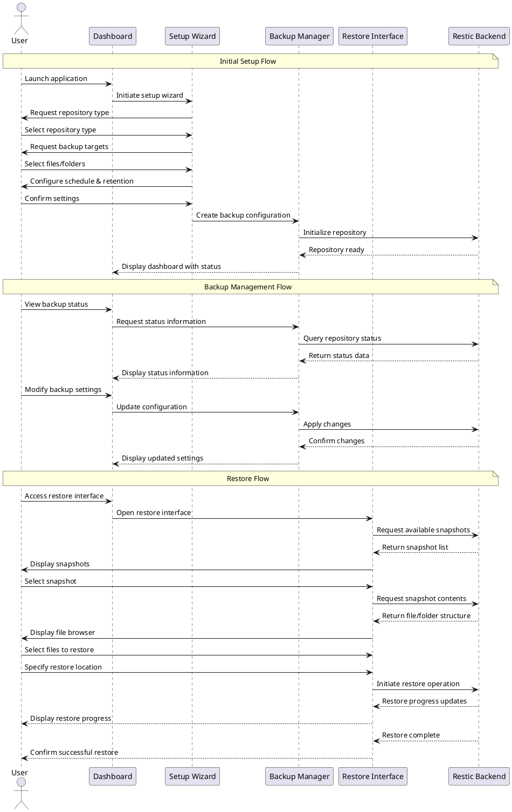

# UX Flow Diagram and Description: Core Flows

This document provides an overview of the core user flows in the TimeLocker application. These flows represent the primary interactions that users will have
with the application.

## Flow Information

- **Flow ID**: UXF-008
- **Flow Name**: Core Flows
- **Created By**: TimeLocker Team
- **Creation Date**: 2023-11-15
- **Last Updated**: 2023-11-16
- **Related Requirements**: User Experience, Navigation, Application Structure
- **Priority**: High

## Overview

The core flows of TimeLocker include:

1. **Initial Setup Flow**: The process of setting up the application for first-time use
2. **Backup Management Flow**: Managing existing backups and their configurations
3. **Restore Operation Flow**: Recovering files from backups

These flows are designed to accommodate the needs of different user personas while maintaining a consistent and intuitive user experience.

## Main Flow Diagram

The following diagram illustrates the relationships between the core flows:

## Flow Descriptions

### Initial Setup Flow

The [Initial Setup Flow](initial-setup-flow.md) guides new users through the process of configuring the application for first use. It includes:

- Repository selection and configuration
- Backup target selection
- Schedule and retention policy configuration
- Initial backup creation

This flow is designed to be simple and guided, with sensible defaults for non-technical users while still providing access to advanced options for power users.

### Backup Management Flow

The [Backup Management Flow](backup-management-flow.md) allows users to:

- View backup status and history
- Modify backup configurations
- Run manual backups
- Monitor backup progress
- View backup statistics

This flow provides both at-a-glance status information for everyday users and detailed metrics for power users.

### Restore Operation Flow

The [Restore Operation Flow](restore-operation-flow.md) enables users to:

- Browse available backup snapshots
- Search for specific files across snapshots
- Preview files before restoration
- Select restore location and options
- Monitor restore progress

This flow emphasizes simplicity and clarity to reduce stress during what is often a critical operation for users.

## Flow Transitions

Users can move between these core flows as follows:

- From **Initial Setup** to **Backup Management**: Automatically after completing setup
- From **Backup Management** to **Restore Operation**: Via dashboard controls
- From **Restore Operation** to **Backup Management**: After completing restore or canceling
- From **Any Flow** to **Settings**: Via global settings access

Each transition is designed to be intuitive and maintain context to avoid disorienting the user.
