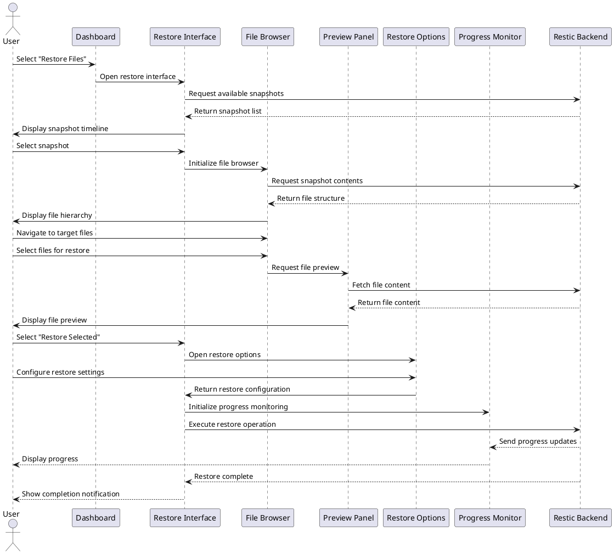

# UX Flow Diagram and Description: Restore Operation Flow

## Flow Information

- **Flow ID**: UXF-003
- **Flow Name**: Restore Operation Flow
- **Created By**: TimeLocker Team
- **Creation Date**: 2023-11-15
- **Last Updated**: 2023-11-16
- **Related Requirements**: Recovery Operations, File Management, User Experience
- **Priority**: High

## Flow Objective

The Restore Operation Flow aims to:

- Provide a clear and stress-free process for file recovery
- Enable users to easily locate specific files across backup snapshots
- Allow preview of files before restoration
- Offer flexible restore options (location, conflict resolution)
- Provide transparent progress and status information

## User Personas

This flow is designed for:

- **Everyday Users (Sarah)**: Users who need simple, guided file recovery
- **Power Users (Michael)**: Technical users who want detailed control over restore operations
- **Business Users (Elena)**: Users focused on business-critical data recovery and compliance

## Preconditions

- TimeLocker application is installed and configured
- At least one successful backup has been completed
- User has appropriate permissions to access backup repositories
- Repository containing the backup is accessible

## Flow Diagram

## Entry Points

Users enter this flow when:

- Selecting "Restore Files" from the dashboard
- Clicking a "Restore" button in the backup detail panel
- Responding to a system notification suggesting restoration
- Using the application's search function to find files to restore

## Step-by-Step Flow

| Step # | Actor  | Action                                 | System Response                     | UI Elements                           | Notes                                          |
|--------|--------|----------------------------------------|-------------------------------------|---------------------------------------|------------------------------------------------|
| 1      | User   | Selects "Restore Files" from dashboard | System opens restore interface      | Restore interface with timeline       | Visual timeline shows available backup points  |
| 2      | User   | Selects a backup point                 | System loads snapshot contents      | File browser with search capability   | Allows filtering by file type, date, etc.      |
| 3      | User   | Navigates to and selects files/folders | System highlights selections        | Selection indicators, file preview    | Preview available for common file types        |
| 4      | User   | Selects "Restore Selected"             | System prompts for restore location | Location selector with smart defaults | Offers original location or custom destination |
| 5      | User   | Confirms restore location              | System initiates restore operation  | Progress indicator with cancel option | Shows estimated time remaining                 |
| 6      | System | Completes restore                      | System notifies user of completion  | Success notification with details     | Option to open restored files                  |

## Exit Points

Users exit this flow when:

- Completing a successful restore operation
- Canceling the restore process
- Navigating away from the restore interface
- Closing the application during restore (operation continues in background)

## Error Scenarios

| Error Scenario          | Trigger                                  | System Response                                  | User Recovery Action                          |
|-------------------------|------------------------------------------|--------------------------------------------------|-----------------------------------------------|
| Snapshot Access Failure | Repository connection issue              | Error message with connection troubleshooting    | Check repository connection and retry         |
| Destination Write Error | Insufficient permissions or disk space   | Specific error with cause and alternatives       | Choose different destination or free up space |
| File Conflict           | Files exist at restore destination       | Prompt with options (skip, overwrite, keep both) | Select preferred conflict resolution option   |
| Corrupted File          | File integrity issue in backup           | Warning with file details and recovery options   | Skip file or attempt repair options           |
| Restore Interruption    | Network disconnection or system shutdown | Automatic resume option on next connection       | Resume interrupted restore operation          |

## UI Components

### Restore Timeline

- **Visual Timeline**: Graphical representation of available backup points
- **Date/Time Indicators**: Clear labeling of backup timestamps
- **Snapshot Details**: Size, content summary, and status for each point
- **Quick Navigation**: Jump to specific dates or tagged snapshots
- **Snapshot Comparison**: Option to compare contents between snapshots

### File Browser

- **Hierarchical View**: Folder structure matching original organization
- **Search Function**: Full-text search across all files in snapshot
- **Filter Options**: Filter by file type, size, date modified, etc.
- **Selection Tools**: Multi-select, select all, invert selection
- **Path Breadcrumbs**: Clear indication of current location in file hierarchy

### File Preview

- **Preview Panel**: Shows content of selected file when possible
- **Metadata Display**: File details (size, date, permissions)
- **Version Comparison**: Compare file with current version if available
- **Preview Controls**: Zoom, scroll, and navigation for larger files
- **Format Support**: Preview for common document, image, and text formats

### Restore Options

- **Location Selector**: Choose between original location or custom path
- **Conflict Resolution**: Options for handling existing files
- **Restore Filters**: Additional options to modify files during restore
- **Batch Settings**: Apply settings to all selected files
- **Permission Options**: Control how file permissions are restored

### Progress Indicator

- **Progress Bar**: Visual representation of restore progress
- **File Counter**: Current file and total count
- **Speed Indicator**: Transfer rate and estimated time remaining
- **Activity Log**: Real-time log of files being restored
- **Cancel/Pause Controls**: Options to interrupt or delay the process

## Design Considerations

### For Everyday Users (Sarah)

- Simplified timeline with clear date/time labels
- Familiar file browser interface similar to system file explorer
- Prominent file preview to confirm correct selection
- Guided conflict resolution with plain-language options
- One-click restore to original locations

### For Power Users (Michael)

- Detailed snapshot metadata and comparison tools
- Advanced search and filtering capabilities
- Batch restore operations with custom parameters
- Command-line equivalent actions shown for learning
- Performance metrics during restore operations

### For Business Users (Elena)

- Priority indicators for business-critical files
- Compliance information for regulated data
- Batch restore presets for common business scenarios
- Delegation options for team-managed restores
- Audit trail of restore operations

## Accessibility Considerations

- File browser supports keyboard navigation and selection
- Preview panel includes alternative text descriptions for non-text files
- Progress indicators include both visual and numerical representations
- Color-coded status indicators also use distinct shapes and icons
- All text elements support screen readers with appropriate ARIA attributes
- Restore options include large touch targets for users with motor limitations

## Performance Expectations

- Snapshot list should load within 3 seconds
- File browser should respond to navigation within 500ms
- File preview should load within 2 seconds for common file types
- Search results should appear within 1 second for typical repositories
- Restore operations should provide progress updates at least once per second
- Large file restores should support background operation with notifications

## Related Flows

- [Backup Management Flow](backup-management-flow.md) - For managing the backups used in restoration
- [Repository Management Flow](repository-management-flow.md) - For managing repository access
- [Log Analysis Flow](log-analysis-flow.md) - For reviewing restore operation history

## Notes

- The restore interface prioritizes clarity and confidence during what can be a stressful operation for users
- File preview functionality depends on file type and size (some files may not be previewable)
- Conflict resolution options are presented before restore begins to avoid interruptions
- Restore operations can be paused and resumed if needed
- Successful restores are logged for audit and reference purposes

## Change Tracking

This section records the history of changes made to this document.

| Version | Date       | Author          | Description of Changes                   |
|---------|------------|-----------------|------------------------------------------|
| 1.0     | 2023-11-15 | TimeLocker Team | Initial version                          |
| 1.1     | 2023-11-16 | TimeLocker Team | Added detailed UI component descriptions |
| 1.2     | 2023-11-20 | TimeLocker Team | Updated to match UXFlow template format  |
