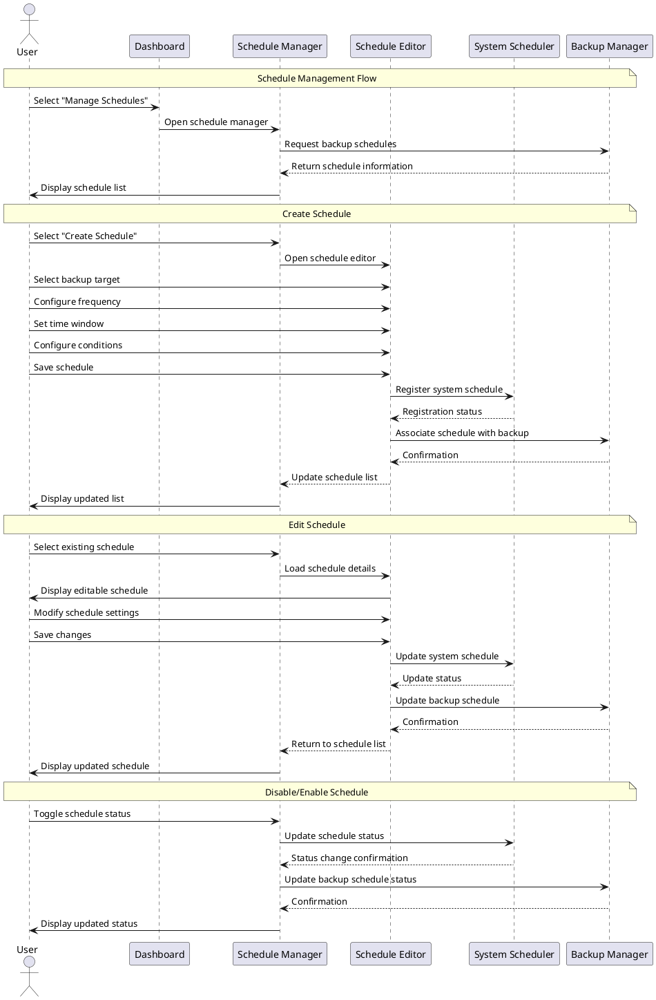

# UX Flow Diagram and Description: Scheduled Task Management Flow

This document details the Scheduled Task Management Flow for the TimeLocker application, which allows users to configure and monitor automated backup schedules.

## Flow Information

- **Flow ID**: UXF-005
- **Flow Name**: Scheduled Task Management Flow
- **Created By**: TimeLocker Team
- **Creation Date**: 2023-11-15
- **Last Updated**: 2023-11-16
- **Related Requirements**: Backup Automation, Scheduling, Task Management
- **Priority**: Medium

## Flow Objective

The Scheduled Task Management Flow aims to:

- Enable users to create automated backup schedules with various frequencies
- Provide tools for setting execution conditions and constraints
- Allow modification of existing schedules
- Support enabling/disabling scheduled backups
- Provide visibility into schedule history and future execution

## Entry Points

Users enter this flow when:

- Selecting "Manage Schedules" from the settings menu
- Configuring a schedule during backup setup
- Responding to a schedule failure notification
- Reviewing backup history and wanting to adjust timing

## Flow Diagram

## Step-by-Step Flow: Creating a Schedule

| Step # | Actor  | Action                                     | System Response                            | UI Elements                                 | Notes                                      |
|--------|--------|--------------------------------------------|--------------------------------------------|---------------------------------------------|--------------------------------------------|
| 1      | User   | Selects "Manage Schedules" from settings   | System opens schedule management interface | Schedule list with status indicators        | Shows all configured schedules             |
| 2      | User   | Selects "Create Schedule"                  | System opens schedule editor               | Schedule editor with backup target selector | Lists available backup targets             |
| 3      | User   | Selects backup target                      | System loads target-specific options       | Target selector, target details             | Shows target information                   |
| 4      | User   | Configures frequency (daily, weekly, etc.) | System presents relevant time options      | Frequency selector with visual calendar     | Intuitive frequency selection              |
| 5      | User   | Sets time window                           | System validates time selection            | Time picker with suggested windows          | Suggests off-peak hours                    |
| 6      | User   | Configures conditions (power, network)     | System shows condition options             | Condition checkboxes with explanations      | Options like "only when on AC power"       |
| 7      | User   | Saves schedule                             | System creates system scheduler entry      | Save button, progress indicator             | Creates appropriate system scheduler entry |
| 8      | System | Completes schedule creation                | System updates schedule list               | Updated schedule list, next run indicator   | Shows when next backup will run            |

## Step-by-Step Flow: Editing a Schedule

| Step # | Actor  | Action                     | System Response                                    | UI Elements                                 | Notes                                             |
|--------|--------|----------------------------|----------------------------------------------------|---------------------------------------------|---------------------------------------------------|
| 1      | User   | Selects existing schedule  | System displays schedule details                   | Schedule detail panel with edit button      | Shows current configuration and history           |
| 2      | User   | Selects "Edit Schedule"    | System opens schedule editor with current settings | Schedule editor with pre-filled values      | Maintains original configuration                  |
| 3      | User   | Modifies schedule settings | System validates changes                           | Schedule editor with validation             | Prevents invalid configurations                   |
| 4      | User   | Saves changes              | System updates system scheduler                    | Save button, progress indicator             | Updates system scheduler entry                    |
| 5      | System | Completes update           | System displays updated schedule details           | Updated schedule detail, next run indicator | Shows when next backup will run with new settings |

## Step-by-Step Flow: Enabling/Disabling a Schedule

| Step # | Actor  | Action                     | System Response                         | UI Elements                              | Notes                                                  |
|--------|--------|----------------------------|-----------------------------------------|------------------------------------------|--------------------------------------------------------|
| 1      | User   | Selects schedule from list | System displays schedule details        | Schedule detail panel with toggle switch | Shows current status                                   |
| 2      | User   | Toggles schedule status    | System updates status                   | Status toggle with visual feedback       | Clearly indicates enabled/disabled state               |
| 3      | System | Updates system scheduler   | System enables/disables scheduler entry | Progress indicator                       | Modifies system scheduler without removing entry       |
| 4      | System | Completes status change    | System updates schedule status          | Updated status indicator                 | Schedule remains in list but won't execute if disabled |

## Exit Points

Users exit this flow when:

- Returning to the schedule list after completing operations
- Navigating back to the settings menu
- Returning to the dashboard with updated schedule information

## Error Scenarios

| Error Scenario              | Trigger                                          | System Response                            | User Recovery Action                                        |
|-----------------------------|--------------------------------------------------|--------------------------------------------|-------------------------------------------------------------|
| Scheduler Permission Denied | Insufficient system permissions                  | Error with permission requirements         | Provide necessary permissions or use alternative scheduling |
| Conflicting Schedules       | Multiple resource-intensive backups at same time | Warning about potential resource conflicts | Adjust schedule times to avoid conflicts                    |
| Invalid Time Window         | Time window too narrow for backup completion     | Warning about insufficient time            | Extend time window or simplify backup                       |
| System Scheduler Failure    | Unable to register with system scheduler         | Error with alternative options             | Use application's internal scheduler instead                |
| Missed Schedule             | System was offline during scheduled time         | Notification of missed backup              | Run manual backup or wait for next scheduled run            |

## UI Components

### Schedule List

- **Schedule Cards**: Visual representation of each schedule with status
- **Next Run Indicator**: When the schedule will next execute
- **Status Toggle**: Enable/disable switch for each schedule
- **Quick Actions**: Buttons for edit, run now, delete
- **Filter Options**: Filter by backup target, status, frequency

### Schedule Editor

- **Backup Target Selector**: Choose which backup to schedule
- **Frequency Selector**: Options for how often to run (daily, weekly, etc.)
- **Visual Calendar**: Interactive calendar for selecting days and times
- **Time Window Picker**: Set start time and duration/end time
- **Advanced Options**: Expandable section for detailed configuration

### Condition Editor

- **System State Conditions**: Options like "only when on AC power"
- **Network Conditions**: Options like "only on specific networks"
- **Resource Conditions**: Options to avoid high system load
- **Dependency Settings**: Run only after other tasks complete
- **Retry Configuration**: Settings for handling failed attempts

### Schedule History

- **Execution Log**: Record of past schedule executions
- **Status Indicators**: Success/failure for each execution
- **Duration Metrics**: How long each execution took
- **Trend Analysis**: Patterns in execution times and results
- **Failure Details**: Specific information about failed runs

### Conflict Detector

- **Conflict Visualization**: Calendar view showing overlapping schedules
- **Resource Impact Analysis**: Estimated system load during schedules
- **Optimization Suggestions**: Recommendations for better scheduling
- **Batch Adjustment**: Tools to spread out conflicting schedules
- **Simulation**: Preview of schedule execution over time

## Design Considerations

### For Everyday Users (Sarah)

- Simple frequency presets (daily, weekly, monthly)
- Visual calendar representation of schedule
- Plain-language condition options
- Clear indication of next scheduled backup
- Automatic conflict resolution

### For Power Users (Michael)

- Advanced scheduling options (cron-style expressions)
- Fine-grained control over execution conditions
- Detailed history and performance metrics
- Command-line equivalent actions shown for learning
- Batch schedule management

### For Business Users (Elena)

- Business-hour aware scheduling options
- Priority settings for critical backups
- Compliance-friendly scheduling patterns
- Delegation options for team-managed schedules
- Reporting on schedule adherence

## Related Flows

- [Backup Management Flow](backup-management-flow.md) - Uses schedules configured in this flow
- [Initial Setup Flow](initial-setup-flow.md) - Includes basic schedule setup
- [Log Analysis Flow](log-analysis-flow.md) - For reviewing schedule execution history
