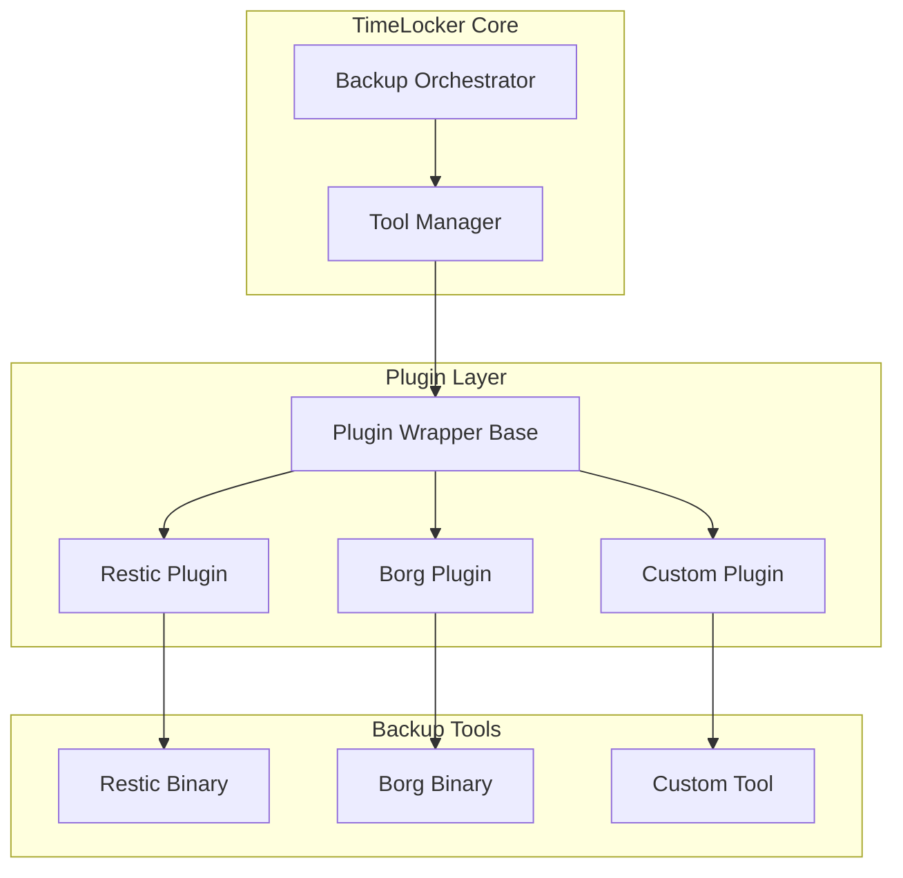

# Plugin Wrapper Development Guide

**Status**: Active  
**Last Updated**: 2025-11-09  
**Audience**: Developers adding new backup tool support

## Overview

This guide explains how to develop plugin wrappers for integrating new backup tools into TimeLocker's backup operations system. Plugin wrappers provide a standardized interface for backup tools and can supplement missing capabilities.

## Architecture Overview

### Plugin Wrapper System



### Design Principles

1. **Standardization**: All plugins implement the same base interface
2. **Capability Transparency**: Clearly distinguish native vs wrapper-provided features
3. **Graceful Degradation**: Handle missing features appropriately
4. **Performance**: Minimize overhead in wrapper layer
5. **Error Handling**: Provide detailed error context

## Plugin Wrapper Base Class

### Interface Definition

```python
from abc import ABC, abstractmethod
from dataclasses import dataclass
from enum import Enum
from pathlib import Path
from typing import Dict, List, Optional, Set
from datetime import datetime


class Feature(Enum):
    """Backup tool features."""
    PARALLEL_PROCESSING = "parallel_processing"
    INTEGRITY_VALIDATION = "integrity_validation"
    INCREMENTAL_BACKUP = "incremental_backup"
    COMPRESSION = "compression"
    ENCRYPTION = "encryption"
    DEDUPLICATION = "deduplication"
    RESUME_SUPPORT = "resume_support"
    BANDWIDTH_LIMITING = "bandwidth_limiting"
    PROGRESS_REPORTING = "progress_reporting"
    SNAPSHOT_TAGGING = "snapshot_tagging"


@dataclass
class BackupConfig:
    """Configuration for backup execution."""
    source_paths: List[Path]
    exclude_patterns: List[str]
    include_patterns: List[str]
    tags: List[str]
    parallel_operations: int
    compression_level: Optional[int]
    bandwidth_limit: Optional[int]
    additional_options: Dict[str, any]


@dataclass
class BackupResult:
    """Result of backup execution."""
    success: bool
    snapshot_id: Optional[str]
    files_processed: int
    bytes_transferred: int
    duration_seconds: float
    errors: List[str]
    warnings: List[str]


class PluginWrapper(ABC):
    """
    Base class for backup tool plugin wrappers.
    
    All backup tool integrations must inherit from this class
    and implement the required abstract methods.
    """
    
    def __init__(self, tool_path: str, repository_uri: str):
        """
        Initialize the plugin wrapper.
        
        Args:
            tool_path: Path to the backup tool executable
            repository_uri: URI of the backup repository
        """
        self.tool_path = tool_path
        self.repository_uri = repository_uri
        self._validate_tool_availability()
    
    @abstractmethod
    def get_native_capabilities(self) -> Set[Feature]:
        """
        Get capabilities natively supported by the tool.
        
        Returns:
            Set of Feature enums for native capabilities
        """
        pass
    
    @abstractmethod
    def get_wrapper_capabilities(self) -> Set[Feature]:
        """
        Get capabilities provided by the wrapper.
        
        Returns:
            Set of Feature enums for wrapper-provided capabilities
        """
        pass
    
    @abstractmethod
    def execute_backup(self, config: BackupConfig) -> BackupResult:
        """
        Execute backup using wrapped tool with standardized interface.
        
        Args:
            config: Backup configuration
            
        Returns:
            BackupResult with execution details
            
        Raises:
            BackupExecutionError: If backup fails
        """
        pass
    
    @abstractmethod
    def validate_repository(self) -> bool:
        """
        Validate that repository is accessible and properly configured.
        
        Returns:
            True if repository is valid, False otherwise
        """
        pass
    
    @abstractmethod
    def get_tool_version(self) -> str:
        """
        Get version of the backup tool.
        
        Returns:
            Version string
        """
        pass
    
    def _validate_tool_availability(self) -> None:
        """
        Validate that the backup tool is available and executable.
        
        Raises:
            ToolNotAvailableError: If tool is not available
        """
        tool_path = Path(self.tool_path)
        if not tool_path.exists():
            raise ToolNotAvailableError(
                f"Backup tool not found at: {self.tool_path}"
            )
        if not tool_path.is_file():
            raise ToolNotAvailableError(
                f"Tool path is not a file: {self.tool_path}"
            )
    
    def get_all_capabilities(self) -> Set[Feature]:
        """
        Get all capabilities (native + wrapper).
        
        Returns:
            Combined set of all capabilities
        """
        return self.get_native_capabilities() | self.get_wrapper_capabilities()
    
    def supports_feature(self, feature: Feature) -> bool:
        """
        Check if a specific feature is supported.
        
        Args:
            feature: Feature to check
            
        Returns:
            True if feature is supported (natively or via wrapper)
        """
        return feature in self.get_all_capabilities()
```

## Implementing a Plugin Wrapper

### Step 1: Create Plugin Class

Create a new file in `src/TimeLocker/plugins/` for your backup tool:

```python
# src/TimeLocker/plugins/my_backup_tool_plugin.py

from pathlib import Path
from typing import Set, List
import subprocess
import json

from TimeLocker.plugins.base import (
    PluginWrapper,
    Feature,
    BackupConfig,
    BackupResult
)
from TimeLocker.interfaces.exceptions import BackupExecutionError


class MyBackupToolPlugin(PluginWrapper):
    """
    Plugin wrapper for MyBackupTool.
    
    MyBackupTool is a backup solution that provides [describe key features].
    This wrapper integrates it into TimeLocker's backup operations system.
    """
    
    def __init__(self, tool_path: str, repository_uri: str):
        """
        Initialize MyBackupTool plugin.
        
        Args:
            tool_path: Path to mybackuptool executable
            repository_uri: Repository URI in format: mybackuptool://host/path
        """
        super().__init__(tool_path, repository_uri)
        self._parse_repository_uri()
    
    def _parse_repository_uri(self) -> None:
        """Parse and validate repository URI format."""
        # Implement URI parsing specific to your tool
        if not self.repository_uri.startswith("mybackuptool://"):
            raise ValueError(
                f"Invalid repository URI format: {self.repository_uri}"
            )
    
    def get_native_capabilities(self) -> Set[Feature]:
        """
        Get natively supported features.
        
        MyBackupTool natively supports:
        - Incremental backups
        - Compression
        - Encryption
        - Progress reporting
        """
        return {
            Feature.INCREMENTAL_BACKUP,
            Feature.COMPRESSION,
            Feature.ENCRYPTION,
            Feature.PROGRESS_REPORTING,
        }
    
    def get_wrapper_capabilities(self) -> Set[Feature]:
        """
        Get wrapper-provided features.
        
        The wrapper provides:
        - Integrity validation (via post-backup verification)
        - Snapshot tagging (via metadata files)
        """
        return {
            Feature.INTEGRITY_VALIDATION,
            Feature.SNAPSHOT_TAGGING,
        }
    
    def execute_backup(self, config: BackupConfig) -> BackupResult:
        """
        Execute backup using MyBackupTool.
        
        Args:
            config: Backup configuration
            
        Returns:
            BackupResult with execution details
        """
        # Build command arguments
        cmd = self._build_backup_command(config)
        
        # Execute backup
        try:
            result = subprocess.run(
                cmd,
                capture_output=True,
                text=True,
                check=True
            )
            
            # Parse output
            backup_result = self._parse_backup_output(result.stdout)
            
            # Apply wrapper capabilities
            if Feature.INTEGRITY_VALIDATION in self.get_wrapper_capabilities():
                self._perform_integrity_validation(backup_result.snapshot_id)
            
            if config.tags and Feature.SNAPSHOT_TAGGING in self.get_wrapper_capabilities():
                self._apply_snapshot_tags(backup_result.snapshot_id, config.tags)
            
            return backup_result
            
        except subprocess.CalledProcessError as e:
            raise BackupExecutionError(
                f"Backup failed: {e.stderr}",
                tool="mybackuptool",
                exit_code=e.returncode
            ) from e
    
    def _build_backup_command(self, config: BackupConfig) -> List[str]:
        """
        Build command line arguments for backup.
        
        Args:
            config: Backup configuration
            
        Returns:
            List of command arguments
        """
        cmd = [
            self.tool_path,
            "backup",
            "--repository", self.repository_uri,
        ]
        
        # Add source paths
        for path in config.source_paths:
            cmd.extend(["--source", str(path)])
        
        # Add exclude patterns
        for pattern in config.exclude_patterns:
            cmd.extend(["--exclude", pattern])
        
        # Add compression if supported
        if config.compression_level is not None:
            cmd.extend(["--compression", str(config.compression_level)])
        
        # Add parallel operations if supported
        if Feature.PARALLEL_PROCESSING in self.get_native_capabilities():
            cmd.extend(["--parallel", str(config.parallel_operations)])
        
        # Add bandwidth limit if supported
        if config.bandwidth_limit and Feature.BANDWIDTH_LIMITING in self.get_native_capabilities():
            cmd.extend(["--bandwidth-limit", str(config.bandwidth_limit)])
        
        # Add progress reporting
        if Feature.PROGRESS_REPORTING in self.get_native_capabilities():
            cmd.append("--progress")
        
        # Add tool-specific options
        for key, value in config.additional_options.items():
            cmd.extend([f"--{key}", str(value)])
        
        return cmd
    
    def _parse_backup_output(self, output: str) -> BackupResult:
        """
        Parse backup tool output into BackupResult.
        
        Args:
            output: Tool stdout output
            
        Returns:
            Parsed BackupResult
        """
        # Implement parsing logic specific to your tool's output format
        # This is a simplified example
        lines = output.strip().split('\n')
        
        snapshot_id = None
        files_processed = 0
        bytes_transferred = 0
        
        for line in lines:
            if "snapshot" in line.lower():
                # Extract snapshot ID
                snapshot_id = line.split()[-1]
            elif "files:" in line.lower():
                # Extract file count
                files_processed = int(line.split()[-1])
            elif "bytes:" in line.lower():
                # Extract byte count
                bytes_transferred = int(line.split()[-1])
        
        return BackupResult(
            success=True,
            snapshot_id=snapshot_id,
            files_processed=files_processed,
            bytes_transferred=bytes_transferred,
            duration_seconds=0.0,  # Extract from output if available
            errors=[],
            warnings=[]
        )
    
    def _perform_integrity_validation(self, snapshot_id: str) -> None:
        """
        Perform integrity validation (wrapper capability).
        
        Args:
            snapshot_id: Snapshot to validate
            
        Raises:
            IntegrityValidationError: If validation fails
        """
        # Implement validation logic
        # This could involve:
        # - Running tool's verify command
        # - Checking file checksums
        # - Validating metadata
        pass
    
    def _apply_snapshot_tags(self, snapshot_id: str, tags: List[str]) -> None:
        """
        Apply tags to snapshot (wrapper capability).
        
        Args:
            snapshot_id: Snapshot to tag
            tags: Tags to apply
        """
        # Implement tagging logic
        # This could involve:
        # - Writing metadata file
        # - Using tool's tagging API if available
        # - Storing tags in separate database
        pass
    
    def validate_repository(self) -> bool:
        """
        Validate repository accessibility.
        
        Returns:
            True if repository is valid
        """
        try:
            cmd = [
                self.tool_path,
                "check",
                "--repository", self.repository_uri
            ]
            
            result = subprocess.run(
                cmd,
                capture_output=True,
                check=True
            )
            
            return result.returncode == 0
            
        except subprocess.CalledProcessError:
            return False
    
    def get_tool_version(self) -> str:
        """
        Get tool version.
        
        Returns:
            Version string
        """
        try:
            result = subprocess.run(
                [self.tool_path, "--version"],
                capture_output=True,
                text=True,
                check=True
            )
            
            # Parse version from output
            # Format: "mybackuptool version 1.2.3"
            return result.stdout.strip().split()[-1]
            
        except subprocess.CalledProcessError:
            return "unknown"
```

### Step 2: Register Plugin

Register your plugin in the plugin registry:

```python
# src/TimeLocker/plugins/__init__.py

from TimeLocker.plugins.restic_plugin import ResticPlugin
from TimeLocker.plugins.borg_plugin import BorgPlugin
from TimeLocker.plugins.my_backup_tool_plugin import MyBackupToolPlugin


class PluginRegistry:
    """Registry of available backup tool plugins."""
    
    _plugins = {
        "restic": ResticPlugin,
        "borg": BorgPlugin,
        "mybackuptool": MyBackupToolPlugin,
    }
    
    @classmethod
    def get_plugin(cls, tool_type: str, tool_path: str, repository_uri: str):
        """
        Get plugin instance for tool type.
        
        Args:
            tool_type: Type of backup tool
            tool_path: Path to tool executable
            repository_uri: Repository URI
            
        Returns:
            Plugin instance
            
        Raises:
            ToolNotFoundError: If tool type is not registered
        """
        if tool_type not in cls._plugins:
            raise ToolNotFoundError(
                f"No plugin registered for tool type: {tool_type}"
            )
        
        plugin_class = cls._plugins[tool_type]
        return plugin_class(tool_path, repository_uri)
    
    @classmethod
    def get_supported_tools(cls) -> List[str]:
        """Get list of supported tool types."""
        return list(cls._plugins.keys())
```

### Step 3: Add Tests

Create comprehensive tests for your plugin:

```python
# tests/TimeLocker/plugins/test_my_backup_tool_plugin.py

import pytest
from pathlib import Path
from unittest.mock import Mock, patch, MagicMock

from TimeLocker.plugins.my_backup_tool_plugin import MyBackupToolPlugin
from TimeLocker.plugins.base import Feature, BackupConfig


class TestMyBackupToolPlugin:
    """Tests for MyBackupTool plugin wrapper."""
    
    @pytest.fixture
    def plugin(self, tmp_path):
        """Create plugin instance for testing."""
        tool_path = tmp_path / "mybackuptool"
        tool_path.touch()
        tool_path.chmod(0o755)
        
        return MyBackupToolPlugin(
            tool_path=str(tool_path),
            repository_uri="mybackuptool://localhost/backup"
        )
    
    def test_native_capabilities(self, plugin):
        """Test native capability reporting."""
        capabilities = plugin.get_native_capabilities()
        
        assert Feature.INCREMENTAL_BACKUP in capabilities
        assert Feature.COMPRESSION in capabilities
        assert Feature.ENCRYPTION in capabilities
        assert Feature.PROGRESS_REPORTING in capabilities
    
    def test_wrapper_capabilities(self, plugin):
        """Test wrapper capability reporting."""
        capabilities = plugin.get_wrapper_capabilities()
        
        assert Feature.INTEGRITY_VALIDATION in capabilities
        assert Feature.SNAPSHOT_TAGGING in capabilities
    
    def test_supports_feature(self, plugin):
        """Test feature support checking."""
        # Native feature
        assert plugin.supports_feature(Feature.COMPRESSION)
        
        # Wrapper feature
        assert plugin.supports_feature(Feature.INTEGRITY_VALIDATION)
        
        # Unsupported feature
        assert not plugin.supports_feature(Feature.PARALLEL_PROCESSING)
    
    @patch('subprocess.run')
    def test_execute_backup_success(self, mock_run, plugin):
        """Test successful backup execution."""
        # Mock subprocess output
        mock_run.return_value = Mock(
            returncode=0,
            stdout="Snapshot: abc123\nFiles: 100\nBytes: 1024000"
        )
        
        config = BackupConfig(
            source_paths=[Path("/data")],
            exclude_patterns=["*.tmp"],
            include_patterns=[],
            tags=["test"],
            parallel_operations=1,
            compression_level=6,
            bandwidth_limit=None,
            additional_options={}
        )
        
        result = plugin.execute_backup(config)
        
        assert result.success
        assert result.snapshot_id == "abc123"
        assert result.files_processed == 100
        assert result.bytes_transferred == 1024000
    
    @patch('subprocess.run')
    def test_execute_backup_failure(self, mock_run, plugin):
        """Test backup execution failure."""
        from subprocess import CalledProcessError
        
        mock_run.side_effect = CalledProcessError(
            returncode=1,
            cmd=["mybackuptool"],
            stderr="Backup failed: connection error"
        )
        
        config = BackupConfig(
            source_paths=[Path("/data")],
            exclude_patterns=[],
            include_patterns=[],
            tags=[],
            parallel_operations=1,
            compression_level=None,
            bandwidth_limit=None,
            additional_options={}
        )
        
        with pytest.raises(BackupExecutionError) as exc_info:
            plugin.execute_backup(config)
        
        assert "connection error" in str(exc_info.value)
    
    def test_build_backup_command(self, plugin):
        """Test backup command construction."""
        config = BackupConfig(
            source_paths=[Path("/data"), Path("/home")],
            exclude_patterns=["*.tmp", "*.log"],
            include_patterns=[],
            tags=["daily"],
            parallel_operations=4,
            compression_level=9,
            bandwidth_limit=1000,
            additional_options={"verbose": "true"}
        )
        
        cmd = plugin._build_backup_command(config)
        
        assert self.tool_path in cmd
        assert "backup" in cmd
        assert "--repository" in cmd
        assert "--source" in cmd
        assert "--exclude" in cmd
        assert "*.tmp" in cmd
        assert "--compression" in cmd
        assert "9" in cmd
    
    @patch('subprocess.run')
    def test_validate_repository(self, mock_run, plugin):
        """Test repository validation."""
        mock_run.return_value = Mock(returncode=0)
        
        assert plugin.validate_repository()
        
        mock_run.assert_called_once()
        assert "check" in mock_run.call_args[0][0]
    
    @patch('subprocess.run')
    def test_get_tool_version(self, mock_run, plugin):
        """Test version retrieval."""
        mock_run.return_value = Mock(
            returncode=0,
            stdout="mybackuptool version 1.2.3"
        )
        
        version = plugin.get_tool_version()
        
        assert version == "1.2.3"
```

## Best Practices

### 1. Error Handling

Always provide detailed error context:

```python
try:
    result = subprocess.run(cmd, capture_output=True, check=True)
except subprocess.CalledProcessError as e:
    raise BackupExecutionError(
        f"Backup failed: {e.stderr}",
        tool=self.tool_name,
        exit_code=e.returncode,
        command=cmd,
        repository=self.repository_uri
    ) from e
```

### 2. Progress Reporting

Implement progress callbacks if the tool supports it:

```python
def execute_backup(self, config: BackupConfig, progress_callback=None) -> BackupResult:
    """Execute backup with optional progress reporting."""
    
    if progress_callback and Feature.PROGRESS_REPORTING in self.get_native_capabilities():
        # Parse progress from tool output
        for line in self._stream_output(cmd):
            progress = self._parse_progress_line(line)
            if progress:
                progress_callback(progress)
```

### 3. Resource Management

Clean up resources properly:

```python
def execute_backup(self, config: BackupConfig) -> BackupResult:
    """Execute backup with proper resource cleanup."""
    temp_files = []
    
    try:
        # Create temporary files if needed
        temp_file = self._create_temp_config(config)
        temp_files.append(temp_file)
        
        # Execute backup
        result = self._run_backup(temp_file)
        
        return result
        
    finally:
        # Clean up temporary files
        for temp_file in temp_files:
            if temp_file.exists():
                temp_file.unlink()
```

### 4. Configuration Validation

Validate configuration before execution:

```python
def execute_backup(self, config: BackupConfig) -> BackupResult:
    """Execute backup with configuration validation."""
    
    # Validate configuration
    self._validate_config(config)
    
    # Check for unsupported features
    if config.parallel_operations > 1:
        if Feature.PARALLEL_PROCESSING not in self.get_all_capabilities():
            raise ConfigurationError(
                "Parallel processing not supported by this tool"
            )
    
    # Execute backup
    return self._execute_backup_internal(config)
```

### 5. Logging

Add comprehensive logging:

```python
import logging

logger = logging.getLogger(__name__)


def execute_backup(self, config: BackupConfig) -> BackupResult:
    """Execute backup with detailed logging."""
    
    logger.info(f"Starting backup with {self.tool_name}")
    logger.debug(f"Repository: {self.repository_uri}")
    logger.debug(f"Source paths: {config.source_paths}")
    
    try:
        result = self._execute_backup_internal(config)
        logger.info(f"Backup completed: {result.snapshot_id}")
        return result
        
    except Exception as e:
        logger.error(f"Backup failed: {e}", exc_info=True)
        raise
```

## Testing Your Plugin

### Unit Tests

Test each method independently:

```bash
pytest tests/TimeLocker/plugins/test_my_backup_tool_plugin.py -v
```

### Integration Tests

Test with actual backup tool:

```python
@pytest.mark.integration
def test_real_backup_execution():
    """Test backup with real tool (requires tool installation)."""
    plugin = MyBackupToolPlugin(
        tool_path="/usr/bin/mybackuptool",
        repository_uri="mybackuptool://localhost/test-repo"
    )
    
    config = BackupConfig(
        source_paths=[Path("/tmp/test-data")],
        exclude_patterns=[],
        include_patterns=[],
        tags=["integration-test"],
        parallel_operations=1,
        compression_level=6,
        bandwidth_limit=None,
        additional_options={}
    )
    
    result = plugin.execute_backup(config)
    
    assert result.success
    assert result.snapshot_id is not None
```

### Performance Tests

Measure plugin overhead:

```python
import time

def test_plugin_overhead():
    """Measure wrapper overhead."""
    plugin = MyBackupToolPlugin(tool_path, repository_uri)
    
    start = time.time()
    result = plugin.execute_backup(config)
    duration = time.time() - start
    
    # Wrapper overhead should be minimal
    assert duration < result.duration_seconds * 1.1  # <10% overhead
```

## Documentation Requirements

### 1. Plugin Documentation

Create documentation file for your plugin:

```markdown
# MyBackupTool Plugin

## Overview

Integration plugin for MyBackupTool backup solution.

## Features

### Native Features
- Incremental backups
- Compression
- Encryption
- Progress reporting

### Wrapper Features
- Integrity validation
- Snapshot tagging

## Configuration

### Repository URI Format

```
mybackuptool://[host]/[path]
```

### Examples

```python
plugin = MyBackupToolPlugin(
    tool_path="/usr/bin/mybackuptool",
    repository_uri="mybackuptool://backup-server/data"
)
```

## Limitations

- No native parallel processing support
- No bandwidth limiting
- Requires MyBackupTool version 1.2.0 or higher

## See Also

- [MyBackupTool Documentation](https://example.com/docs)
- [Plugin Wrapper Development Guide](plugin-wrapper-development.md)
```

### 2. Update Main Documentation

Add your plugin to the supported tools list in the main documentation.

## Troubleshooting

### Common Issues

#### Tool Not Found

```python
ToolNotAvailableError: Backup tool not found at: /usr/bin/mybackuptool
```

**Solution**: Verify tool installation and path configuration.

#### Repository URI Format

```python
ValueError: Invalid repository URI format: wrong://format
```

**Solution**: Check URI format in plugin documentation.

#### Missing Capabilities

```python
ConfigurationError: Parallel processing not supported by this tool
```

**Solution**: Check tool capabilities before configuring features.

## See Also

- [Backup Operations API Reference](../../reference/backup-operations-api.md)
- [Backup Operations Design](.kiro/specs/backup-operations/design.md)
- [Backup Operations Troubleshooting](../user/backup-operations-troubleshooting.md)
