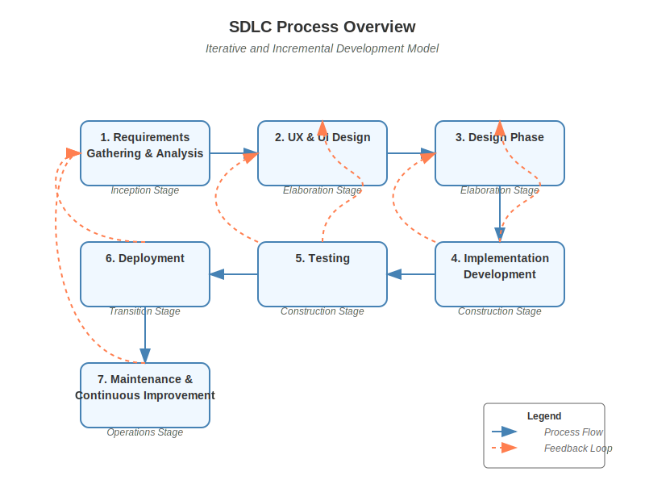

# Process Overview
Below is an updated SDLC process that takes into account the existing WriterSide SRS document (located in docs/sdlc/SRS/) and guides development with clear review checkpoints. In addition to the process phases, sample AI LLM chat prompts are provided for initiating review requests of each key deliverable.

*Note: The process overview diagram shows the relationships between different phases and the feedback loops that enable iterative development.*