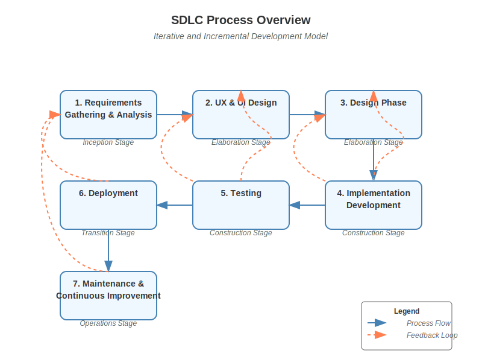

# SDLC Process

## Purpose
This document defines a comprehensive Software Development Life Cycle (SDLC) process for the TimeLocker backup management application. The purpose of this SDLC process is to provide a structured framework that guides the development team through all phases of software development, from requirements gathering to maintenance, ensuring consistent quality, traceability, and compliance with relevant standards.

## Scope
This SDLC process covers all phases of software development for the TimeLocker application:
- Requirements Gathering & Analysis
- UX & UI Design
- Design Phase
- Implementation / Development
- Testing
- Deployment
- Maintenance & Continuous Improvement

The process includes activities, documentation requirements, and review checkpoints for each phase. It does not cover project management processes, resource allocation, or budgeting, which are addressed in separate documentation.

## Objectives and Goals
The primary objectives of this SDLC process are to:
- Ensure all requirements are clearly understood and properly implemented
- Maintain traceability between requirements, design, implementation, and testing
- Produce high-quality, maintainable, and secure software
- Facilitate effective communication among stakeholders
- Enable consistent and repeatable development practices
- Ensure compliance with relevant standards and regulations
- Provide clear guidance for review and approval at each stage

## Intended Audience
This process documentation is intended for:
- Development team members (developers, testers, designers)
- Project managers and team leads
- Quality assurance personnel
- Stakeholders involved in review and approval processes
- New team members requiring onboarding to the development process

## How to Use This Documentation
This document is organized by SDLC phases, with each phase containing:
- Objectives: What the phase aims to accomplish
- Activities: Specific tasks to be performed
- Documentation Produced: Deliverables expected from the phase
- Checkpoint & Review Prompts: Guidance for review and approval

Team members should:
1. Review the entire process before beginning work
2. Reference the relevant phase section when starting work on that phase
3. Use the provided review prompts when requesting feedback
4. Ensure all required documentation is produced before moving to the next phase

## Life Cycle Model and Stages
This SDLC follows an iterative and incremental development model, with the following stages:

1. **Inception Stage**: Includes initial requirements gathering and analysis
2. **Elaboration Stage**: Encompasses UX/UI design and detailed technical design
3. **Construction Stage**: Covers implementation/development and testing
4. **Transition Stage**: Includes deployment and initial maintenance
5. **Operations Stage**: Ongoing maintenance and continuous improvement

Each stage may involve multiple iterations, with feedback loops allowing for refinement based on stakeholder input and changing requirements.

## Process Overview
Below is an updated SDLC process that takes into account the existing WriterSide SRS document (located in docs/sdlc/SRS/) and guides development with clear review checkpoints. In addition to the process phases, sample AI LLM chat prompts are provided for initiating review requests of each key deliverable.

*Note: The process overview diagram shows the relationships between different phases and the feedback loops that enable iterative development.*

## Glossary of Terms
- **SRS**: Software Requirements Specification
- **UX**: User Experience
- **UI**: User Interface
- **UAT**: User Acceptance Testing
- **CI/CD**: Continuous Integration/Continuous Deployment
- **LLM**: Large Language Model (AI assistant)
- **Junie**: The AI assistant used in this project
- **Checkpoint**: A point in the process where review and approval are required before proceeding
- **Deliverable**: A tangible output produced during a phase of the SDLC
- **Traceability**: The ability to track requirements through design, implementation, and testing
