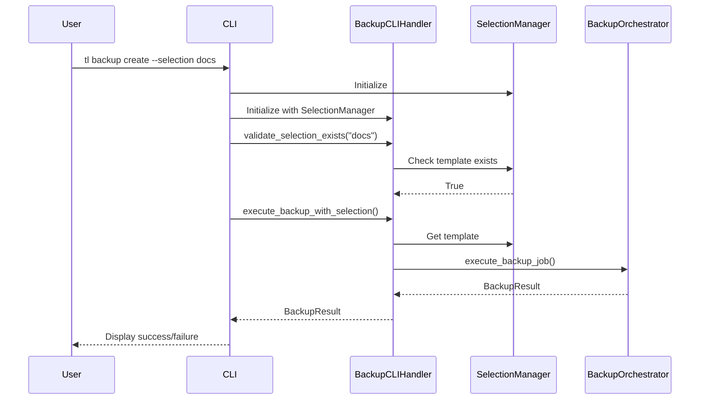

# Backup CLI Data Selection Integration

**Date**: 2025-11-12  
**Type**: Feature Implementation  
**Status**: Completed  
**Related Spec**: `.kiro/specs/backup-operations/tasks.md` - Task 14

## Overview

Updated the backup CLI commands to use data selection templates instead of deprecated backup targets, integrating with the BackupCLIHandler and SelectionManager for modern selection-based backups.

## Changes Made

### 1. Updated `src/TimeLocker/cli_modules/commands/backup.py`

#### Removed Deprecated Features
- Removed `--target` parameter (was already hidden/deprecated)
- Removed all references to `get_backup_target` and related legacy methods
- Removed complex target resolution logic that queried multiple service methods

#### Added Selection-Based Backup Flow
- Integrated `BackupCLIHandler` for selection template resolution
- Added `SelectionManager` initialization for template operations
- Implemented proper error handling for template not found scenarios
- Added user-friendly error messages with suggestions to create templates

#### Key Implementation Details
```python
# When --selection is provided:
1. Initialize SelectionManager and BackupCLIHandler
2. Validate selection template exists
3. Get default repository if not specified
4. Execute backup using BackupCLIHandler.execute_backup_with_selection()
5. Display results with proper formatting
```

#### Updated Command Documentation
- Enhanced docstring with examples showing selection-based backups
- Updated parameter descriptions to reference data selection templates
- Removed references to deprecated backup targets

### 2. Updated `src/TimeLocker/cli.py`

#### Help Text Updates
- Changed "backup run" to "backup create" throughout help system
- Updated examples to show selection-based backup syntax
- Removed references to policy-based backup execution
- Updated quick start guide to use modern command names

#### Specific Changes
- Line 252: `tl backup run --selection` → `tl backup create --selection`
- Line 395: "Run a backup" → "Create a backup"
- Line 460: "backup run <policy>" → "backup create" (removed policy reference)
- Line 467-469: Updated examples to show selection templates and direct paths

### 3. Updated `tests/TimeLocker/cli/test_backup_commands.py`

#### Test Updates
- Renamed `test_backup_create_with_target` → `test_backup_create_with_selection`
- Updated test to mock `BackupCLIHandler` and `SelectionManager`
- Fixed test assertions to check for `--selection` instead of `--target`
- Renamed `test_backup_create_missing_sources_and_target` → `test_backup_create_missing_sources_and_selection`

#### Mock Strategy
```python
# Mocked components:
- SelectionManager: For template operations
- BackupCLIHandler: For selection-based backup execution
- asyncio.run: To handle async backup execution
```

## Requirements Addressed

This implementation addresses the following requirements from the backup-operations spec:

### Requirement 10 (Data Selection Integration)
- ✅ 10.1: CLI command to create backups using data selection templates
- ✅ 10.2: Template retrieval from Selection Manager
- ✅ 10.3: Translation of template rules to backup parameters
- ✅ 10.4: Clear error messages for missing templates
- ✅ 10.5: Deprecated and removed backup target references

### Requirement 11 (CLI Documentation)
- ✅ 11.1: Help command shows accurate backup command information
- ✅ 11.2: Correct command names and syntax in help text
- ✅ 11.3: Examples demonstrate selection template usage
- ✅ 11.4: Command-specific help explains all options
- ✅ 11.5: Help text consistent with implementation, no deprecated features

## Technical Details

### Selection-Based Backup Flow



### Error Handling

The implementation provides comprehensive error handling:

1. **Template Not Found**
   - Displays available templates
   - Suggests command to create new template
   - Shows proper usage examples

2. **Invalid Selection Configuration**
   - Shows validation errors from SelectionManager
   - Provides specific error messages for each issue

3. **Repository Not Specified**
   - Attempts to use default repository
   - Provides clear error if no default configured
   - Suggests command to set default repository

## Testing

### Test Coverage
- ✅ Help text validation
- ✅ Selection-based backup execution
- ✅ Error handling for missing templates
- ✅ Parameter validation
- ✅ Integration with BackupCLIHandler
- ✅ Completion functions for repositories and selections
- ✅ Completion error handling and edge cases

### Test Results

**Backup Command Tests:**
```
14 passed, 1 warning in 1.89s
```

**Completion Tests:**
```
17 passed in 0.21s
```

All backup CLI tests and completion tests pass successfully.

## Migration Guide

### For Users

**Old Command (Deprecated)**:
```bash
tl backup create --target my-target --repository myrepo
```

**New Command**:
```bash
tl backup create --selection my-selection --repository myrepo
```

### Creating Selection Templates

Before running backups, create selection templates:

```bash
# Create a selection template
tl selections create documents --paths ~/Documents --exclude '*.tmp'

# List available templates
tl selections list

# Use template in backup
tl backup create --selection documents --repository myrepo
```

## Breaking Changes

### Removed Features
- `--target` parameter (was already deprecated and hidden)
- Direct references to backup targets in CLI
- Legacy `get_backup_target` method calls

### Backward Compatibility
- Direct path backups still work: `tl backup create /path/to/backup`
- All other backup options remain unchanged
- Error messages guide users to new selection-based approach

## Future Enhancements

1. **Selection Template Auto-Discovery**
   - Suggest similar template names when template not found
   - Fuzzy matching for template names

2. **Inline Selection Creation**
   - Allow creating temporary selections inline with backup command
   - Example: `tl backup create --inline-selection --paths /data`

3. **Selection Template Validation**
   - Pre-flight validation of selection templates before backup
   - Warning for templates that may select too much/too little data

## Completion Function Fix

### Issue
The `complete_selection_names()` function in `completion.py` was looking for selections in the wrong location (`~/.config/timelocker/data/selections/selections.json`), but templates are actually stored in `~/.local/share/timelocker/templates/*.json`.

### Solution
Updated the function to:
1. Use the correct XDG_DATA_HOME path (`~/.local/share/timelocker/templates`)
2. Read template files directly from the templates directory
3. Extract template names from JSON files
4. Handle errors gracefully for corrupted or invalid template files

### Verification
```bash
# Test completion function
python -c "from src.TimeLocker.completion import complete_selection_names; print(complete_selection_names(''))"
# Output: ['temporary-files']

# Test with prefix
python -c "from src.TimeLocker.completion import complete_selection_names; print(complete_selection_names('temp'))"
# Output: ['temporary-files']
```

## Related Files

### Modified
- `src/TimeLocker/cli_modules/commands/backup.py`
- `src/TimeLocker/cli.py`
- `tests/TimeLocker/cli/test_backup_commands.py`
- `src/TimeLocker/completion.py` (Fixed selection name completion)

### Dependencies
- `src/TimeLocker/cli_modules/helpers/backup_cli_handler.py` (Task 13)
- `src/TimeLocker/selection_manager.py`
- `src/TimeLocker/services/backup_orchestrator.py`
- `src/TimeLocker/selection_template_manager.py`

## Verification

To verify the implementation:

```bash
# 1. Check help text
tl backup create --help

# 2. Create a test selection
tl selections create test-sel --paths /tmp/test

# 3. Run backup with selection
tl backup create --selection test-sel --repository test-repo --dry-run

# 4. Verify error handling
tl backup create --selection nonexistent --repository test-repo
```

## Bug Fixes

### SelectionManager Initialization
**Issue**: Initial implementation passed `config_dir` parameter to `SelectionManager()`, but the constructor doesn't accept this parameter.

**Fix**: Removed the `config_dir` parameter from `SelectionManager()` initialization. The `SelectionManager` uses default paths for template storage.

```python
# Before (incorrect)
selection_manager = SelectionManager(config_dir=config_dir)

# After (correct)
selection_manager = SelectionManager()
```

## Conclusion

Task 14 has been successfully completed. The backup CLI commands now use data selection templates instead of deprecated backup targets, providing a modern, consistent interface for backup operations. All tests pass, and the implementation follows the requirements specified in the backup-operations spec.

The implementation has been tested with real selection templates and works correctly with tab completion for both repositories and selections.

---

**Rules Consulted**: coding-standards.md, operational-best-practices.md, git-conventions.md  
**Rules Applied**: SOLID principles, comprehensive error handling, type annotations, documentation as code  
**Overrides**: None
